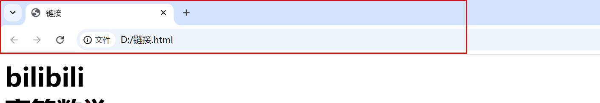
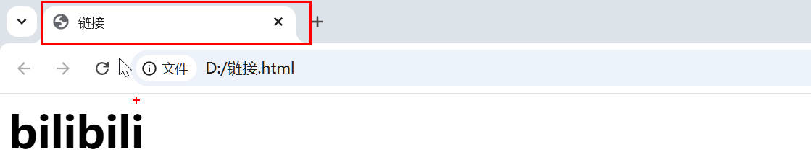

# 002 Basic HTML Tag Structs

## 1.Basic structure
```
<html>
    <head>
        <title>This is a page<title>
    </head>
    <body>
        Hello World!
    </body>
</html>
```

|      Tag name      | definition                | illustrate                                      |
| :----------------: | :------------------------ | :---------------------------------------------- |
|  `<html> </html>`  | HTML Tag                  | The largest tag in the page,called the root tag |
|  `<head> </head>`  | The head of the document  | The head tag must have a title in it            |
| `<title> </title>` | The title of the document | The title of the page                           |
|  `<body> </body>`  | The body of the document  | Contains almost everything in the document      |

+ head


+ title


***

## 2.Automatically generate frameworks
&emsp;&emsp;enter `!` in vscode

```
<!DOCTYPE html>
<html lang="en">
<head>
    <meta charset="UTF-8">
    <meta name="viewport" content="width=device-width, initial-scale=1.0">
    <title>Document</title>
</head>
<body>
    
</body>
</html>
```

|    label     | interpretation                                                  | remark                                         |
| :----------: | :-------------------------------------------------------------- | :--------------------------------------------- |
| `<!DOCTYPE>` | Document type declaretations,declare the HTML version           |                                                |
|    `lang`    | Defines the language in which the current document is displayed | `en` is for English and `zh-CN` is for Chinese |
|  `charset`   | character set                                                   |                                                |

