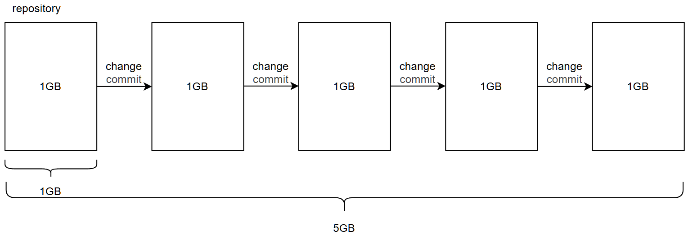
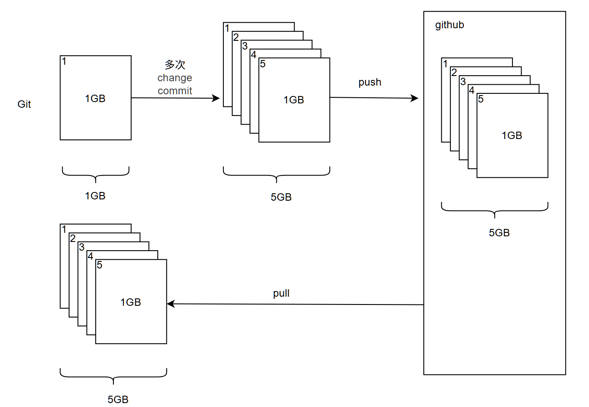
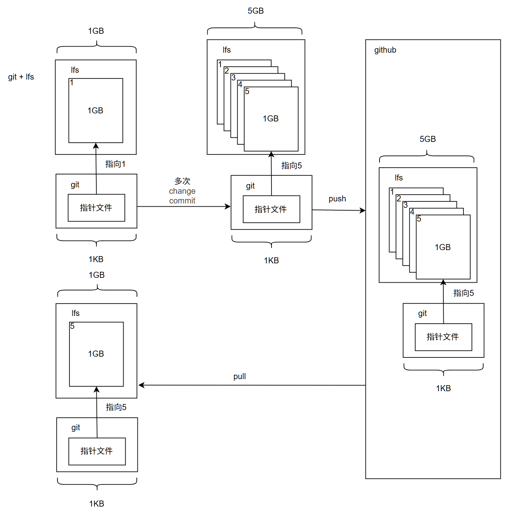
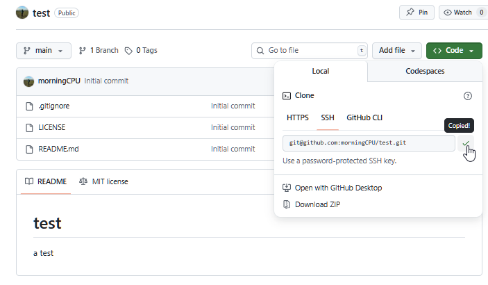
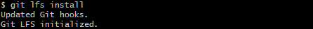
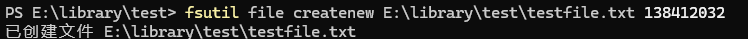
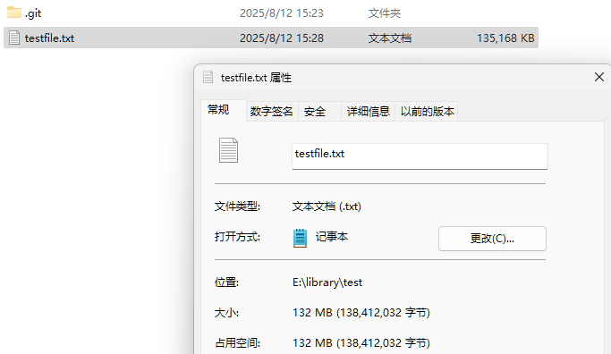
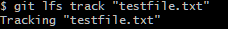
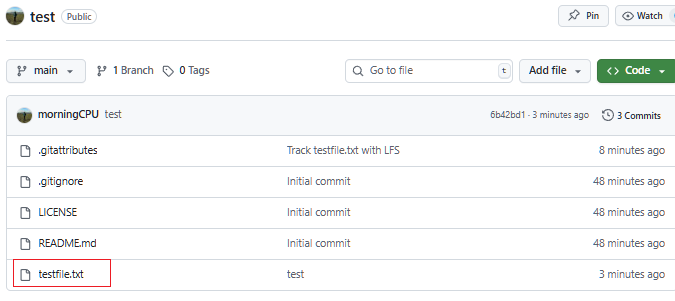
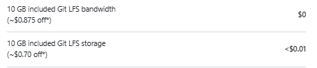

# Git LFS (Git Large File Storage)     
## 1. 为什么需要LFS     
+ `LFS`能够解决 `github` 不能推送100MB以上的单个文件的问题     
     
`Git`并不合适管理大文件，每一次改动`git`都会将整份二进制文件保存一次(会有优化,这里简化不考虑)，这意味着一个 `1GB` 的文件你改动几次就会让这个仓库变得非常大     


***

## 2. LFS是如何解决大文件的问题的     
LFS会对文件进行如下的处理:     
1. 将指定的文件(自定义)上传到独立的LFS服务器,本地文件只保留相应文件的指针文件     
> 这里有两个概念     
> (1) LFS服务器:     
> 远程仓库会自动提供(github有免费额度)     
> (2) 指针文件:     
> 使用lfs后,git对lfs管理的文件不会直接管理,git只是管理哪些文件相对应的指针文件(1KB左右)     
> 这些指针文件能够告诉git这个文件实际在LFS服务器的哪个位置     
> 本地磁盘也是会有一个文件的，那是最新的文件     
2. 当 `git lfs pull` 时,Git LFS 客户端会依据指针文件自动把对应的大文件版本下载回来     
+ 这里要注意要 `pull`,`git clone`只针对git,得到的是指针文件,没有具体文件     
> 这里体现了用 git 管理和用 lfs 管理的不同     
> git 在 clone 时会把所有历史版本都 clone     
> 而 lfs 只是提供最新的版本     
     
下面通过图说明     
.git/objects 简写为 git     
.git/lfs/objects 简写为 lfs     
(注意只是示意图,只用于说明意思,实际会有优化)     
+ Git     
     
+ Git + LFS     
     

***

## 3. LFS 的具体使用     
具体git的使用可以见我下面这篇文章     
**1. 新建仓库**     
`git init`     
     
     
**2. 创建远程仓库**     
     

**3. 连接**     
```
git remote add origin git@github.com:morningCPU/test.git     
git branch -M main     
git pull origin main     
```

**4. 使用LFS**     
在git仓库中使用 `git lfs install`     
     
现在就可以使用LFS了     
     
**5. 追踪需要追踪的文件**     
一般大文件会追踪 `.zip`,`.pdf`,`.docx`     
```     
git lfs track "*.zip"     
git lfs track "*.pdf"     
git lfs track "*.docx"     
```     
     
**6. 提交lfs设置**     
```     
git add .gitattributes     
git commit -m "Track testfile.txt with LFS"     
```     
到这里 lfs 就能正常使用了,下面是git的使用     
     
**7. push**     
这里创建了一个实验文件testfile.txt,大小为132MB     
     
     
这里使用`git lfs track "testfile.txt"`测试,单独追踪      `testfile.txt` 文件     
     
`git push -u origin main`     
          
可见能够成功     

***

## 4. 注意事项     
1. `github` 的 `LFS` 是有**免费额度**的     
头像 -> Settings -> Access的Billing and licensing -> Overview -> More details     
     