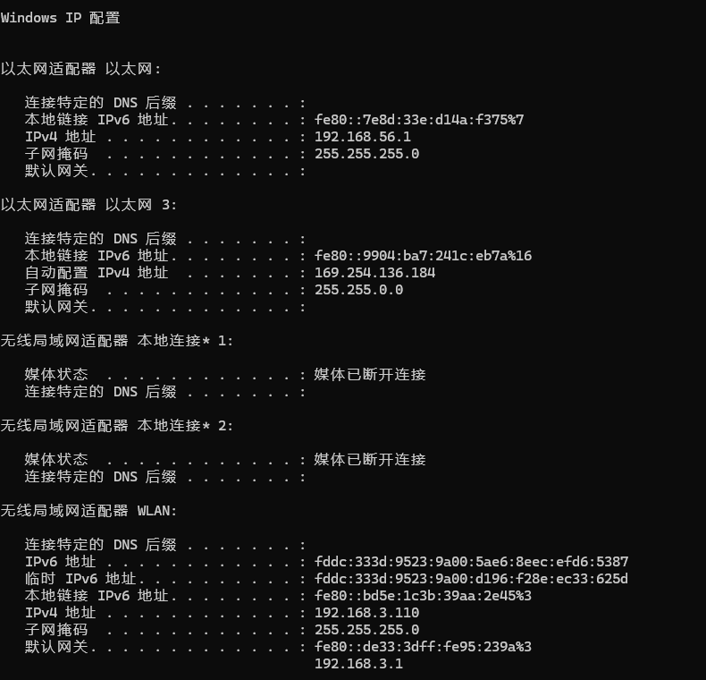

# 一文带你掀了网络IP的老底                                                                                
ip是什么？我要怎么找到自己的IP？为什么IP有这么多,哪个才是我要的？等等、等等本文带你一次性解决          
## 1. IP是什么          
IP地址(Internet Protocol Address),是分配给每一台联网设备的**唯一标识**(注意这句话,后面你可能会有疑问)          
也就是说知道了IP就可以确定你这一台联网的设备          
          
### 1.1 获取当前设备IP          
那我们要如何获取自己的IP呢,我们可以通过命令行简单获得          
+ 对windows系统          
`win + R` -> `输入cmd` -> `回车` -> `命令行输入 ipconfig`          
          
          
+ 对linux系统     
命令行输入 `ifconfig`     
     
     
以上并不是同一配置,所以会有差异     
就让我们先看win的结果吧,你可能会有疑问:     
1. 这么多信息我要怎么看呀     
2. 不是说IP地址是唯一的吗,为什么这里有这么多个     
     
### 1.2 IP信息要怎么看     
     
下面让我们对上面这张图的信息进行剖析     
先让我们知道网络适配器是什么：     
网络适配器(网卡) : 负责收发数据的硬件,联网就一定要有网卡     
     
从图上可见一个电脑上有多个网卡(依据配置每个人的电脑不同)     
     
这两个是虚拟网卡,由VirtualBox软件创建,后面会详细介绍     
     
这几个和wifi连接有关(wifi是WLAN的一种实现方式)     
+ 上面两个和热点有关,开了电脑的热点就会有显示     
我感觉一个就可以了啊，查了一下好像是冗余     
+ 最后的WLAN就是wifi了     
     
```     
插入一段:如何开启电脑wifi (不想看可以跳过灰色部分)     
这你可能就想问了,开热点还不简单啊,点一下不就可以     
```     
     
```     
要下滑一下,在下面     
也可以 设置 -> 网络 -> 热点     
事情可没有这么简单,你可能会发现手机一直连不上去,这是因为这个热点根本没网     
下面让我告诉你们如何解决     
```     
     
```     
win -> 控制面板 -> 网络和共享中心      
```     
     
```     
可以看到这里有活动网络(可能是wifi或者是网线),选一个连上了的     
点那个蓝色的字     
```     
     
```     
点下面这个属性(不是上面那个) -> 上面那个共享     
```     
     
```     
勾选这两个 -> 家庭网络连接 -> 可以看到有一个本地连接(就选那个)     
这时手机就可以连接上电脑的热点了,因为wifi共享了网络给电脑的热点使用     
```     
     
```     
可以看到 本地连接*2 有了     
```     
每个网络适配器的内容其实都差不多,主要看一下几个     
1. IPv4 / IPv6 : 同一个IP的不同表示,因为IPv4用完了,所以要用IPv6了(下面通过IPv4介绍)     
```     
知识补充：     
IP地址的组成     
IP = 网络号 + 主机号     
格式为 a.b.c.d , 其中abcd都是十进制数,范围 0~255     
```     
2. 子网掩码 : 指示了IP地址的网络号部分     
(255.255.255.0 就表示0.0.0.0~255.255.255.0是网络号,剩下的是主机号,用于区分同一个局域网里面的不同主机)     
这又引出了局域网     
     
***     
     
## 2. 局域网     
**局域网**（LAN, Local Area Network）就是把同一小范围（一栋楼、一层办公室、一个家庭）里的电脑、手机、打印机、NAS 等设备用网线或 Wi-Fi 连在一起，让它们能互相高速通信、共享文件、共用打印机、一起上网的一种“本地网络”。     
(一般IP是192.168.x.x)     
+ 如何标识他们在同一个局域网中呢,这就有**网段**的概念了     
     
### 2.1 网段     
其实就是上面讲的网络号,相同网络号那就意味着在同一个局域网中     
而只有在同一个局域中,设备之间才可以进行数据的相互传输(不考虑路由器)     
+ 下面用具体例子说明     
     
### 2.2 局域网的通信     
同一个网段的设备才在一个局域网中,在一个局域网中才可以进行通信(不考虑路由器)     
那也就是说使用同一个wifi的设备的IP的网段是相同的     
这里使用一个扫描器扫描电脑热点网段(192.168.137.1~192.168.137.254)     
(wifi连得太多了)(192.168.137.0网段,192.168.137.255是广播码,下面灰色那里有讲)     
     
可见有三个设备(电脑,手机,平板),都在这一个网段内     
     
```     
进一步通过一个Linux虚拟机进行测试(不想看可以跳过这个灰色部分)     
```     
     
```     
还记得这张图吗,这是一个Linux虚拟机,使用桥接的网络     
```     
inet 192.168.3.107  netmask 255.255.255.0  broadcast 192.168.3.255     
```     
只需要看这一句,表明他的局域网IP是192.168.3.107     
掩码是 255.255.255.0 于是 局域网的网络号为192.168.3.0 , 主机号为 192.168.3.107     
broadcast是广播地址     
网卡会自动使用这个地址向局域网 192.168.3.1 ~ 192.168.3.254 的设备广播每一个设备发出的数据     
你可能会问为什么没有192.168.3.0呢     
这是因为192.168.3.0是一个保留地址,专门用于表示这一个网络号     
上面说了这个虚拟机使用的网络使用的是桥接     
也就是说他用的是本地使用的网络，我这里就是wifi     
```     
     
     
```     
wifi网关的IP是192.168.3.11     
掩码是255.255.255.0,可以退出网段是192.168.3.0,可见与虚拟机网关相同     
下面尝试进行连接     
本地打开PowerShell     
使用 Test-NetConnection 192.168.3.107 进行测试     
看本地能否与虚拟机连接     
```     
     
```     
可见连通     
下面尝试连接 192.168.3.106 应该不能连接     
```     
     
```     
可见不能连通，和猜测结果一致     
```     
     
下面是私货     
***     
## 3. 网络连接的不同方式     
     
NAT,桥接,内部网络,Host-Only这些都是什么?     
1. NAT网络地址转换     
虚拟机不占用局域网的 IP 地址，仅分配到连接宿主机的内部地址     
虚拟机可以通过网卡访问到主机和网络,但是主机无法通过网络访问到虚拟机     
2. 桥接     
虚拟机使用主机网络,虚拟机在主机网络中有自己的IP     
1. 内部网络     
所有使用内部网络的虚拟机彼此互通，但和宿主机、外网完全隔离     
1. Host-Only     
虚拟机只能跟宿主机通信，不能上网     
     
     
     
     
     
     
     
     
     
     