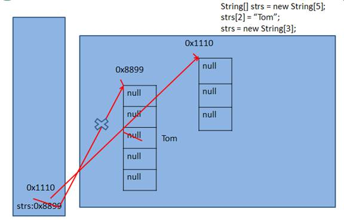
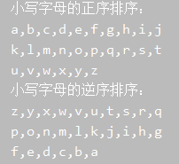

# 第05章_数组拓展练习

讲师：尚硅谷-宋红康

网址：www.atguigu.com

***

## 简答题

### 1、写出一维数组初始化的两种方式

```java
int[] arr = new int[5];//动态初始化

String[] arr1 = new String[]{"Tom","Jerry","Jim"};//静态初始化

//数组一旦初始化，其长度就是确定的。arr.length
//数组长度一旦确定，就不可修改。
```


### 2、写出二维数组初始化的两种方式

```java
int[][] arr = new int[4][3];//动态初始化1
int[][] arr1 = new int[4][];//动态初始化2

int[][] arr2 = new int[][]{{1,2,3},{4,5,6},{7,8}};//静态初始化
```


### 3、不同类型的一维数组元素的默认初始化值各是多少

```
整型 : 0
浮点型：0.0
char:0
boolean :false
引用类型：null
```


### 4、一维数组的内存解析

解析如下代码的内存结构

```
String[] strs = new String[5];

strs[2] = “Tom”;

strs = new String[3];
```



> 关于字符串"Tom"的具体存放位置，我们放到第11章具体讲解。暂时先简化了字符串"Tom"的位置。
>

### 5、数组中常见的异常有哪些？请举例说明

```
ArrayIndexOutOfBoundsException:数组角标越界异常：
合理范围：[0,arr.length -1]
越界：arr[-1],arr[arr.length]

NullPointerException:空指针异常
int[] arr = null;
arr[0];
```


## 编程题

### 1、遍历如下的二维数组

```
int[][] arr = new int[][]{{1,2,3},{4,5},{6,7,8}};
```


```java
public class Exercise1 {
    public static void main(String[] args) {
        int[][] arr = new int[][]{{1,2,3},{4,5},{6,7,8}};

        for(int i = 0;i < arr.length;i++){
            for(int j = 0;j < arr[i].length;j++){
                System.out.print(arr[i][j] + "\t");
            }
            System.out.println();
        }
    }   
}
```


### 2、小组学员姓名

用一个数组存储本组学员的姓名，先从键盘输入小组人数，再从键盘输入每一个学员的姓名，然后遍历显示。

```java
import java.util.Scanner;

public class Exercise2 {
    public static void main(String[] args) {
        //用一个数组存储本组学员的姓名
        //元素的类型是String，长度是多少？
        //长度的确定：（1）根据自己小组定（2）可以从键盘输入
        Scanner input = new Scanner(System.in);

        System.out.print("请输入小组的人数：");
        int count = input.nextInt();

        //声明数组并且初始化
        String[] names = new String[count];
        //此时names数组中都是默认值null

        for(int i=0; i<names.length; i++){
            System.out.print("请输入第"+ (i+1) + "个同学的姓名:");
            names[i] = input.next();
        }

        //全部输入完后显示
        System.out.println("本组学员的姓名如下：");
        for(int i=0; i<names.length; i++){
            System.out.print(names[i] + "\t");
        }
        System.out.println();

        input.close();
    }
}
```

### 3、统计低于平均分的学生人数

先从键盘输入本组学员的人数，再从键盘输入本组学员的姓名和成绩，最后统计：

- 本组学员的平均分，
- 低于平均分的学员人数，
- 哪些学员低于平均分，
- 最高分和最低分分别是谁。

```java
import java.util.Scanner;

public class Exercise3 {
    public static void main(String[] args) {
        Scanner input = new Scanner(System.in);
        System.out.print("请录入本组学员人数：");
        int count = input.nextInt();

        int[] grades = new int[count];
        String[] names = new String[count];

        for (int i = 0; i < grades.length; i++) {
            System.out.print("第" + (i+1) + "个学员的姓名：");
            names[i] = input.next();

            System.out.print("第" + (i+1) + "个学员的成绩：");
            grades[i] = input.nextInt();
        }
        input.close();

        //学员姓名和成绩
        System.out.println("所有学员的成绩如下：");
        for (int i = 0; i < names.length; i++) {
            System.out.println(names[i] + ":" + grades[i]);
        }

        //找出最高分、最低分、累加总分，计算平均分
        int max = grades[0];
        int min = grades[0];
        double sum = 0;
        for (int i = 1; i < grades.length; i++) {
            if(grades[i] > max){
                max = grades[i];
            }
            if(grades[i] < min){
                min = grades[i];
            }
            sum += grades[i];
        }
        double avg = sum/grades.length;

        //输出结果
        System.out.println("最高分成绩是：" + max);
        System.out.println("最第分成绩是：" + min);
        System.out.println("平均分成绩是：" + avg);
        System.out.println("获得最高分的有：");
        for (int i = 0; i < names.length; i++) {
            if(max == grades[i]){
                System.out.println(names[i]);
            }
        }
        System.out.println("获得最第分的有：");
        for (int i = 0; i < names.length; i++) {
            if(min == grades[i]){
                System.out.println(names[i]);
            }
        }
        System.out.println("低于平均分的有：");
        int total = 0;
        for (int i = 0; i < names.length; i++) {
            if(grades[i] < avg){
                System.out.println(names[i]);
                total++;
            }
        }
        System.out.println("低于平均分的一共有：" + total +"人");
    }
}
```

### 4、一年12个月的存储

用一个数组，保存12个月的英语单词，从键盘输入1-12，显示对应的单词。

```java
{"January","February","March","April","May","June","July","August","September","October","November","December"}
```

```java
import java.util.Scanner;

public class Exercise4 {
    public static void main(String[] args) {
        String[] monthNames = {"January","February","March","April","May","June","July","August","September","October","November","December"};

        Scanner input = new Scanner(System.in);
        System.out.print("请输入月份值：");
        int month = input.nextInt();

        if(month <1 || month> 12){
            System.out.println("输入有误");
        }else{
            System.out.println("月份" + month +"是" + monthNames[month-1]);
        }

        input.close();
    }
}
```


### 5、随机产生偶数并排序

随机产生10个[1,100]之间的偶数存储到数组中，并按照从小到大排序输出。

```java
public class Exercise5 {
    public static void main(String[] args) {
        int[] arr = new int[10];

        //随机产生10个[1,100]的偶数
        for (int i = 0; i < arr.length; i++) {
            /*
            Math.random()：[0,1)的小数
            Math.random()*50：[0,50)的小数
            Math.random()*50+1：[1,51)的小数
            (int)(Math.random()*50 + 1)：[1,51)的整数，即[1,50]的整数
            (int)(Math.random()*50 + 1) * 2 ： [1,100]的偶数
             */
            arr[i] = (int)(Math.random()*50 + 1) * 2;
        }

        //排序
        for (int i = 1; i < arr.length; i++) {
            for(int j=0; j<arr.length - i; j++){
                if(arr[j] > arr[j+1]){
                    int temp = arr[j];
                    arr[j] = arr[j+1];
                    arr[j+1] = temp;
                }
            }
        }

        //显示结果
        for (int i = 0; i < arr.length; i++) {
            System.out.println(arr[i]);
        }

    }
}
```


### 6、正序、逆序遍历英文字母

要求使用char数组存储26个英文字母，并分别用正序和逆序方式显示输出。要求10个一行。



```java
public class Exercise6 {
    public static void main(String[] args) {
        char[] letters = new char[26];

        for (int i=0; i<letters.length; i++){
            letters[i] = (char)('a' + i);
        }

        System.out.println("小写字母的正序排序：");
        int count = 0;
        for (int i = 0; i <letters.length; i++) {
            count++;
            if(count == 10 || i == letters.length-1){
                System.out.println(letters[i]);
                count = 0;
            }else if(count < 10) {
                System.out.print(letters[i]+",");
            }
        }

        System.out.println("小写字母的逆序排序：");
        count = 0;
        for (int i = letters.length-1; i >= 0; i--) {
            count++;
            if(count == 10 || i == 0){
                System.out.println(letters[i]);
                count = 0;
            }else if(count < 10) {
                System.out.print(letters[i]+",");
            }
        }
    }
}

```

### 7、查找满分学员

先从键盘输入本组学员的人数，再从键盘输入本组学员的姓名和成绩，显示学员姓名和成绩。最后查找是否有满分(100)学员，如果有显示姓名，否则显示没有满分学员。

```java
import java.util.Scanner;

public class Exercise7 {
    public static void main(String[] args) {
        Scanner input = new Scanner(System.in);
        System.out.print("请录入本组学员人数：");
        int count = input.nextInt();

        int[] grades = new int[count];
        String[] names = new String[count];

        for (int i = 0; i < grades.length; i++) {
            System.out.print("第" + (i+1) + "个学员的姓名：");
            names[i] = input.next();

            System.out.print("第" + (i+1) + "个学员的成绩：");
            grades[i] = input.nextInt();
        }
        input.close();

        //输出学员姓名和成绩
        System.out.println("所有学员的成绩如下：");
        for (int i = 0; i < names.length; i++) {
            System.out.println(names[i] + ":" + grades[i]);
        }

        //查找满分学员
        System.out.println("本班满分学员：");
        boolean flag = false;
        for(int i=0; i<grades.length; i++){
            if(grades[i] == 100){
                System.out.println(names[i]);
                flag = true;
            }
        }
        if(!flag){
            System.out.println("没有");
        }
    }
}
```


### 8、随机生成大乐透

- 模拟大乐透号码：

  - 一组大乐透号码由10个1-99之间的随机数字组成，可以重复
  - 打印大乐透号码信息

- 代码实现，效果如图所示：

  

```java
public class Exercise8 {

	public static void main(String[] args) {
		//1、声明并创建数组
		int[] arr = new int[10];
		
		//2、为元素赋值
		java.util.Random rand = new java.util.Random();
		for (int i = 0; i < arr.length; i++) {
			arr[i] = rand.nextInt(99)+1;
		}
		
		//3、输出
		for (int i = 0; i < arr.length; i++) {
			System.out.print(arr[i]+" ");
		}
	}

}
```

### 9、升级大乐透

大乐透（前区“35选5”＋后区“12选2”），即前区在1-35之间的号码中随机选取5个，后区在1-12之间的号码中随机选取2个，组成一期的中奖号码，请用程序模拟产生一组大乐透中奖号码。

开发提示：

- 声明一个int类型的数组front，长度为35，默认值都是0；
- 声明一个int类型的数组after，长度为12，默认值都是0；
- 随机产生[0,35）之间的整数。如果随机产生的是0，那么就把front[0]修改为1，如果随机产生的是5，那么就把front[5]修改为1，如果随机产生的是10，就把front[10]修改为1。但是如果本次随机产生的是5，而front[5]已经是1了，那么需要重新随机产生一个整数。用这种方式把front数组的5个元素修改为1。
- 随机产生[0,12）之间的整数。使用同样的方式，把after数组的2个元素修改为1。
- 遍历front和after数组，输出大乐透中奖号码，判断front和after数组元素是否为1，如果为1，就显示它的下标+1值。

```java
public class Exercise9 {
    public static void main(String[] args) {
        int[] front = new int[35];
        int[] after = new int[12];

        for (int i = 1; i <=5; i++) {
            /*
            Math.random()：[0,1)的小数
            Math.random() * front.length：[0,front.length)的小数
             (int)(Math.random() * front.length)：[0,front.length)的整数，[0,front.length-1]
             */
            int index;
            do{
                index = (int)(Math.random() * front.length);
            }while(front[index]==1);
            front[index] = 1;
        }

        for (int i = 1; i <=2; i++) {
            int index;
            do{
                index = (int)(Math.random() * after.length);
            }while(after[index]==1);
            after[index] = 1;
        }

        System.out.println("本期大乐透中奖号码：");
        System.out.print("前区号码为：");
        for (int i = 0; i < front.length; i++) {
            if(front[i] == 1){
                System.out.print(i+1+"\t");
            }
        }
        System.out.print("\n后区号码为：");
        for (int i = 0; i < after.length; i++) {
            if(after[i] == 1){
                System.out.print(i+1+"\t");
            }
        }
        System.out.println();
    }
}
```


### 10、判断单词是否是回文单词

```
从键盘输入一个单词，判断它是否是回文单词。

开发提示：
- 从键盘输入一个单词，存放到一个String类型的变量word中
- 通过word.toCharArray()可以根据字符串word得到一个char[]类型的数组。

  其中toCharArray()是String类型提供的系统函数，就像Math.random()等函数一样，后面会学到，这里先提前用一下。它的作用就是创建一个char[]数组，并把字符串中的每一个字符依次存储到这个char[]数组中。


  Scanner input = new Scanner(System.in);

  System.out.print("请输入一个英语单词：");
  String word = input.next(); //假如输入的英语单词是mom

  char[] wordCharArray = word.toCharArray(); // wordCharArray字符数组内容是{'m','o','m'}
```

```java
/**
 * @author 尚硅谷-宋红康
 * @create 19:39
 */
public class Exercise10 {
    public static void main(String[] args) {
        Scanner input = new Scanner(System.in);

        System.out.print("请输入一个英语单词：");
        String word = input.next(); //假如输入的英语单词是mom

        input.close();

        char[] wordCharArray = word.toCharArray(); // wordCharArray字符数组内容是{'m','o','m'}

        //(1)先假设它是对称的
        boolean flag = true;

        //(2)遍历，查看数组的元素是否首尾对称
        //left表示左边的下标
        //right表示右边的下标
        for(int left=0,right=wordCharArray.length-1; left<right; left++,right--){
            if(wordCharArray[left] != wordCharArray[right]){
                flag = false;
                break;
            }
        }

        if(flag){
            System.out.println(word + "是回文单词");
        }else{
            System.out.println(word + "不是回文单词");
        }

    }
}
```

### 11、寻找锦鲤

公司年会有一个寻找锦鲤的游戏，每一个员工随意写一个字，如果在“锦鲤”词库中有这个字，那么就奖励500元锦鲤红包，否则就没有，每人只能玩一次。

现有锦鲤字库如下，它们按照Unicode编码值从小到大排序：

```
char[] koiFishWords = {'一','今','地','定','尚','年','开','我','果','火','爱','硅','结','花','谷','遍'};
```

```java
/**
 * @author 尚硅谷-宋红康
 * @create 19:42
 */
public class Exercise11 {
    public static void main(String[] args) {
        char[] koiFishWords = {'一','今','地','定','尚','年','开','我','果','火','爱','硅','结','花','谷','遍'};

        Scanner input = new Scanner(System.in);

        System.out.print("请输入一个字：");
        char word = input.next().charAt(0);
        input.close();

        int index = -1;
        for(int left = 0,right = koiFishWords.length-1; left<=right; ){
            //int mid = (left+right)/2;
            int mid = left + (right-left)/2;

            if(koiFishWords[mid] == word){
                index = mid;
                break;
            }else if(word > koiFishWords[mid]){
                //说明target在[mid]右边
                left = mid+1;
            }else{
                //说明target<arr[mid]，target在[mid]左边
                right= mid-1;
            }
        }
        if(index!=-1){
            System.out.println("你是锦鲤！！！恭喜获得锦鲤红包500元");
        }else{
            System.out.println("o(╥﹏╥)o");
        }
    }
}
```

### 12、绳子覆盖点


```java
import java.util.Arrays;

public class Exercise12 {
    public static void main(String[] args) {

        double[] arr = new double[10];
        for (int i = 0; i < arr.length-1; i++) {
            arr[i] = Math.random() * 100;//[0,100)之间的小数
        }
        arr[arr.length-1] = 0;
        System.out.println("直线上每一个点距离下一个点的距离："+Arrays.toString(arr));

        double length = 150.5;

        int count = 0;
        double sum = 0;
        for (int i = 0; i < arr.length; i++) {
            sum += arr[i];
            if(sum<=length) {
                count++;
            }else {
                break;
            }
        }
        System.out.println("长度为：" + length + "的绳子最多能覆盖" +count+"个点");
    }
}
```


### 13、学生成绩统计

需求：保存全班的每个组的成绩，并对成绩做统计

使用二维数组保存全班的每个组的成绩，

- 从键盘输入一共有几组
- 从键盘输入每一组分别有多少人
- 从键盘输入每一个同学的成绩

并对成绩做如下统计：

- 统计每一组的最高分、最低分
- 统计每一组的平均分
- 统计全班的最高分、最低分
- 统计全班的平均分
- 统计全班的总人数

```java
public class Exercise13 {
	public static void main(String[] args){
		java.util.Scanner input = new java.util.Scanner(System.in);
		
		//(1)从键盘输入一共有几组，确定二维数组的行数
		System.out.print("请输入一共有几组：");
		int group = input.nextInt();
		
		//(2)创建二维数组，并确定行数
		int[][] arr = new int[group][];
		
		//(3)从键盘输入每一组分别有多少人，确定每一行的列数
		for(int i=0; i<arr.length; i++){
			System.out.print("请输入第" + (i+1) + "组有几个人:");
			arr[i] = new int[input.nextInt()];
			
			//(4)从键盘输入每一个同学的成绩
			for(int j = 0; j<arr[i].length; j++){
				System.out.print("请输入第" + (j+1) + "个组员的成绩：");
				arr[i][j] = input.nextInt();
			}
		}
		
		//(4)显示成绩表
		System.out.println("每组成绩如下：");
		for(int i=0; i<arr.length; i++){
			for(int j=0; j<arr[i].length; j++){
				System.out.print(arr[i][j] + "\t");
			}
			System.out.println();
		}
		
		/*
		4. 统计每一组的最高分、最低分
		5. 统计每一组的平均分
		6. 统计全班的最高分、最低分
		7. 统计全班的平均分
		8. 统计全班的总人数
		*/
		int[] groupMax = new int[group];//有几组就有几个元素
		int[] groupMin = new int[group];
		double[] groupAvg = new double[group];
		int max = -1;//全班的最高分
		int min = 101;//全班的最低分，假设成绩的范围是[0,100]
		double sum = 0;
		int count = 0 ;
		
		//把每一组的最高分，最低分，都初始化为特殊值
		for(int i=0; i<group; i++){
			groupMax[i] = -1;
			groupMin[i] = 101;
		}
		
		//统计
		for(int i=0; i<arr.length; i++){
			double groupSum = 0;//每一组累加总分，都是从0开始
			for(int j=0; j<arr[i].length; j++){
				if(arr[i][j] > groupMax[i]){//找每组的最高分
					groupMax[i] = arr[i][j];
				}
				if(arr[i][j] < groupMin[i]){//找每组的最低分
					groupMin[i] = arr[i][j];
				}
				if(arr[i][j] > max){//找全班的最高分
					max = arr[i][j];
				}
				if(arr[i][j] < min){//找全班的最低分
					min = arr[i][j];
				}
				groupSum += arr[i][j];//累加每一组的总分
				sum += arr[i][j];//累加全部的总分
				count++;//累加总人数
			}
			
			//每一组的平均分 = 每一组的总分/每一组的人数
			groupAvg[i] = groupSum / arr[i].length;
		}
		
		//全部的平均分 = 全部的总分 / 总人数
		double avg = sum / count;
		
		System.out.println("全班的最高分：" + max);
		System.out.println("全班的最低分：" + min);
		System.out.println("全班的平均分：" + avg);
		System.out.println("全班的总人数：" + count);
		for(int i=0; i<arr.length; i++){
			System.out.println("第" + (i+1) + "组的最高分：" + groupMax[i]);
			System.out.println("第" + (i+1) + "组的最低分：" + groupMin[i]);
			System.out.println("第" + (i+1) + "组的平均分：" + groupAvg[i]);
		}
	}
}
```

