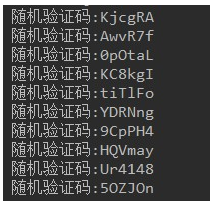
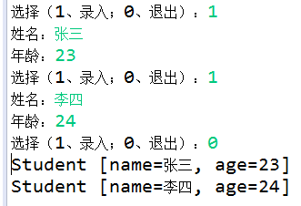
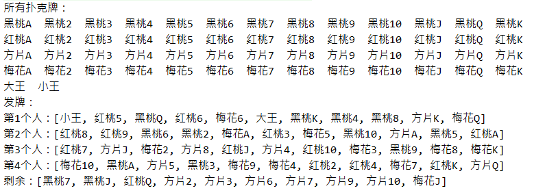
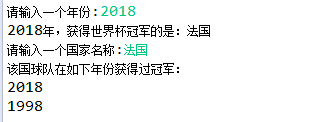
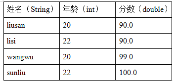
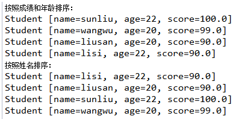

# 第13章_泛型拓展练习

讲师：尚硅谷-宋红康

网址：www.atguigu.com

***

## 集合中泛型的使用

### 1、姓名、手机号码

（1）从键盘输入本组学员的姓名和他的手机号码，存放到HashMap<K,V>中，泛型指定为<String,String>，姓名为key,手机号码为value，并且遍历显示

（2）再从键盘输入姓名，查询他的手机号码

```java
public class Exercise1 {
    public static void main(String[] args) {
        Scanner input = new Scanner(System.in);
        HashMap<String,String> map = new HashMap<>();

        System.out.print("请输入小组人数：");
        int count = input.nextInt();

        for(int i=1; i<=count; i++){
            System.out.print("请输入学员姓名：");
            String name = input.next();

            System.out.print("请输入手机号码：");
            String tel = input.next();

            map.put(name, tel);
        }
       /* map.put("张三","10086");
        map.put("李四","10010");
        map.put("王五","95586");*/

       System.out.print("请输入你要查询的学员姓名：");
       String findName = input.next();
       String findTel = map.get(findName);
        System.out.println(findName +"的手机号码是" + (findTel != null ? findTel : "不存在"));

        input.close();
    }
}
```

### 2、学生信息录入

（1）创建HashMap对象，泛型为<String, ArrayList<String>>，

（2）存储咱们班每组学员信息，组长姓名为key，组员们的姓名（包括组长自己）为value

（2）遍历显示每一个小组信息

（3）从键盘输入一个学员姓名，查找这个学员是否咱们班

```java
public class Exercise2 {
    public static void main(String[] args) {
        HashMap<String, ArrayList<String>> map = new HashMap<>();

        ArrayList<String> group1 = new ArrayList<>();
        group1.add("张三");
        group1.add("李四");
        group1.add("王五");
        group1.add("赵六");

        ArrayList<String> group2 = new ArrayList<>();
        group2.add("张飞");
        group2.add("刘备");
        group2.add("关羽");
        group2.add("庞统");

        map.put("张三",group1);
        map.put("张飞",group2);

        System.out.println("每一个小组信息：");
        Set<Map.Entry<String, ArrayList<String>>> entries = map.entrySet();
        for (Map.Entry<String, ArrayList<String>> entry : entries) {
            System.out.println("组长：" + entry.getKey());
            System.out.println("组员们有：");
            ArrayList<String> group = entry.getValue();
            for (String s : group) {
                System.out.println("\t" + s);
            }
        }

        Scanner input = new Scanner(System.in);
        System.out.print("请输入你要查询的学员姓名：");
        String findName = input.next();
        boolean flag = false;
        for (Map.Entry<String, ArrayList<String>> entry : entries) {
            ArrayList<String> group = entry.getValue();
            if(group.contains(findName)){
                flag = true;
                break;
            }
        }

        if(flag){
            System.out.println(findName + "在本班");
        }else{
            System.out.println(findName + "不在这个班");
        }
        input.close();
    }
}
```

### 3、List中存储偶数

随机产生10个100以内的偶数，存放到一个List集合中，然后获取元素的个数，最后使用foreach循环遍历显示它们。

```java
public class Exercise3 {
    public static void main(String[] args) {
        Random random = new Random();
        ArrayList<Integer> list = new ArrayList<>();
        for (int i = 1; i <=10 ; i++) {
            list.add(random.nextInt(50)*2);
        }

        System.out.println("100以内的随机偶数个数有：" + list.size());
        for (Integer integer : list) {
            System.out.println(integer);
        }
    }
}

```

### 4、Set中存储偶数

随机产生10个100以内的偶数，存放到一个Set集合中，然后获取元素的个数，最后使用foreach循环遍历显示它们。

```java
public class Exercise4 {
    public static void main(String[] args) {
        Random random = new Random();
        HashSet<Integer> set = new HashSet<>();
        for (int i = 1; i <=10 ; i++) {
            set.add(random.nextInt(50)*2);
        }

        System.out.println("100以内的随机偶数个数有：" + set.size());
        for (Integer integer : set) {
            System.out.println(integer);
        }
    }
}
```

### 5、Set中存10个偶数

随机产生几个100以内的偶数，存放到HashSet中，并且使用Iterator迭代器遍历显示它们，保证最后Set中有10个元素。

```java
public class Exercise5 {
    public static void main(String[] args) {
        Random random = new Random();
        HashSet<Integer> set = new HashSet<>();
        while(set.size()<10){
            set.add(random.nextInt(50)*2);
        }

        System.out.println("100以内的随机偶数个数有：" + set.size());
        for (Integer integer : set) {
            System.out.println(integer);
        }
    }
}
```

### 6、回文单词

（1）创建一个Collection集合（暂时创建ArrayList集合对象），并指定泛型为<String>

（2）添加如下单词到集合中，

```java
hello,java,world,atguigu,love,you,mom,dad,noon
```

（3）使用foreach遍历输出，

（4）使用集合的removeIf方法删除回文单词，为Predicate接口指定泛型<String>

（5）再使用Iterator迭代器输出剩下的单词以及单词的长度，为Iterator接口指定泛型<String>。

```java
public class Exercise6 {
    public static void main(String[] args) {
        Collection<String> coll = new ArrayList<String>();
        coll.add("hello");
        coll.add("java");
        coll.add("world");
        coll.add("atguigu");
        coll.add("love");
        coll.add("you");
        coll.add("mom");
        coll.add("dad");
        coll.add("noon");

        System.out.println("coll中的单词有：");
        for (String word : coll) {
            System.out.println(word);
        }

        coll.removeIf(new Predicate<String>() {
            @Override
            public boolean test(String word) {
                return new StringBuilder(word).reverse().toString().equals(word);
            }
        });

        System.out.println("coll中删除回文单词后：");
        Iterator<String> iterator = coll.iterator();
        while(iterator.hasNext()){
            String word = iterator.next();
            System.out.println(word + "=>" + word.length());
        }
    }
}
```

### 7、随机验证码

* 随机生成十组六位字符组成的验证码。
* 验证码由大小写字母、数字字符组成。

* 代码实现，效果如图所示：

  

  

* 开发提示：

  * 使用字符数组保存原始字符，利用Random类生成随机索引。
  * 将十组验证码放到集合中
  * 用Iterator迭代器遍历集合
  * 注意正确指定泛型

```java
public class Exercise7 {
	public static void main(String[] args) {
		char[] arr = new char[26+26+10];
		
		//使用字符数组保存原始字符
		for (int i = 0; i < arr.length; i++) {
			if(i<10){//前10个放数字
				arr[i] = (char)(i+48);
			}else if(i<10+26){//中间26个放大写字母
				arr[i] = (char)(i+65-10);
			}else{//剩下的放小写字母
				arr[i] = (char)(i+97-10-26);
			}
		}
		
		//随机生成10组验证码
		ArrayList<String> list = new ArrayList<>();
		Random rand = new Random();
		for (int i = 0; i < 10; i++) {
			String str = "";
			for (int j = 0; j < 6; j++) {
				int index = rand.nextInt(arr.length);
				str += arr[index];
			}
			list.add(str);
		}
		
		Iterator<String> iter = list.iterator();
		while(iter.hasNext()){
			System.out.println("随机验证码：" + iter.next());
		}
	}
}

```

### 8、学生信息录入

* 键盘录入学生信息，保存到集合中。

  * 循环录入的方式，1：表示继续录入，0：表示结束录入。
  * 定义学生类，属性为姓名，年龄，使用学生对象保存录入数据。
  * 使用ArrayList集合，保存学生对象，注意正确指定泛型
  * 录入结束后，用foreach遍历集合。

* 代码实现，效果如图所示：

  

```java
public class Exercise8 {
	public static void main(String[] args) {
		ArrayList<Student> list = new ArrayList<>();
		
		Scanner input = new Scanner(System.in);
		while(true){
			System.out.print("选择（1、录入；0、退出）：");
			int select = input.nextInt();
			if(select == 0){
				break;
			}
			System.out.print("姓名：");
			String name = input.next();
			System.out.print("年龄：");
			int age = input.nextInt();
			
			Student stu = new Student(name,age);
			list.add(stu);
		}
		
		for (Student student : list) {
			System.out.println(student);
		}
		input.close();
	}
}
class Student{
	private String name;
	private int age;
	public Student(String name, int age) {
		super();
		this.name = name;
		this.age = age;
	}
	public Student() {
		super();
	}
	public String getName() {
		return name;
	}
	public void setName(String name) {
		this.name = name;
	}
	public int getAge() {
		return age;
	}
	public void setAge(int age) {
		this.age = age;
	}
	@Override
	public String toString() {
		return "Student [name=" + name + ", age=" + age + "]";
	}
	
}
```

### 9、歌手和歌曲

案例：添加你喜欢的歌手以及你喜欢他唱过的歌曲，请正确指定泛型

例如：


```java
public class Exercise9 {
	public static void main(String[] args) {
		HashMap<String,ArrayList<String>> map = new HashMap<>();
		
		ArrayList<String> wangfei = new ArrayList<>();
		wangfei.add("《红豆》");
		wangfei.add("《传奇》");
		wangfei.add("《容易受伤的女人》");
		map.put("王菲", wangfei);
		
		
		ArrayList<String> zxy = new ArrayList<>();
		zxy.add("《一路上有你》");
		zxy.add("《吻别》");
		zxy.add("《一千个伤心的理由》");
		map.put("张学友", zxy);
		
		Set<Entry<String, ArrayList<String>>> entrySet = map.entrySet();
		for (Entry<String, ArrayList<String>> entry : entrySet) {
			System.out.println(entry);
		}
	}
}

```

### 10、统计字母次数


一个字符串，包含了空格等标点符号，写一个函数计算出出现次数最多的字母和该字母出现的次数。

开发提示：可以使用Map，key是字母，value是该字母的次数，请正确指定泛型

效果演示：例如：String str = "Your future depends on your dreams, so go to sleep.";


```java
public class Exercise10 {
	public static void main(String[] args) {
		String str = "Your future depends on your dreams, so go to sleep.";
		str = str.replaceAll("[^a-zA-Z]", "");
		HashMap<Character,Integer> map = new HashMap<>();
		char[] arr = str.toCharArray();
		for (int i = 0; i < arr.length; i++) {
			if(map.containsKey(arr[i])){
				Integer count = map.get(arr[i]);
				map.put(arr[i], count+1);
			}else{
				map.put(arr[i], 1);
			}
		}
		
		Set<Entry<Character, Integer>> entrySet = map.entrySet();
		for (Entry<Character, Integer> entry : entrySet) {
			System.out.println(entry);
		}
	}
}

```

### 11、扑克牌

案例：

​	1、用一个String[]数组存点数

​	2、用一个String[]数组存花色

​	3、用一个String[]数组存大王、小王

​	4、用上面的数组，生成一副扑克牌

​	5、遍历显示全副扑克牌

​	6、模拟给4个人随机发牌，每个人11张牌

​	7、显示每个人的牌和剩余的牌

​	效果如下：



```java
public class Exercise11 {
    public static void main(String[] args) {
        String[] dian = {"A","2","3","4","5","6","7","8","9","10","J","Q","K"};
        String[] hua = {"黑桃","红桃","方片","梅花"};
        String[] wang = {"大王","小王"};

        ArrayList<String> list = new ArrayList<String>();
        for (int j = 0; j < hua.length; j++) {
            for (int i = 0; i < dian.length; i++) {
                list.add(hua[j]+dian[i]);
            }
        }
        for (int i = 0; i < wang.length; i++) {
            list.add(wang[i]);
        }

        System.out.println("所有扑克牌：");
        for (int i = 0; i < list.size(); i++) {
            System.out.print(list.get(i)+"  ");
            if((i+1)%13==0){
                System.out.println();
            }
        }
        System.out.println();
        System.out.println("发牌：");

        Random rand = new Random();
        ArrayList<String> one = new ArrayList<String>();
        for (int i = 0; i < 11; i++) {
            one.add(list.remove(rand.nextInt(list.size())));
        }

        ArrayList<String> two = new ArrayList<String>();
        for (int i = 0; i < 11; i++) {
            two.add(list.remove(rand.nextInt(list.size())));
        }

        ArrayList<String> three = new ArrayList<String>();
        for (int i = 0; i < 11; i++) {
            three.add(list.remove(rand.nextInt(list.size())));
        }

        ArrayList<String> four = new ArrayList<String>();
        for (int i = 0; i < 11; i++) {
            four.add(list.remove(rand.nextInt(list.size())));
        }

        System.out.println("第1个人：" + one);
        System.out.println("第2个人：" + two);
        System.out.println("第3个人：" + three);
        System.out.println("第4个人：" + four);
        System.out.println("剩余：" + list);
    }
}
```

### 12、去重复字符

键盘录入一串字符，去掉其中重复字符，打印出不同的那些字符，必须保证顺序。例如输入：aaaabbbcccddd，打印结果为：abcd。效果如图：


提示：LinkedHashSet的使用

```java
public class Exercise12 {
	public static void main(String[] args) {
		Scanner input = new Scanner(System.in);
		
		System.out.print("请输入一串字母：");
		String str = input.nextLine();
		System.out.println("str=" + str);
		
		LinkedHashSet<Character> set = new LinkedHashSet<Character>();
		for (int i = 0; i < str.length(); i++) {
			set.add(str.charAt(i));
		}
		
		System.out.print("去重后：");
		String result = "";
		for (Character object : set) {
			result += object;
		}
		System.out.println(result);
	}
}

```

### 13、双色球

案例：双色球规则：双色球每注投注号码由6个红色球号码和1个蓝色球号码组成。红色球号码从1—33中选择；蓝色球号码从1—16中选择；请随机生成一注双色球号码。（要求同色号码不重复）


开发提示：可以使用TreeSet和ArrayList结合

```java
public class Exercise13 {
    public static void main(String[] args) {
        TreeSet<Integer> red = new TreeSet<Integer>();
        Random rand = new Random();
        while(red.size()<6){
            red.add(rand.nextInt(33)+1);
        }
        ArrayList<Integer> list = new ArrayList<Integer>();
        list.addAll(red);
        list.add(rand.nextInt(16)+1);//蓝色号码
        System.out.println("双色球所有号码：" + list);

        System.out.print("红色号码：");
        for (int i = 0; i < list.size()-1; i++) {
            System.out.print(list.get(i)+" ");
        }
        System.out.println("蓝色号码：" + list.get(list.size()-1));
    }
}
```

### 14、省份城市

案例：

​	添加如下省份与城市信息到map中，并遍历显示

```java
浙江省
	绍兴市
	温州市
	湖州市
	嘉兴市
	台州市
	金华市
	舟山市
	衢州市
	丽水市
	杭州市
	宁波市
海南省
	海口市
	三亚市
北京市
	北京市
```

开发提示：

​	其中key为省份名，value为该省份所有的市辖区

```java
public class Exercise14 {
    public static void main(String[] args) throws Exception {
        HashMap<String, List<String>> map = new HashMap<>();
        map.put("北京市", Arrays.asList("北京市"));
        map.put("海南省", Arrays.asList("海口市","三亚市"));
        map.put("浙江省", Arrays.asList("绍兴市","温州市","湖州市","嘉兴市","台州市","金华市","舟山市","衢州市","丽水市"));

        Set<Map.Entry<String, List<String>>> entrySet = map.entrySet();
        for (Map.Entry<String, List<String>> entry : entrySet) {
            System.out.println(entry);
        }
    }
}
```

### 15、世界杯

（1）从键盘输入一个年份，输出该年的世界杯冠军是哪支球队。如果该年没有举办世界杯，则输出：没有举办世界杯。 

（2）从键盘输入一支球队的名字，输出该球队夺冠的年份列表。 例如，读入“巴西”，应当输出 1958 1962 1970 1994 2002 读入“荷兰”，应当输出 没有获得过世界杯

运行效果如下：



开发提示：

把年份作为key，改年夺冠的国家名称作为value存到map中

附：历届世界杯冠军

| 届数       | 举办年份 | 举办地点 | 冠军   |
| ---------- | -------- | -------- | ------ |
| 第一届     | 1930年   | 乌拉圭   | 乌拉圭 |
| 第二届     | 1934年   | 意大利   | 意大利 |
| 第三届     | 1938年   | 法国     | 意大利 |
| 第四届     | 1950年   | 巴西     | 乌拉圭 |
| 第五届     | 1954年   | 瑞士     | 西德   |
| 第六届     | 1958年   | 瑞典     | 巴西   |
| 第七届     | 1962年   | 智利     | 巴西   |
| 第八届     | 1966年   | 英格兰   | 英格兰 |
| 第九届     | 1970年   | 墨西哥   | 巴西   |
| 第十届     | 1974年   | 前西德   | 西德   |
| 第十一届   | 1978年   | 阿根廷   | 阿根廷 |
| 第十二届   | 1982年   | 西班牙   | 意大利 |
| 第十三届   | 1986年   | 墨西哥   | 阿根廷 |
| 第十四届   | 1990年   | 意大利   | 西德   |
| 第十五届   | 1994年   | 美国     | 巴西   |
| 第十六届   | 1998年   | 法国     | 法国   |
| 第十七届   | 2002年   | 韩日     | 巴西   |
| 第十八届   | 2006年   | 德国     | 意大利 |
| 第十九届   | 2010年   | 南非     | 西班牙 |
| 第二十届   | 2014年   | 巴西     | 德国   |
| 第二十一届 | 2018年   | 俄罗斯   | 法国   |

```java
public class Exercise15 {
    public static void main(String[] args) {
        Map<Integer,String> m = new HashMap<>();

        m.put(1930, "乌拉圭");
        m.put(1934, "意大利");
        m.put(1938, "意大利");
        m.put(1950, "乌拉圭");
        m.put(1954, "西德");
        m.put(1958, "巴西");
        m.put(1962, "巴西");
        m.put(1966, "英格兰");
        m.put(1970, "巴西");
        m.put(1974, "西德");
        m.put(1978, "阿根廷");
        m.put(1982, "意大利");
        m.put(1986, "阿根廷");
        m.put(1990, "西德");
        m.put(1994, "巴西");
        m.put(1998, "法国");
        m.put(2002, "巴西");
        m.put(2006, "意大利");
        m.put(2010, "西班牙");
        m.put(2014, "德国");
        m.put(2018, "法国");

        Scanner input = new Scanner(System.in);
        System.out.print("请输入一个年份:");
        int key = input.nextInt();

        if (m.containsKey(key)) {
            System.out.println(key + "年，获得世界杯冠军的是：" + m.get(key));
        } else {
            System.out.println("该年没有举办世界杯！");
        }

        System.out.print("请输入一个国家名称:");
        String country = input.next();

        if (m.containsValue(country)) {
            System.out.println("该国球队在如下年份获得过冠军：");
            for (Integer year : m.keySet()) {
                if (m.get(year).equals(country)) {
                    System.out.println(year);
                }
            }
        } else {
            System.out.println("该国家没有获得世界杯冠军");
        }

        input.close();
    }
}
```

### 16、菜单的二级联动效果

现有全国各省市信息字符串如下：

```java
String str = "'北京': ['北京'];"
    +"'上海': ['上海'];"
    +"'天津': ['天津'];"
    +"'重庆': ['重庆'];"
    +"'河北省': ['石家庄', '张家口', '承德', '秦皇岛', '唐山', '廊坊', '保定', '沧州', '衡水', '邢台', '邯郸'];"
    +"'山西省': ['太原', '大同', '朔州', '阳泉', '长治', '晋城', '忻州', '吕梁', '晋中', '临汾', '运城'];"
    +"'辽宁省': ['沈阳', '朝阳', '阜新', '铁岭', '抚顺', '本溪', '辽阳', '鞍山', '丹东', '大连', '营口', '盘锦', '锦州', '葫芦岛'];"
    +"'吉林省': ['长春', '白城', '松原', '吉林', '四平', '辽源', '通化', '白山', '延边'];"
    +"'黑龙江省': ['哈尔滨', '齐齐哈尔', '黑河', '大庆', '伊春', '鹤岗', '佳木斯', '双鸭山', '七台河', '鸡西', '牡丹江', '绥化', '大兴安'];"
    +"'江苏省': ['南京', '徐州', '连云港', '宿迁', '淮阴', '盐城', '扬州', '泰州', '南通', '镇江', '常州', '无锡', '苏州'];"
    +"'浙江省': ['杭州', '湖州', '嘉兴', '舟山', '宁波', '绍兴', '金华', '台州', '温州', '丽水','衢州'];"
    +"'安徽省': ['合肥', '宿州', '淮北', '阜阳', '蚌埠', '淮南', '滁州', '马鞍山', '芜湖', '铜陵', '安庆', '黄山', '六安', '巢湖', '池州', '宣城'];"
    +"'福建省': ['福州', '南平', '三明', '莆田', '泉州', '厦门', '漳州', '龙岩', '宁德'];"
    +"'江西省': ['南昌', '九江', '景德镇', '鹰潭', '新余', '萍乡', '赣州', '上饶', '抚州', '宜春', '吉安'];"
    +"'山东省': ['济南', '聊城', '德州', '东营', '淄博', '潍坊', '烟台', '威海', '青岛', '日照', '临沂', '枣庄', '济宁', '泰安', '莱芜', '滨州', '菏泽'];"
    +"'河南省': ['郑州', '三门峡', '洛阳', '焦作', '新乡', '鹤壁', '安阳', '濮阳', '开封', '商丘', '许昌', '漯河', '平顶山', '南阳', '信阳', '周口', '驻马店'];"
    +"'湖北省': ['武汉', '十堰', '襄攀', '荆门', '孝感', '黄冈', '鄂州', '黄石', '咸宁', '荆州', '宜昌', '恩施', '襄樊'];"
    +"'湖南省': ['长沙', '张家界', '常德', '益阳', '岳阳', '株洲', '湘潭', '衡阳', '郴州', '永州', '邵阳', '怀化', '娄底', '湘西'];"
    +"'广东省': ['广州', '清远', '韶关', '河源', '梅州', '潮州', '汕头', '揭阳', '汕尾', '惠州', '东莞', '深圳', '珠海', '江门', '佛山', '肇庆', '云浮', '阳江', '茂名', '湛江'];"
    +"'海南省': ['海口', '三亚'];"
    +"'四川省': ['成都', '广元', '绵阳', '德阳', '南充', '广安', '遂宁', '内江', '乐山', '自贡', '泸州', '宜宾', '攀枝花', '巴中', '达川', '资阳', '眉山', '雅安', '阿坝', '甘孜', '凉山'];"
    +"'贵州省': ['贵阳', '六盘水', '遵义', '毕节', '铜仁', '安顺', '黔东南', '黔南', '黔西南'];"
    +"'云南省': ['昆明', '曲靖', '玉溪', '丽江', '昭通', '思茅', '临沧', '保山', '德宏', '怒江', '迪庆', '大理', '楚雄', '红河', '文山', '西双版纳'];"
    +"'陕西省': ['西安', '延安', '铜川', '渭南', '咸阳', '宝鸡', '汉中', '榆林', '商洛', '安康'];"
    +"'甘肃省': ['兰州', '嘉峪关', '金昌', '白银', '天水', '酒泉', '张掖', '武威', '庆阳', '平凉', '定西', '陇南', '临夏', '甘南'];"
    +"'青海省': ['西宁', '海东', '西宁', '海北', '海南', '黄南', '果洛', '玉树', '海西'];"
    +"'内蒙古': ['呼和浩特', '包头', '乌海', '赤峰', '呼伦贝尔盟', '兴安盟', '哲里木盟', '锡林郭勒盟', '乌兰察布盟', '鄂尔多斯', '巴彦淖尔盟', '阿拉善盟'];"
    +"'广西': ['南宁', '桂林', '柳州', '梧州', '贵港', '玉林', '钦州', '北海', '防城港', '南宁', '百色', '河池', '柳州', '贺州'];"
    +"'西藏': ['拉萨', '那曲', '昌都', '林芝', '山南', '日喀则', '阿里'];"
    +"'宁夏': ['银川', '石嘴山', '吴忠', '固原'];"
    +"'新疆': ['乌鲁木齐', '克拉玛依', '喀什', '阿克苏', '和田', '吐鲁番', '哈密', '博尔塔拉', '昌吉', '巴音郭楞', '伊犁', '塔城', '阿勒泰'];"
    +"'香港': ['香港'];"
    +"'澳门': ['澳门'];"
    +"'台湾': ['台北', '台南', '其他']";
```

效果如下：

```
请选择：
1:北京
2:上海
3:天津
4:重庆
5:河北省
6:山西省
7:辽宁省
8:吉林省
9:黑龙江省
10:江苏省
11:浙江省
12:安徽省
13:福建省
14:江西省
15:山东省
16:河南省
17:湖北省
18:湖南省
19:广东省
20:海南省
21:四川省
22:贵州省
23:云南省
24:陕西省
25:甘肃省
26:青海省
27:内蒙古
28:广西
29:西藏
30:宁夏
31:新疆
32:香港
33:澳门
34:台湾
省份：11
该省份共有辖区：[杭州, 湖州, 嘉兴, 舟山, 宁波, 绍兴, 金华, 台州, 温州, 丽水, 衢州]
```

开发提示：

（1）把字符串str字符串先按照;进行拆分，得到34个省（包括23个省，5个自治区，4个直辖市，2个特别行政区，下面的题目描述中，把它们都成为省份）

（2）然后把每个省的字符串，按照:进行拆分，那么:左边的是省份名称，:右边的是该省的各市辖区

（3）把34个省存储到一个HashMap集合中，其中编号是key，省份名是value

（4）把所有省份的城市存储到一个LinkedHashMap集合中，其中省份名是key，该省份的所有城市用一个ArrayList的集合装起来，然后作为value。

（5）注意，字符串处理过程中，注意：[、]、,、'等标点符号的处理

例如：

```java
去掉单引号'
replace("'", "")

去掉[,],',空格
replaceAll("\\[|\\]|\\'| ", "")
```

```java
public class Exercise16 {
    public static void main(String[] args) {
        LinkedHashMap<String, ArrayList<String>> all = new LinkedHashMap<>();
        HashMap<Integer,String> allProvinces = new HashMap<>();
        String str = "'北京': ['北京'];"
                +"'上海': ['上海'];"
                +"'天津': ['天津'];"
                +"'重庆': ['重庆'];"
                +"'河北省': ['石家庄', '张家口', '承德', '秦皇岛', '唐山', '廊坊', '保定', '沧州', '衡水', '邢台', '邯郸'];"
                +"'山西省': ['太原', '大同', '朔州', '阳泉', '长治', '晋城', '忻州', '吕梁', '晋中', '临汾', '运城'];"
                +"'辽宁省': ['沈阳', '朝阳', '阜新', '铁岭', '抚顺', '本溪', '辽阳', '鞍山', '丹东', '大连', '营口', '盘锦', '锦州', '葫芦岛'];"
                +"'吉林省': ['长春', '白城', '松原', '吉林', '四平', '辽源', '通化', '白山', '延边'];"
                +"'黑龙江省': ['哈尔滨', '齐齐哈尔', '黑河', '大庆', '伊春', '鹤岗', '佳木斯', '双鸭山', '七台河', '鸡西', '牡丹江', '绥化', '大兴安'];"
                +"'江苏省': ['南京', '徐州', '连云港', '宿迁', '淮阴', '盐城', '扬州', '泰州', '南通', '镇江', '常州', '无锡', '苏州'];"
                +"'浙江省': ['杭州', '湖州', '嘉兴', '舟山', '宁波', '绍兴', '金华', '台州', '温州', '丽水','衢州'];"
                +"'安徽省': ['合肥', '宿州', '淮北', '阜阳', '蚌埠', '淮南', '滁州', '马鞍山', '芜湖', '铜陵', '安庆', '黄山', '六安', '巢湖', '池州', '宣城'];"
                +"'福建省': ['福州', '南平', '三明', '莆田', '泉州', '厦门', '漳州', '龙岩', '宁德'];"
                +"'江西省': ['南昌', '九江', '景德镇', '鹰潭', '新余', '萍乡', '赣州', '上饶', '抚州', '宜春', '吉安'];"
                +"'山东省': ['济南', '聊城', '德州', '东营', '淄博', '潍坊', '烟台', '威海', '青岛', '日照', '临沂', '枣庄', '济宁', '泰安', '莱芜', '滨州', '菏泽'];"
                +"'河南省': ['郑州', '三门峡', '洛阳', '焦作', '新乡', '鹤壁', '安阳', '濮阳', '开封', '商丘', '许昌', '漯河', '平顶山', '南阳', '信阳', '周口', '驻马店'];"
                +"'湖北省': ['武汉', '十堰', '襄攀', '荆门', '孝感', '黄冈', '鄂州', '黄石', '咸宁', '荆州', '宜昌', '恩施', '襄樊'];"
                +"'湖南省': ['长沙', '张家界', '常德', '益阳', '岳阳', '株洲', '湘潭', '衡阳', '郴州', '永州', '邵阳', '怀化', '娄底', '湘西'];"
                +"'广东省': ['广州', '清远', '韶关', '河源', '梅州', '潮州', '汕头', '揭阳', '汕尾', '惠州', '东莞', '深圳', '珠海', '江门', '佛山', '肇庆', '云浮', '阳江', '茂名', '湛江'];"
                +"'海南省': ['海口', '三亚'];"
                +"'四川省': ['成都', '广元', '绵阳', '德阳', '南充', '广安', '遂宁', '内江', '乐山', '自贡', '泸州', '宜宾', '攀枝花', '巴中', '达川', '资阳', '眉山', '雅安', '阿坝', '甘孜', '凉山'];"
                +"'贵州省': ['贵阳', '六盘水', '遵义', '毕节', '铜仁', '安顺', '黔东南', '黔南', '黔西南'];"
                +"'云南省': ['昆明', '曲靖', '玉溪', '丽江', '昭通', '思茅', '临沧', '保山', '德宏', '怒江', '迪庆', '大理', '楚雄', '红河', '文山', '西双版纳'];"
                +"'陕西省': ['西安', '延安', '铜川', '渭南', '咸阳', '宝鸡', '汉中', '榆林', '商洛', '安康'];"
                +"'甘肃省': ['兰州', '嘉峪关', '金昌', '白银', '天水', '酒泉', '张掖', '武威', '庆阳', '平凉', '定西', '陇南', '临夏', '甘南'];"
                +"'青海省': ['西宁', '海东', '西宁', '海北', '海南', '黄南', '果洛', '玉树', '海西'];"
                +"'内蒙古': ['呼和浩特', '包头', '乌海', '赤峰', '呼伦贝尔盟', '兴安盟', '哲里木盟', '锡林郭勒盟', '乌兰察布盟', '鄂尔多斯', '巴彦淖尔盟', '阿拉善盟'];"
                +"'广西': ['南宁', '桂林', '柳州', '梧州', '贵港', '玉林', '钦州', '北海', '防城港', '南宁', '百色', '河池', '柳州', '贺州'];"
                +"'西藏': ['拉萨', '那曲', '昌都', '林芝', '山南', '日喀则', '阿里'];"
                +"'宁夏': ['银川', '石嘴山', '吴忠', '固原'];"
                +"'新疆': ['乌鲁木齐', '克拉玛依', '喀什', '阿克苏', '和田', '吐鲁番', '哈密', '博尔塔拉', '昌吉', '巴音郭楞', '伊犁', '塔城', '阿勒泰'];"
                +"'香港': ['香港'];"
                +"'澳门': ['澳门'];"
                +"'台湾': ['台北', '台南', '其他']";

        String[] provincesStr = str.split(";");
        for (int i = 0; i < provincesStr.length; i++) {
            String[] split = provincesStr[i].split(":");
            String proviceName = split[0].replace("'", "");
            allProvinces.put(i+1, proviceName);

            ArrayList<String> cityList = new ArrayList<String>();
            String[] cityStrings = split[1].replaceAll("\\[|\\]|\\'| ", "").split(",");
            for (int j = 0; j < cityStrings.length; j++) {
                cityList.add(cityStrings[j]);
            }
            all.put(proviceName, cityList);
        }

        Scanner input = new Scanner(System.in);
        System.out.println("请选择：");
        Set<Map.Entry<Integer, String>> entrySet = allProvinces.entrySet();
        for (Map.Entry<Integer, String> entry : entrySet) {
            System.out.println(entry);
        }
        System.out.print("省份：");
        int select = input.nextInt();
        System.out.println("该省份共有辖区：" + all.get(allProvinces.get(select)));

        input.close();
    }
}
```

## 比较器

### 17、Circle类

（1）声明一个圆Circle类型，包含半径radius属性，属性私有化，提供有参构造，get/set，重写toString方法，实现Comparable<T>接口，T指定为Circle类型，重写int compareTo(T t)方法按照半径大小排序

（2）存储几个圆对象到TreeSet中，并且遍历显示

```java
public class Circle implements Comparable<Circle>{
    private double radius;

    public Circle(double radius) {
        this.radius = radius;
    }

    public double getRadius() {
        return radius;
    }

    public void setRadius(double radius) {
        this.radius = radius;
    }

    @Override
    public String toString() {
        return "Circle{" +
                "radius=" + radius +
                '}';
    }

    @Override
    public int compareTo(Circle o) {
        return Double.compare(radius,o.radius);
    }
}

```

```java
public class Exercise17 {
    public static void main(String[] args) {
        TreeSet<Circle> set = new TreeSet<>();
        set.add(new Circle(2.5));
        set.add(new Circle(1.5));
        set.add(new Circle(3.5));
        set.add(new Circle(0.5));

        for (Circle circle : set) {
            System.out.println(circle);
        }
    }
}
```


### 18、员工类排序

（1）声明员工类型Employee，包含属性姓名（String），薪资（double），年龄（int），属性私有化，提供有参构造、get/set方法、重写toString方法。

（2）员工类Employee实现java.lang.Comparable<T>接口，指定T为Employee类型，重写抽象方法int compareTo(T t)，按照薪资比较大小，薪资相同的按照姓名的自然顺序（调用String类的compareTo方法）比较大小。

（3）在测试类中创建Employee数组，然后调用Arrays.sort(Object[] arr)方法进行排序，遍历显示员工信息。

（4）声明EmployeeAgeComparator比较器，实现java.util.Comparator<T>接口，重写int compare(T t1, T t2)方法，指定T为Employee类型，按照员工年龄比较大小，年龄相同的按照姓名字典顺序（使用java.text.Collatord compare方法）比较大小

（5）再次调用Arrays.sort(Object[] arr,Comparator<T> c)方法对员工数组进行排序，遍历显示员工信息

```java
public class Employee implements Comparable<Employee>{
    private String name;
    private double salary;
    private int age;

    public Employee(String name, double salary, int age) {
        super();
        this.name = name;
        this.salary = salary;
        this.age = age;
    }
    public Employee() {
        super();
    }

    public String getName() {
        return name;
    }
    public void setName(String name) {
        this.name = name;
    }
    public double getSalary() {
        return salary;
    }
    public void setSalary(double salary) {
        this.salary = salary;
    }
    public int getAge() {
        return age;
    }
    public void setAge(int age) {
        this.age = age;
    }

    @Override
    public String toString() {
        return "Employee [name=" + name + ", salary=" + salary + ", age=" + age + "]";
    }

    //重写抽象方法，按照薪资比较大小，薪资相同的按照姓名的自然顺序比较大小。
    @Override
    public int compareTo(Employee o) {
        if(this.salary != o.salary) {
            return Double.compare(this.salary, o.salary);
        }
        return this.name.compareTo(o.name);//name是String类型，有compareTo方法
    }

}
```

```java
public class EmployeeAgeComparator implements Comparator<Employee> {
    @Override
    public int compare(Employee o1, Employee o2) {
        if(o1.getAge() != o2.getAge()) {
            return o1.getAge() - o2.getAge();
        }
        return Collator.getInstance(Locale.CHINA).compare(o1.getName(),o2.getName());
    }
}
```

```java
public class Exercise18 {
    public static void main(String[] args) {
        Employee[] arr = new Employee[4];
        arr[0] = new Employee("张三", 18000, 18);
        arr[1] = new Employee("李四", 14000, 28);
        arr[2] = new Employee("王五", 14000, 24);
        arr[3] = new Employee("赵六", 15000, 18);

        System.out.println("排序之前：");
        for (Employee employee : arr) {
            System.out.println(employee);
        }

        Arrays.sort(arr);

        System.out.println("按照薪资排序后：");
        for (Employee employee : arr) {
            System.out.println(employee);
        }

        Arrays.sort(arr, new EmployeeAgeComparator());

        System.out.println("按照年龄排序后：");
        for (Employee employee : arr) {
            System.out.println(employee);
        }
    }
}
```

### 19、学生排序

案例：有如下四个学生的成绩：



（1）用Comparable接口对下列四位同学的成绩做降序排序，如果成绩一样，那在成绩排序的基础上按照年龄由小到大排序。请正确指定泛型

（2）用Comparator实现按照姓名排序，请正确指定泛型

（3）效果如下



```java
public class Exercise19 {
	public static void main(String[] args) {
		System.out.println("按照成绩和年龄排序：");
		TreeSet<Student> set = new TreeSet<>();
		set.add(new Student("liusan",20,90.0));
		set.add(new Student("lisi",22,90.0));
		set.add(new Student("wangwu",20,99.0));
		set.add(new Student("sunliu",22,100.0));
		for (Student student : set) {
			System.out.println(student);
		}
		
		System.out.println("按照姓名排序：");
		TreeSet<Student> all = new TreeSet<>(new Comparator<Student>() {

			@Override
			public int compare(Student o1, Student o2) {
				return o1.getName().compareTo(o2.getName());
			}
		});
		all.addAll(set);
		
		for (Student student : all) {
			System.out.println(student);
		}
	}
}
class Student implements Comparable<Student>{
	private String name;
	private int age;
	private double score;
	public Student(String name, int age, double score) {
		super();
		this.name = name;
		this.age = age;
		this.score = score;
	}
	public Student() {
		super();
	}
	public String getName() {
		return name;
	}
	public void setName(String name) {
		this.name = name;
	}
	public int getAge() {
		return age;
	}
	public void setAge(int age) {
		this.age = age;
	}
	public double getScore() {
		return score;
	}
	public void setScore(double score) {
		this.score = score;
	}
	@Override
	public String toString() {
		return "Student [name=" + name + ", age=" + age + ", score=" + score + "]";
	}
	@Override
	public int compareTo(Student stu) {
		if(this.getScore()>stu.getScore()){
			return -1;
		}else if(this.getScore() < stu.getScore()){
			return 1;
		}
		return this.getAge() - stu.getAge();
	}
	
}
```

## 自定义泛型类

### 20、坐标类Coordinate\<T>

（1）声明一个坐标类Coordinate<T>，它有两个属性：x,y，都为T类型，属性私有化，提供有参构造、get/set方法、重写toString方法。

（2）在测试类中，创建两个不同的坐标类对象，分别指定T类型为String和Double，并为x,y赋值，打印对象

```java
public class Coordinate<T>{
    private T x;
    private T y;
    public Coordinate(T x, T y) {
        super();
        this.x = x;
        this.y = y;
    }
    public Coordinate() {
        super();
    }
    public T getX() {
        return x;
    }
    public void setX(T x) {
        this.x = x;
    }
    public T getY() {
        return y;
    }
    public void setY(T y) {
        this.y = y;
    }
    @Override
    public String toString() {
        return "Coordinate [x=" + x + ", y=" + y + "]";
    }
}
```

```java
public class Exercise20 {
    public static void main(String[] args) {
        Coordinate<String> c1 = new Coordinate<String>("北纬38.6", "东经36.8");
        System.out.println(c1);

//		Coordinate<Double> c2 = new Coordinate<>(38.6, 38);//自动装箱与拆箱只能与对应的类型 38是int，自动装为Integer
        Coordinate<Double> c2 = new Coordinate<>(38.6, 36.8);
        System.out.println(c2);
    }
}
```

### 21、元素交换

​	1、声明泛型方法，可以实现任意引用类型数组指定位置元素交换。

```java
public static <T> void method( T[] arr,int a,int b)
```

​	2、在主方法中调用测试

```java
public class Exercise21 {
	public static void main(String[] args) {
		Integer[] arr = {1,2,3,4,5,6};
        method(arr,0,1);
        for (Integer num : arr) {
			System.out.println(num);
		}
	}
	public static <T> void method( T[] arr,int a,int b){
		 //元素互换
        T temp = arr[a];
        arr[a] = arr[b];
        arr[b] = temp;
	}
}

```

### 22、反转元素

案例：

​	1、声明泛型方法，可以接收一个任意引用类型的数组，并反转数组中的所有元素

```java
public static <T> void reverse(T[] arr)
```

​	2、在主方法中调用测试

```java
public class Exercise22 {
	public static void main(String[] args) {
		Integer[] arr = {1,2,3,4,5,6};
		reverse(arr);
		System.out.println(Arrays.toString(arr));
	}
	public static <T> void reverse(T[] arr){
		for (int i = 0; i < arr.length/2; i++) {
			T temp = arr[i];
			arr[i] = arr[arr.length-1-i];
			arr[arr.length-1-i] = temp;
		}
	}
}

```

### 23、数组排序

1、声明MyArrays工具类，包含泛型方法：

public static <T> void sort(T[] arr)：可以给任意对象数组按照元素的自然排序实现从小到大排序，用冒泡排序实现

public static <T> void sort(T[] arr, Comparator<? super T> c)：可以给任意对象数组按照指定的比较器实现从小到大排序，用冒泡排序实现

2、有如下四个学生的成绩：


（1）用Comparable接口对下列四位同学的成绩做降序排序，如果成绩一样，那在成绩排序的基础上按照年龄由小到大排序。请正确指定泛型。

（2）用Comparator实现按照姓名排序，请正确指定泛型

（3）效果如下


```java
public class Student implements Comparable<Student> {
    private String name;
    private int age;
    private double score;

    public Student(String name, int age, double score) {
        super();
        this.name = name;
        this.age = age;
        this.score = score;
    }

    public Student() {
        super();
    }

    public String getName() {
        return name;
    }

    public void setName(String name) {
        this.name = name;
    }

    public int getAge() {
        return age;
    }

    public void setAge(int age) {
        this.age = age;
    }

    public double getScore() {
        return score;
    }

    public void setScore(double score) {
        this.score = score;
    }

    @Override
    public String toString() {
        return "Student [name=" + name + ", age=" + age + ", score=" + score + "]";
    }

    @Override
    public int compareTo(Student stu) {
        if (this.getScore() > stu.getScore()) {
            return -1;
        } else if (this.getScore() < stu.getScore()) {
            return 1;
        }
        return this.getAge() - stu.getAge();
    }

}

```

```java
public class MyArrays {
    public static <T extends Comparable<T>> void sort(T[] arr){
        for (int i = 1; i < arr.length; i++) {
            for (int j = 0; j < arr.length-i; j++) {
                if(arr[j].compareTo(arr[j+1])>0){
                    T temp = arr[j];
                    arr[j] = arr[j+1];
                    arr[j+1] = temp;
                }
            }
        }
    }
    public static <T> void sort(T[] arr, Comparator<? super T> c){
        for (int i = 1; i < arr.length; i++) {
            for (int j = 0; j < arr.length-i; j++) {
                if(c.compare(arr[j], arr[j+1])>0){
                    T temp = arr[j];
                    arr[j] = arr[j+1];
                    arr[j+1] = temp;
                }
            }
        }
    }
}

```

```java
public class Exercise23 {
    public static void main(String[] args) {
        Student[] students = new Student[4];
        students[0] = new Student("liusan",20,90.0);
        students[1] = new Student("lisi",22,90.0);
        students[2] = new Student("wangwu",20,99.0);
        students[3] = new Student("sunliu",22,100.0);

        System.out.println("按照成绩和年龄排序：");
        MyArrays.sort(students);
        for (Student student : students) {
            System.out.println(student);
        }

        System.out.println("按照姓名排序：");
        MyArrays.sort(students, new Comparator<Student>() {

            @Override
            public int compare(Student o1, Student o2) {
                return o1.getName().compareTo(o2.getName());
            }
        });
        for (Student student : students) {
            System.out.println(student);
        }
    }
}
```

### 24、自定义ArrayList

（1）定义MyArrayList<T>类，其中T表示元素类型，该类包含

- private的Object[]类型all，初始化长度为4。
- private的int类型的total，
- public void add(T t)：实现添加一个元素到all数组中，如果all数组已满，数组扩容为原来2倍。
- public T get(int index)：实现返回all[index]的元素。
- public Object toArray()：返回实际存储的元素。

（2）在测试类中创建MyArrayList容器对象

- 添加1-10的数字到MyArrayList容器中，
- 返回下标[5]的元素，
- 返回所有元素。

```java
public class MyArrayList<T> {
    private Object[] all = new Object[4];
    private int total;

    public void add(T t){
        if(total >= all.length){
            all = Arrays.copyOf(all, all.length*2);
        }
        all[total++] = t;
    }

    public T get(int index){
        if(index<0 || index>=total){
            throw new IndexOutOfBoundsException(index +"越界");
        }
        return (T) all[index];
    }

    public Object[] toArray(){
        return Arrays.copyOf(all,total);
    }
}

```

```java
public class Exercise24 {
    public static void main(String[] args) {
        MyArrayList<Integer> list = new MyArrayList<>();
        for (int i = 1; i <= 10 ; i++) {
            list.add(i);
        }
        System.out.println("list[5] = " + list.get(5));
        Object[] objects = list.toArray();
        for (Object object : objects) {
            System.out.println(object);
        }
    }
}

```

### 25、自定义泛型类：Person

（1）声明一个Person<T>类，包含姓名和伴侣属性，其中姓名是String类型，而伴侣的类型不确定，用T表示，
因为伴侣可以是Person，可以是Animal（例如：金刚），可以是Ghost鬼（例如：倩女幽魂），
可以是Demon妖（例如：白娘子），可以是Robot机器人（例如：剪刀手爱德华）。。。。

Person<T>类属性私有化，提供有参构造、get/set方法、重写toString方法。

（2）声明Demon妖类，包含姓名属性，属性私有化，提供有参构造、get/set方法、重写toString方法。

（3）在测试类中，

- 创建1个Person对象“你自己”，伴侣为另一个Person对象"你对象"，打印显示信息；
- 创建1个Person对象“许仙”，他伴侣为Demon对象"白娘子"，打印显示信息；

```java
public class Person<T>{
    private String name;
    private T fere;

    public Person(String name, T fere) {
        super();
        this.name = name;
        this.fere = fere;
    }
    public Person(String name) {
        super();
        this.name = name;
    }

    public Person() {
        super();
    }
    public String getName() {
        return name;
    }
    public void setName(String name) {
        this.name = name;
    }
    public T getFere() {
        return fere;
    }
    public void setFere(T fere) {
        this.fere = fere;
    }

    @Override
    public String toString() {
        if(fere instanceof Person){
            Person p = (Person) fere;
            return "Person [name=" + name + ", fere=" + p.name + "]";
        }
        return "Person [name=" + name + ", fere=" + fere + "]";
    }
}
```

```java
public class Demon{
    private String name;

    public Demon(String name) {
        super();
        this.name = name;
    }

    @Override
    public String toString() {
        return "Demon [name=" + name + "]";
    }
}
```

```java
public class Exercise25 {
    public static void main(String[] args) {
        Person<Demon> xu = new Person<Demon>("许仙",new Demon("白娘子"));
        System.out.println(xu);

        Person<Person> self = new Person<Person>("如花",new Person("翠花"));
        System.out.println(self);
    }
}
```

### 26、自定义数组工具类

（1）在数组工具类MyArrays中声明如下泛型方法：

- 可以在任意类型的对象数组中，查找某个元素的下标，按照顺序查找，如果有重复的，就返回第一个找到的，如果没有返回-1

- 可以在任意类型的对象数组中，查找最大值，要求元素必须实现Comparable接口

- 可以在任意类型的对象数组中，查找最大值，按照指定定制比较器来比较元素大小


（2）声明员工类型Employee，包含属性姓名（String），薪资（double），年龄（int），属性私有化，提供有参构造、get/set方法、重写toString方法，重写hashCode和equals方法。

（3）员工类Employee实现java.lang.Comparable<T>接口，指定T为Employee类型，重写抽象方法int compareTo(T t)，按照薪资比较大小，薪资相同的按照姓名的自然顺序（调用String类的compareTo方法）比较大小。

（4）声明EmployeeAgeComparator比较器，实现java.util.Comparator<T>接口，重写int compare(T t1, T t2)方法，指定T为Employee类型，按照员工年龄比较大小，年龄相同的按照姓名字典顺序（使用java.text.Collatord compare方法）比较大小

（5）在测试类中创建员工对象数组，并调用MyArrays的三个方法测试

```java
public class MyArrays {
    //可以在任意类型的对象数组中，查找某个元素的下标，按照顺序查找，如果有重复的，就返回第一个找到的，如果没有返回-1
    public static <T> int find(T[] arr, T value) {
        for (int i = 0; i < arr.length; i++) {
            if(arr[i].equals(value)) {//使用==比较太严格，使用equals方法，因为任意对象都有equals方法
                return i;
            }
        }
        return -1;
    }

    //可以在任意类型的对象数组中，查找最大值，要求元素必须实现Comparable接口
    public static <T extends Comparable<? super T>> T max(T[] arr) {
        T max = arr[0];
        for (int i = 0; i < arr.length; i++) {
            if(max.compareTo(arr[i])<0) {//if(max < arr[i]) {
                max = arr[i];
            }
        }
        return max;
    }

    //可以在任意类型的对象数组中，查找最大值，按照指定定制比较器来比较元素大小
    public static <T> T max(T[] arr, Comparator<? super T> c) {
        T max = arr[0];
        for (int i = 0; i < arr.length; i++) {
            if(c.compare(max, arr[i])<0) {//if(max < arr[i]) {
                max = arr[i];
            }
        }
        return max;
    }

}
```

```java
public class Employee implements Comparable<Employee>{
    private String name;
    private double salary;
    private int age;

    public Employee(String name, double salary, int age) {
        super();
        this.name = name;
        this.salary = salary;
        this.age = age;
    }
    public Employee() {
        super();
    }

    public String getName() {
        return name;
    }
    public void setName(String name) {
        this.name = name;
    }
    public double getSalary() {
        return salary;
    }
    public void setSalary(double salary) {
        this.salary = salary;
    }
    public int getAge() {
        return age;
    }
    public void setAge(int age) {
        this.age = age;
    }

    @Override
    public boolean equals(Object o) {
        if (this == o) return true;
        if (o == null || getClass() != o.getClass()) return false;
        Employee employee = (Employee) o;
        return Double.compare(employee.salary, salary) == 0 &&
                age == employee.age &&
                Objects.equals(name, employee.name);
    }

    @Override
    public int hashCode() {
        return Objects.hash(name, salary, age);
    }

    @Override
    public String toString() {
        return "Employee [name=" + name + ", salary=" + salary + ", age=" + age + "]";
    }

    //重写抽象方法，按照薪资比较大小，薪资相同的按照姓名的自然顺序比较大小。
    @Override
    public int compareTo(Employee o) {
        if(this.salary != o.salary) {
            return Double.compare(this.salary, o.salary);
        }
        return this.name.compareTo(o.name);//name是String类型，有compareTo方法
    }

}

```

```java
public class EmployeeAgeComparator implements Comparator<Employee> {
    @Override
    public int compare(Employee o1, Employee o2) {
        if(o1.getAge() != o2.getAge()) {
            return o1.getAge() - o2.getAge();
        }
        return Collator.getInstance(Locale.CHINA).compare(o1.getName(),o2.getName());
    }
}

```

```java
public class Exercise26 {
    public static void main(String[] args) {
        Employee[] arr = new Employee[4];
        arr[0] = new Employee("张三", 18000, 18);
        arr[1] = new Employee("李四", 14000, 28);
        arr[2] = new Employee("王五", 14000, 24);
        arr[3] = new Employee("赵六", 15000, 18);

        int index = MyArrays.find(arr, new Employee("张三", 18000, 18));
        System.out.println(index);

        Employee maxSalary = MyArrays.max(arr);
        System.out.println("max = " + maxSalary);

        Employee maxAge = MyArrays.max(arr, new EmployeeAgeComparator());
        System.out.println("maxAge = " + maxAge);
    }
}

```


