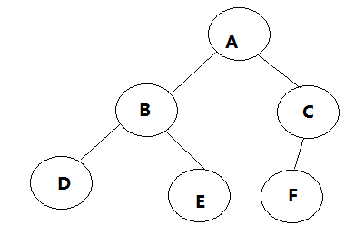
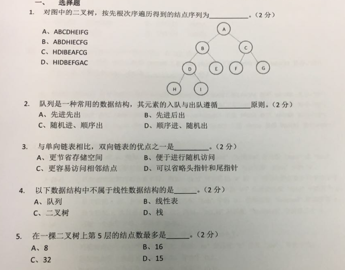

# 第14章_集合与数据结构拓展练习

讲师：尚硅谷-宋红康

网址：www.atguigu.com

***

## 选择填空题

### 1、前序、中序、后序遍历


分析：

完全二叉树： 叶结点只能出现在最底层的两层，且最底层叶结点均处于次底层叶结点的左侧



```
题1：
前序遍历：中左右  ABDECF

中序遍历：左中右  DBEAFC

后序遍历：左右中  DEBFCA
```

```
题2：n-i+1
```

### 2、线性结构


```
C
```

### 3、其它



```
1、先根次序遍历，就是前序遍历：
ABDHIECFG
2、队列先进先出
3、C
4、C
5、2的4次方是16个
```

## 编程题

### 4、单向链表构建

（1）定义一个单向链表SingleLinked类

- 包含私有的静态内部类Node
  - 包含Object类型的data属性和Node类型的next属性
  - 包含有参构造Node(Object data, Node next)
- 包含私有的单链表的Node类型的头结点first
- 包含public void add(Object element)方法，可以添加元素到当前单链表中
- 包含私有的非静态内部类Itr，Itr类实现java.util.Iterator接口
  - 包含Node类型的实例变量node，初始化为单链表的first
  - 重写boolean hasNext()方法，判断node结点是否为空
  - 重写Object next()方法，获取node对象的data值，并让node结点指向下一个结点

- 单向链表SingleLinked类实现java.lang.Iterable接口，
  - 重写Iterator iterator()方法，返回非静态内部类Itr的对象

（2）测试类中创建SingleLinked单链表的对象，并添加（张三、李四、王五、赵六）几个元素到单链表中，并用foreach循环变量输出。

```java
public class SingleLinked implements Iterable{
    private Node first;//单向链表的头

    private static class Node{
        Object data;
        Node next;

        Node(Object data, Node node) {
            this.data = data;
            this.next = node;
        }
    }

    public void add(Object element){
        Node newNode = new Node(element, null);
        if(first == null){
            first = newNode;
            return;
        }

        Node node = first;
        while(node.next !=null){
            node = node.next;
        }
        node.next = newNode;
    }

    @Override
    public Iterator iterator() {
        return new Itr();
    }

    private class Itr implements Iterator{
        Node node = first;
        @Override
        public boolean hasNext() {
            return node != null;
        }

        @Override
        public Object next() {
            Object element = node.data;
            node = node.next;
            return element;
        }
    }

	/* 
	暴露静态内部类
    public static class Knot{
        public Object data;
        public Knot next;
    }
    */

}
```

```java
public class Exercise4 {
    public static void main(String[] args) {
        //违反了高内聚低耦合的原则
/*        SingleLinked.Knot k1 = new SingleLinked.Knot();
        k1.data = "张三";

        SingleLinked.Knot k2 = new SingleLinked.Knot();
        k2.data = "李四";
        k1.next = k2;*/

        //高内聚低耦合
        SingleLinked link = new SingleLinked();
        link.add("张三");
        link.add("李四");
        link.add("王五");
        link.add("赵六");

        for (Object o : link) {
            System.out.println(o);
        }
    }
}
```

### 5、单向链表及其反转


单链表的实现

```java
public class OneWayLinkedList<E>{
	private Node<E> head;
	private int total;
	
	private static class Node<E>{
		E data;
		Node<E> next;
		Node(E data, Node<E> next) {
			this.data = data;
			this.next = next;
		}
	}

	public void add(E e) {
		Node<E> newNode = new Node<>(e,null);
		if(head==null){
			head = newNode;
		}else{
			Node<E> node = head;
			while(node.next!=null){
				node = node.next;
			}
			node.next = newNode;
		}
		total++;
	}

	public void delete(E e) {
		Node<E> node = head;
		Node<E> find = null;
		Node<E> last = null;
		
		if(e==null){
			while(node!=null){
				if(node.data==null){
					find = node;
					break;
				}
				last = node;
				node = node.next;
			}
		}else{
			while(node!=null){
				if(e.equals(node.data)){
					find = node;
					break;
				}
				last = node;
				node = node.next;
			}
		}
		
		if(find != null){
			if(last==null){
				head = find.next;
			}else{
				last.next = find.next;
			}
			total--;
		}
	}
	
	public void update(E old, E value) {
		Node<E> node = head;
		Node<E> find = null;
		
		if(old==null){
			while(node!=null){
				if(node.data==null){
					find = node;
					break;
				}
				node = node.next;
			}
		}else{
			while(node!=null){
				if(old.equals(node.data)){
					find = node;
					break;
				}
				node = node.next;
			}
		}
		
		if(find != null){
			find.data = value;
		}
	}

	public boolean contains(E e) {
		return indexOf(e) != -1;
	}

	public int indexOf(E e) {
		int index = -1;
		if(e==null){
			int i=0;
			for(Node<E> node = head; node!=null; node=node.next ){
				if(node.data==e){
					index=i;
					break;
				}
				i++;
			}
		}else{
			int i=0;
			for(Node<E> node = head; node!=null; node=node.next ){
				if(e.equals(node.data)){
					index=i;
					break;
				}
				i++;
			}
		}
		return index;
	}

	public Object[] getAll() {
		Object[] all = new Object[total];
		Node<E> node = head;
		for (int i = 0; i < all.length; i++,node = node.next) {
			all[i] = node.data;
		}
		return all;
	}

	public int size() {
		return total;
	}

	@SuppressWarnings("unchecked")
	public void reverse() {
		if(head!=null) {
			Node<E>[] all = new Node[total];
			Node<E> node = head;
			for (int i = 0; i < all.length; i++) {
				all[i] = node;
				node = node.next;
			}
			
			head = all[all.length-1];
			node = head;
			for (int i = all.length-2; i >= 0; i--) {
				node.next = all[i];
				node = node.next;
			}
		}
	}
}
```

```java
public class Exercise5 {
	public static void main(String[] args) {
		OneWayLinkedList<Integer> list = new OneWayLinkedList<>();
		for (int i = 1; i <= 5; i++) {
			list.add(i);
		}
		
		Object[] all = list.getAll();
		System.out.println(Arrays.toString(all));
		
		list.reverse();
		
		all = list.getAll();
		System.out.println(Arrays.toString(all));
	}
}
```

### 6、字符串压缩


```
实现简易字符串压缩算法，其中连续出现2次以上（含2次）的字母转换为字母和出现的次数。
例如：AAAABCCDEEEEE,压缩之后为A4BC2DE5。
```

代码实现：

```java
public class Exercise6 {
	public static void main(String[] args) {
//		String str = "AAAABCCDEEEEE";
		String str = "AAAABCCDEEEEEF";
		
		LinkedList<String> list = new LinkedList<>();
		int count = 0;
		for (int i = 0; i < str.length(); i++) {
			if(list.size()==0) {
				list.addLast(str.charAt(i)+"");
				count++;
			}else {
				if(list.getLast().equals(str.charAt(i)+"")) {
					count++;
				}else {
					if(count>1) {
						list.addLast(count+"");
					}
					list.addLast(str.charAt(i)+"");
					count=1;
				}
			}
		}
		
		if(count>1) {
			list.addLast(count+"");
		}
		
		while(list.size()!=0) {
			System.out.print(list.pollFirst());
		}
	}
}
```


