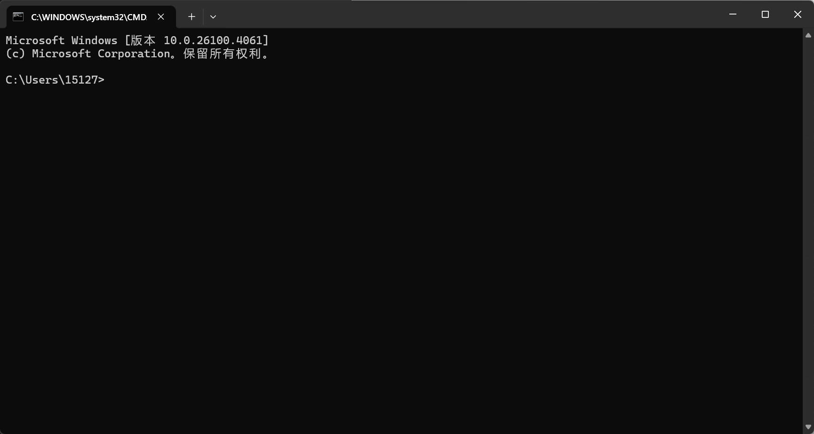
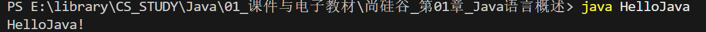

# java学习记录

# 一、Java语言概述

## 1.GUI 和 CLI
+ GUI 图形用户界面
Graphical User Inerface
+ CLI 命令行界面
Command Line Interface


***

## 2.dos系统
windows的前身,打开的cmd就是dos操作界面，windows中嵌入了dos
### 常用的dos命令
+ `cd 盘符:` : 盘符切换
`cd e:` : 切换到e盘,记得要有冒号
+ `dir` : 查看文件
+ `cd url` : 进入路径
+ `md` : 创建文件夹 make document
+ `rd` : 删除文件夹 remove document
+ `copy nul 文件名` : 创建空文件
`copy nul JavaStudy.txt`
+ `del 文件吗` : 删除文件
+ `cls` : 清屏
+ `exit` : 退出

***

## 3.java相关概念
+ JDK : java开发工具包(JDK中会包含JRE)
+ JRE : java开发环境
+ JVM : java虚拟机

***

## 4.java程序的运行过程
+ 编译 : javac HelloWorld.java
.java -> .class 字节码文件，和JVM一起实现了java的一次编译各处使用
注意.class文件名是和.java里面的类一样的名字，不是和.java文件一样的名字，并且.java里如果有多个类的话会生成多个.class文件
+ 运行 : java HelloWorld
具体示例
(1)创建一个HelloWorld.java文件

(2)填入内容，功能是输出HelloJava!
```
class HelloJava{
    public static void main(String[] args){
        System.out.println("HelloJava!");
        //println换行
        //print不换行
    }
}
```
(3)编译
javac HelloWorld.java

(4)运行
java HelloJava


***

## 5.Windows 和 Linux
Windows文件名对大小写不敏感,但是Linux对大小写敏感

***
## 6.注释
+ 单行注释 : `//`
+ 多行注释 : `/*    */`
+ 文档注释 : 
```
/**
*
*
*/
```

*** 
## 7. 文档注释
文档注释不单单是注释，通过工具 `javadoc` 可以生成网页展示的说明文档
`javadoc -d mydoc -author -version HelloWorld.java`

***

# 二、变量与运算符

## 1.标识符
字母，数字，下划线，**$**
+ 要注意有`$`

***

## 2.标识符命名规范
+ 包名: 全部小写
+ 类名,接口名: 单词首字母大写
+ 方法名,变量名: 第二个单词开始首字母大写
+ 常量名: 全部大写，单词之间下划线连接

***

## 3.数据类型
java数据类型有两个类: 基本数据类型和引用数据类型

### (1) 基础数据类型
**整型,浮点型,字符型,布尔型**
+ **整型**
byte    1
short   2
int     4
long    8
其中对long赋值要用L或l说明: long a = 123L
+ **浮点型**
float   4   7位有效
double  8   15位有效
注意浮点数有精度误差，不能表示准确的数
有精度要求的计算要用 BigDecimal 类
+ **字符型**
char    2
这里要注意,因为java使用的unicode字符集,会占两个字节
字符有三种表示方式：
1.直接表示 'a'
2.unicode编码表示 '\uXXXX'
3.转义字符表示，比如 '\n','\t'
+ **布尔型**
boolean
只有true和false两个值,不能用0或1表示
但是JVM中boolean使用int表示的，所以在JVM中又是用0代表false,用1代表true的

### (2)引用数据类型
数组,类,接口,枚举,注释,记录
+ 数组 arrays
+ 类 class 
+ 接口 interface
+ 枚举 enum
+ 注释 annotation
+ 记录 recode

***

## 4.自动类型转换

byte
short -> int -> long -> float -> double
char

注意：byte,short,char只要参与运算就会变成int,他们之间运算也会变成int

***

## 5.强制类型转换

`int a = (float)(1.0);`

有以下几点要注意：
1. 不能写成 `int a = float(1.0)`,并没有用
2. 要注意 += 之类的运算符是自带强制类型转换的
int a;
a += b 其实是 a = (int)(a + b);
并不是 a = a + b;

***

## 6.进制
+ 二进制 0b/0B
+ 八进制 0
+ 十进制
+ 十六进制 0x/0X

***

## 7.条件运算符比if else更高效

***

# 三、外部输入

## 1.使用键盘输入
使用流程
1.引入包
`import java.util.Scanner;` 记得要有分号
2.新建对象
`Scanner scan = new Scanner(System.in);`
3.调用方法
`int a = scan.nextInt();`
4.释放
`scan.close();`

***

## 2.Scanner可以调用的方法
+ `next()` : 下一个单词(空格间隔)
+ `nextLine()` : 下一行
+ `nextByte`,`nextInt()`,`nextLong`,`nextFloat`,`nextDouble`,`nextBoolean`

***
## 3.随机数
`Math.random`：会生成 `[0,1)` 的 double