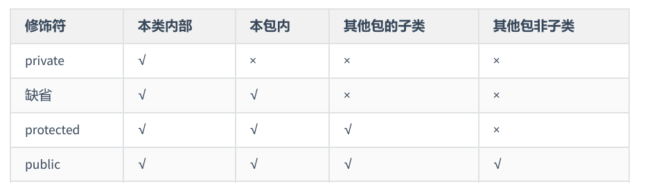
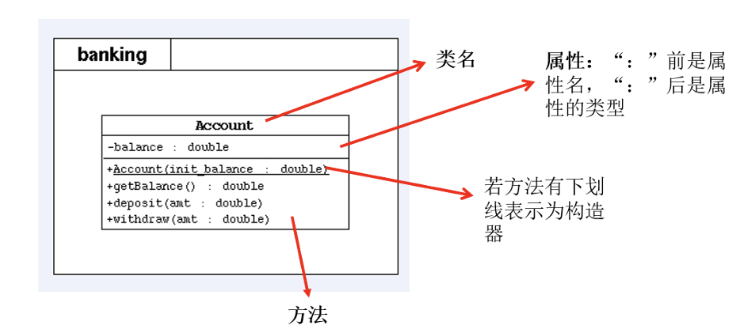

**类,数组都是引用数据类型**
+ 变量里面存的是地址(堆中对象的首地址)

**成员变量**

**方法**
java里方法不能独立存在，必须存放在类里

方法没有被调用的时候，都在方法区中的字节码文件(.class)中存储

**方法的重载**

**可变个数的参数**
+ 我感觉就相当于数组，用法也和数组差不多
+ int sums(int ...arr) 使用三个点
+ 可变个数形参的方法与同名的方法之间，彼此构成重载
+ 可变参数方法的使用与方法参数部分使用数组是一致的，二者不能同时声明，否则报错。
+ 方法的参数部分有可变形参，需要放在形参声明的最后
+ 在一个方法的形参中，最多只能声明一个可变个数的形参

java里方法的参数传递方式只有值传递一种
基本数据类型传送数据，引用数据类型传送地址

**关键字 package、import**
+ package 包
用于指明该文件中定义的类、接口等结构所在的包
package 顶层包名.子包名;
对 pack1\pack2\PackageTest.java 有 package pack1.pack2;
不要取 java.xxx 的包名

**包的作用**
+ 划分项目层次
+ 管理大型软件
+ 解决类命名冲突
+ 控制访问权限

**import 导入**
使用定义在其他包中的java类
+ import 在 package 和 主体之间
+ 如果导入的类或接口是java.lang包下的，或者是当前包下的，则可以省略此import语句。
+ 如果已经导入java.a包下的类，那么如果需要使用a包的子包下的类的话，仍然需要导入

**MVC设计模式**
分为三个层次：数据模型(Model),视图模型(Viewer),控制器(Controller)

**JDK中主要的包**
+ java.lang 包含一些Java语言的核心,如String,Math,Integer,System,Thread
+ java.net
+ java.io
+ java.util 包含一些实用工具类，如定义系统特性、接口的集合框架类、使用与日期日历相关的函数
+ java.text
+ java.sql
+ java.awt

**import 的用法**
+ import 包名.类名;
+ import static 组合的使用
调用指定类或接口下的静态的属性或方法(落脚于属性、方法)

**封装性**
+ 访问控制修饰符
public,protected,缺省,private

**权限的具体使用**
+ 类只能使用 public 或者 缺省

**封装性的体现**
+ 成员变量/属性私有化
私有化类的成员变量,提供公共的get和set方法,对外暴露获取和修改属性的功能
+ 私有化方法
一般成员实例变量习惯使用 private 修饰,在提供相应的 public 权限的get/set方法访问
对于 final 的实例变量,不提供 set() 方法
对于 static final 的成员变量,习惯上使用 public 修饰

**构造器**
public Student(String n,int a){
    name = n;
    age = a;
}

**UML类图**
+ UML : Unified Modeling Language 统一建模语言
+ 常用软件有 PowerDesinger,Rose,Enterprise Architect
+ public : +
  private : -
  protected : #
+ 方法的写法 : 方法的类型 方法名(参数名:参数类型):返回类型

**JavaBean**
+ 类是公共的
+ 有一个默认构造
+ 有属性，且有对应的get和set方法

alt + insert可以自动生成
或者 代码 -> 生成

**Java的引用数据类型**
+ 类,数组,接口,枚举,注解,记录