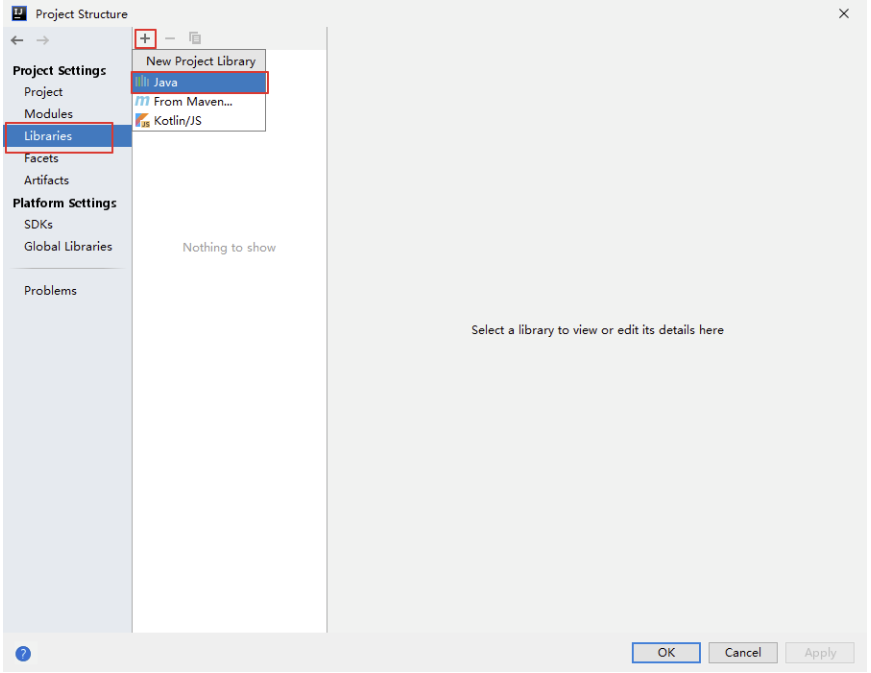
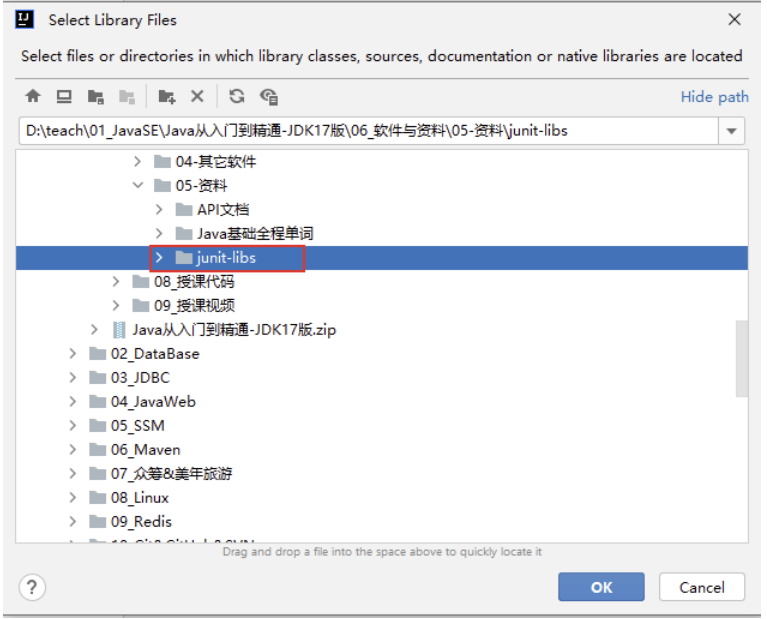
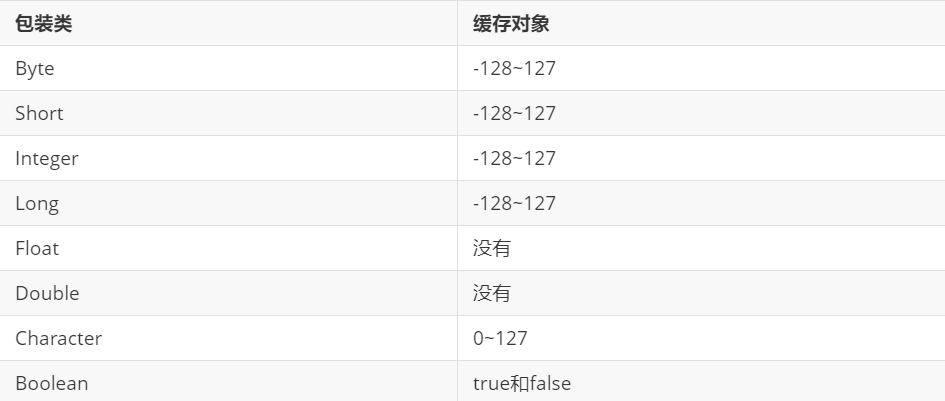

# 008 面向对象编程(高级)
## 1. static 关键词
`static` 让一个成员变量被类的所有实例所共享,称为类变量

### 1.1 static 修饰成员的特点
+ 随类的加载而加载
+ 优于对象存在
+ 可直接调用

### 1.2 静态变量
#### 1.2.1 语法格式
```java
public static int a;
```
+ 可以通过 `类名.静态变量` / `对象.静态变量` 方式访问
+ 静态变量的 get 和 set 方法也是静态的
+ 当局部变量和静态变量重名时,使用`类名.静态变量`进行区分
+ 静态变量存储在方法区

### 1.3 静态方法
#### 1.3.1 语法格式
```java
public static int getNum(){}
```
+ `static` 方法内部只能访问类的 `static` 修饰的属性或方法,不能访问类的非`static`的结构
+ 静态方法可以被继承,但不能被重写
+ 没有 `this` 和 `super`

***

## 2. 单例(Singleton)设计模式
+ 推荐书籍 : 《设计模式》

### 2.1 单例模式
在整个软件系统中,对某个类只能存在一个对象实例,并且该类只提供一个取得其对象实例的方法

### 2.3 实现思路
+ 将类的构造器的访问权限设置为 `private`,从而禁止 `new` 的使用
+ 调用该类的某个静态方法`以返回类内部创建的对象
+ 指向类内部产生的`该类对象的变量也必须定义成静态的

### 2.4 单例模式的两种实现方法
#### 2.4.1 饿汉式
```java
class Singleton{
    //1. 私有化构造器
    private Singleton(){}
    //2. 创建静态实例
    private static Singleton single = new Singleton();
    //3. 静态方法,返回创建的静态对象
    public static Singleton getInstance(){
        return single;
    }
}
```
#### 2.4.2 懒汉式
```java
class Singleton{
    //1. 私有化构造器
    private Singleton(){}
    //2. 声明静态实例
    private static Singleton single;
    //3. 静态方法,返回创建的静态对象
    public static Singleton getInstance(){
        if(single == null){
            single = new Singleton();
        }
        return single;
    }
}
```
### 2.4.3 对比饿汉式和懒汉式
+ 饿汉式在使用类的时候立即加载,可能会耗费内存,但没有多线程安全问题
+ 懒汉式在使用类的方法时才加载,但有多线程安全问题,可以进行改造

## 2.5 单例模式的优点
+ 减少了系统开销

## 2.6 单例模式的应用场景
+ windows的任务管理器和回收站
+ 应用程序的日志应用
+ 数据库连接池

***

## 3. 理解 main 方法的语法
```java
public static void main(String[] args){}
```
+ `public` : 因为 JVM 需要调用 main 方法,所以要是 public
+ `static` : JVM在启动的时候还没有任何对象,只知道类名,不能使用new
所以需要定义为 static ,让JVM通过 `类名.main` 的方法进行调用
+ args : 一个字符串数组,保存了传入的参数
```java
public class HelloWorld {
    public static void main(String[] args){
        for(var i:args){
            System.out.println(i);
        }
    }
}
```
java HelloWorld.java "a" "b" "c" 结果为:
```
a
b
c
```

***

## 4. 代码块
代码块是为了对Java类或对象进行初始化
### 4.1 类中可以声明的结构
+ 属性
+ 方法
+ 构造器
+ 代码块(初始化块)
+ 内部类


### 4.2 代码块的格式
```java
// 非静态代码块
{

}
// 静态代码块 
// 只能用 static 修饰
static {

}
```

### 4.3 代码块的使用
**(1) 静态代码块**
+ 随着类的加载自动执行
+ 类的加载之后执行一次,所以静态代码块只会执行一次
+ 用于初始化类
+ 只能调用静态的结构,不能调用非静态的结构

**(2) 非静态代码块**
+ 随着对象的创建自动执行
+ 每创建一个对象就会执行一次
+ 用于初始化对象

静态代码块的执行先于非静态代码块

### 4.4 实例变量赋值顺序
默认初始化 -> 显式,代码块 -> 构造器 -> 赋值 

***

## 5. final 关键字
### 5.1 修饰类
+ 表示这个类是最终的,不能被继承,没有子类
### 5.2 修饰方法
+ 表示这个方法不能被子类重写
### 5.3 修饰变量
+ 变量一旦赋值就不能修改
`final double PI = 3.14`
+ 如果某个成员变量用final修饰后，没有set方法，并且必须初始化（可以显式赋值、或在初始化块赋值、实例变量还可以在构造器中赋值）

***

## 6. 抽象类和抽象方法
使用 `abstract` 关键字
+ 抽象方法 : 没有方法体的方法
+ 抽象类 : 包含抽象方法的类

### 6.1 语法格式
+ 抽象类
```java
public abstract class A{

}
public abstract class B extends A{

}
```
+ 抽象方法
```java
abstract double show(); // 注意最后是分号,没有方法体
```

### 6.2 使用说明
+ 抽象类不能创建对象
+ 抽象类不一定包含抽象方法,但包含抽象方法的类一定是抽象类
通过 `abstract` 可以让调用者无法创建该类的对象
+ 不用修饰私有方法、静态方法、final方法、final类

***

## 7. 接口(interface)
接口就是规范,定义的一组规则

### 7.1 定义格式
+ 注意点
属性 : 必须使用 public static final
方法 : jdk8 之前: 声明抽象方法,修饰为 public abstract
       jdk8 : 声明静态方法、默认方法
       jdk9 : 声明私有方法
+ 声明格式
```
[修饰符] interface 接口名{
    // 接口的成员列表
    // 公共的常态变量
    // 公共的抽象方法

    // 公共的默认方法
    // 公共的静态方法
    // 私有方法
}
```
+ 具体例子
```java
public interface USB{
    // 静态常量
    // public static final 默认有,可以省略
    long MAX_SPEED = 500*1024*1024;//500MB/s
    // 抽象方法
    // public abstract 默认有,可以省略
    void in();
    void out();

    // 默认方法
    public default void start(){
        System.out.println("开始");
    }
    public default void stop(){
        System.out.println("结束");
    }
    //静态方法
    static void show(){
        System.out.println("USB 3.0可以同步全速地进行读写操作");
    }
}
```

### 7.2 接口的实现规则
+ 使用 implements 用类实现接口
`class Camera implements USB{}`
+ 一个类可以实现多个接口
`public class D extends C implement A,B{}`
+ 一个接口可以继承多个接口
`public interface C extends A,B{}`

### 7.3 接口多态的实现
```java
public class usbTest {
    public static void main(String[] args) {
        Computer computer = new Computer();
        USB camera = new Camera();
        computer.use(usb);
        USB printer = new Printer();
        computer.use(usb);
    }
}
```
+ 创建接口实现类的对象
```java
public class usbTest {
    public static void main(String[] args) {
        Computer computer = new Computer();
        Camera camera = new Camera();
        computer.use(camera);
        Printer printer = new Printer();
        computer.use(printer);
    }
}
```
+ 创建接口实现类的匿名对象
```java
public class usbTest {
    public static void main(String[] args) {
        Computer computer = new Computer();
        computer.use(new Camera());
        computer.use(new Printer());
    }
}
```
+ 创建接口匿名实现类的对象
```java
public class usbTest {
    public static void main(String[] args) {
        Computer computer = new Computer();
        USB usb = new USB(){
            public void start() {
                System.out.println("正在启动USB...");
            }
            public void stop() {
                System.out.println("正在关闭USB...");
            }
        };
        computer.use(usb);
    }
}
```
+ 创建接口匿名实现类的匿名对象
```java
public class usbTest {
    public static void main(String[] args) {
        Computer computer = new Computer();
        computer.use(new USB(){
            public void start() {
                System.out.println("正在启动USB...");
            }
            public void stop() {
                System.out.println("正在关闭USB...");
            }
        });
    }
}
```

***

## 8. 内部类
### 8.1 内部类的分类
(1) 成员内部类
+ 静态成员内部类
+ 非静态成员内部类
(2) 局部内部类
+ 非匿名局部内部类
+ 匿名局部内部类

***

## 9. 枚举类
使用 `enum` 关键字
+ 枚举类本质上也是一种类，不过对象是有限的、固定的,不能让用户随意创建
### 9.1 格式
+ 模板
```java
[修饰符] enum 枚举类名{
    常量对象列表; //一定在一开始
    对象的实例变量列表;
}
```
+ 具体例子
```java
public enum Season {
    //常量对象列表,一定要这个开始
    //默认就是 public static final Season,不要自己写
    SPRING("春天","春暖花开"),//对象之间用逗号
    SUMMER("夏天","夏日炎炎"),
    AUTUMN("秋天","秋高气爽"),
    WINTER("冬天","白雪皑皑");

    // 这里的 private final 要自己写
    private final String seasonName;
    private final String seasonDesc;

    Season(String seasonName, String seasonDesc) {
        this.seasonName = seasonName;
        this.seasonDesc = seasonDesc;
    }

    public String getSeasonName() {
        return seasonName;
    }

    public String getSeasonDesc() {
        return seasonDesc;
    }
}
```
+ enum 类的默认父类是 java.lang.Enum 类

### 9.2 enum 的常用方法
+ `String toString()` : 默认返回对象名
`System.out.println(Season.SPRING);`
`System.out.println(Season.SPRING.toString());`
+ `String name()` : 当前枚举常量的名称
`System.out.println(Season.SPRING.name());`
+ `static 枚举类型[] values()` : 返回枚举类型的对象数组
```java
Season[] values = Season.values();
for(var i : values){
    System.out.println((i.ordinal()+1) + "." + i.name());
}
```
+ `static 枚举类型 valueOf(String name)` : 把一个字符串转为对应的枚举类对象,要求字符串必须是枚举类对象的名字
根据静态变量名查找
```java
String name = "SPRING";
        System.out.println(Season.valueOf(name));
```
+ `int ordinal()` : 返回当前枚举常量的次序号

### 9.3 实现接口的枚举类
+ 整体实现方法
+ 单独实现方法

***

## 10. 注解
`annotation`
### 10.1 格式
`@注解`

### 10.2 注解的作用
+ 可以被编译器或其他程序读取,程序可以根据注解的不同做出相应的处理

### 10.3 常见注解的作用
+ 生成文档相关的注解
+ 在编译时进行格式检查
+ 跟踪代码依赖性,实现代替配置文件功能

### 10.4 三个最基本的注解
+ @Override
用于标记重写的方法
+ @Deprecated
用于标记过时的数据
+ @SuppressWarnings
用于抑制警告

### 10.5 元注解
对现有的注解进行解释说明的注解
+ @Target 用于描述注解的使用范围
+ @Retentino 用于描述注解的声明周期
+ @Documented 表明这个注解应该被 javadoc 工具记录
+ @Inherited 允许子类继承父类中的注解

### 10.6 单元测试
使用 JUnit 进行白盒测试
+ 需要引入 JUnit 库
+ 本地引入
    1. file -> project structure
    
    2. 加入本地下载库
    
    3. 选择在哪些模块中应用

+ **要求**
1. 所在的类必须是public的,非抽象的,包含唯一的无参构造器
2. @Test标记的方法本身必须是public,非抽象,非静态,无返回值,无参
```java
//标准示例
public class TestJUnit{
    @Test
    public void test1(){
        System.out.println("hello")
    }
}
```
+ **注意事项**
1. 在单元测试方法中使用Scanner时，并不能实现控制台数据的输入
在`idea64.exe.vmoptions配置文件`中加入下面一行设置，重启idea后生效
`-Deditable.java.test.console=true`

***

## 11. 包装类
让基本数据类型扩展为对象
是基本数据类型的变量具备应用数据类型变量的相关特征
### 11.1 包装类的种类
| 基本数据类型 |  包装类   |
| :----------: | :-------: |
|     byte     |   Byte    |
|    short     |   Short   |
|     int      |  Integer  |
|     long     |   Long    |
|    float     |   Float   |
|    double    |  Double   |
|   boolean    |  Boolean  |
|     char     | Character |

### 11.2 基本数据类型与包装类之间的转换
1. 为什么需要转换
+ 需要使用基本数据类型对应的包装类的对象进行一些处理
+ 对象不能进行运算

2. 基本数据类型转包装类
`Integer ii = Integer.valueOf(i);` 

3. 包装类转基本数据类型
`int num = obj.intValue();`

+ JDK5.0 之后其实可以自动进行
```java
Integer i = 4;
i++;
System.out.println(i);
System.out.println(i.toString());
```

### 11.3 对字符串的转换
(1) 基本数据类型或包装类转为字符串
+ 使用 `valueOf()`
```java
int i = 10;
String ii = String.valueOf(i);
```
+ 使用 `""`
```java
int i = 10;
String ii = i + "";
```
(2) 字符串装换为基本数据类型或包装类
+ 使用 `parseInt()`

### 11.4 包装类缓存对象

缓存里面的会共享使用
```java
Integer a = 1;
Integer b = 1;
System.out.println(a == b);//true

Integer i = 128;
Integer j = 128;
System.out.println(i == j);//false

Integer m = new Integer(1);//新new的在堆中
Integer n = 1;//这个用的是缓冲的常量对象，在方法区
System.out.println(m == n);//false

Integer x = new Integer(1);//新new的在堆中
Integer y = new Integer(1);//另一个新new的在堆中
System.out.println(x == y);//false
```
