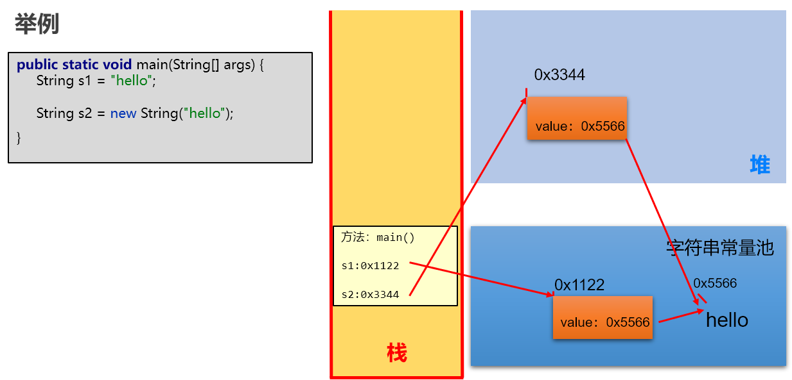

# 011 常用类和基础API
## 1. String
### 1.1 类的声明
```java
public final class String
    implements java.io.Serializable,Comparable<String>,CharSequence
```
+ Serializable : 可序列化接口,实现此接口的类的对象可以通过网络或本地流进行数据传输

### 1.2 内部声明的属性
+ jdk8中:
`private final char value[]`
+ jdk9以后:
`private final byte value[]`
为了节省内存空间

### 1.3 字符串常量的存储位置
+ 字符串存放在常量池中,常量池中不会有相同的两个值
+ jdk7之前常量池放在方法区中,之后放在堆空间
这个改动是为了便于GC(自动回收)的操作

### 1.4 字符串的不可变性
+ 不可变性
+ 字符串的拼接不是在常量池中新创建,而是在堆空间中创建
+ 改动都需要 new 

### 1.5 String 实例化的两种方式
1. `String s1 = "abc";`
2. `String s2 = new String("abc");`
+ 单独说 `String s2 = new String("abc");` 它其实创建了两个对象(一个在堆空间中,一个在常量池中)


### 1.6 String的连接操作
1. 常量 + 常量
2. 常量 + 变量
3. 变量 + 变量
+ 只要带变量就会 new , 没有就会在常量池中找
注意如果是`final String s`,那s是常量,不是变量
4. concat() 方法,一定会 new 

### 1.7 String的构造器和常用方法
#### 1.7.1 构造器
+ public String()
初始化一个表示空字符的序列
+ public String(String original) 
初始化一个对象,各种参数和original一致
+ public String(char[] value)
通过字符串数组来构造
+ public String(char[] value,int offset,int count) 
通过字符串数组的一部分进行构造
+ public String(byte[] bytes) 
通过平台的默认字符集解码当前参数中的字节数组来构造新的对象
+ puclic String(byte[] bytes,String charseName)
指定字符集

### 1.7.2 String 与 基本数据类型、包装类之间的转换
+ String -> 基本数据类型
`int n = Integer.parseInt(s);`
+ 基本数据类型 -> String
1. `String s = 1 + "";`
2. `String s = String().valueOf(1);`

### 1.7.3 String 与 char[] 之间的转换
+ String -> char[]
`char[] arr = "fadsfa".toCharArray()`
+ char[] -> String
`String s = new String(new char[]{'a','b','c'});`

### 1.7.4 String 与 byte[] 之间的转换
+ String -> byte[]
`byte[] arr = "fadsfsdaf".getBytes();`
utf-8 字符集中字母占据一个字节,汉字占据3个字节
`byte[] arr = "fafsdfada".getBytes("gbk");`
gbk 字符集中字母占据一个字节,汉字占据2个字节

### 1.7.5 常用方法
1. boolean isEmpty()
2. int length()
3. String concat() 拼接
4. boolean equals(Object obj) 比较字符串是否相等
5. boolean equalsIgnoreCase(Object obj) 比较字符串是否相等,忽略大小写
6. int compareTo(String string) 按照Unicode编码值比较大小
7. int compareToIgnoreCase(String string) 按照Unicode编码值比较大小,忽略大小
8. String toLowerCase() 大写变小写
9.  String toUpperCase() 小写变大写
10. String trim() 去掉字符串前后空白符
11. public String intern() 结果在常量池中共享

### 1.7.6 查找
1. boolean contains(String string) 是否包含 string
2. int indexOf(String string) 第一次出现 string 的下标,没有则返回 -1
3. int indexOf(String string,int fromIndex) 从 fromIndex 开始查找
4. int lastIndexOf() 从后向前,最后一次
5. int lastIndexOf(String string,int formIndex)

### 1.7.7 字符串截取
1. String substring(int beginIndex) 从beginIndex到最后
2. String substring(int beginIndex,int endIndex) 从beginIndex截取到endIndex(不含)

### 1.7.8 和字符/字符数组相关
1. char charAt(int index) 返回index位置的字符
2. char[] toCharArray() 转换为字符串数组返回
3. static String valueOf(char[] data) 返回指定数组中表示该字符序列的String
4. static String valueOf(char[] data,int offset,int count)
5. static String copyValueOf(char[] data) //不要用了,和valueOf一样
6. static String copyValueOf(char[] data,int offset,int count)

### 1.7.9 开头和结尾
1. boolean startsWith(String string) 是否以指定内容开始
2. boolean startsWith(String prefix,int toffset) 指定位置开始
3. boolean endWith(String string) 

### 1.7.10 替换
1. String replace(char oldChar,char newChar) 字符
2. String replace(CharSequence target,CharSequence replacement) 字符串
3. String replaceAll(String regex,String replacement) 使用正则表达式
4. String replaceFirst(String regex,String replacement) 替换第一个

## 1.8 String、StringBuffer、StringBuilder
+ String 不可变
+ StringBuffer 可变,线程安全,效率低
+ StringBuilder 可变,线程不安全,效率高
### 1.8.1 StringBuffer、StringBuilder的可变性分析
+ String 内部属性
`private final byte[] value;`
+ StringBuffer、StringBuilder 内部属性
```java
byte[] value;
int count;
```
### 1.8.2 使用选择
+ 当有很多对字符串的改动操作时使用 StringBuffer、StringBulider

### 1.8.3 常用API
1. StringBuffer append(String string) 追加
2. StringBuffer delete(int start,int end) 删除 [start,end) 之间的字符
3. StringBuffer deleteCharAt(int index) 
4. StringBuffer replace(int start,int end,String str)
5. void setCharAt(int index,char c) 替换index位置的字符
6. char charAt(int index)
7. StringBuffer insert(int index,String string)
8. int length()
9. StringBuffer reverse()

### 1.8.4 其他API
1. int indexOf(String string)
2. int indexOf(String string,int fromIndex)
3. int lastIndexOf(String string)
4. int lastIndexOf(String string,int fromIndex)
5. String substring(int start)
6. String substring(int start,int end)
7. String toString()
8. void setLength(int newLength)

***

## 2. 日期时间API (JDK8之前)
### 2.1 java.lang.System类的方法
+ `public static long currentTimeMilis()`
用来返回当前时间与1970年1月1日0时0分0秒之间以毫秒为单位的时间差
+ 世界时间主要标准
UTC,GMT,CST

### 2.2 java.util.Date
#### 2.2.1 构造器
+ Date date = new Date() 当前时间
+ Date date = new Date(long time) time

#### 2.2.2 使用
+ toString 当前时间,便于阅读
+ getTime 相对于1970年的毫秒数

### 2.3 java.sql.Date
是 java.util.Date 的子类
#### 2.3.1 构造器
+ `Date date = new Date(long time);`

### 2.4 SimpleDateFormat 类
用于日期时间的格式化和解析
#### 2.4.1 格式化 : 日期 -> 字符串
使用 format
```java
SimpleDateFormat sdf = new SimpleDateFormat();
Date date = new Date();
String strDate sdf.format(date)
```
+ **自定义格式**
```java
SimpleDateFormat sdf = new SimpleDateFormat(String pattern)
```
+ **pattern**
y : year
M : Month
d : day
h : hour (12)
H : Hour (24)
m : minute
s : second
"yyyy-MM-dd HH:mm:ss"

#### 2.4.2 解析 : 字符串 -> 日期
使用 parse
+ 注意只能认识 "2025/8/8 11:24" 这样的格式

### 2.5 Calendar
#### 2.5.1 获取实例
`Calendar calendar = Calendar.getInstance();`

#### 2.5.2 方法
+ get()
+ set()
+ add()
+ getTime()
+ setTime ()

***

## 3. LocalDate,LocalTime,LocalDateTime
+ now()
+ of() 

***

## 4. Java 比较器
### 4.1 Comparable
+ 在当前类中实现 Comparable 的 compareTo(Object o) 方法
+ Array.sort(arr)

### 4.2 comparator
+ 不能都compareTo进行修改时
+ 创建一个实现 comparator 实现类的对象
```java
Comparator comparator = new Comparator() {
    @Override
    public int compare(Object o1, Object o2) {
        if (o1 instanceof Product && o2 instanceof Product) {
            Product p1 = (Product) o1;
            Product p2 = (Product) o2;
            return p1.getName().compareTo(p2.getName());
        } else {
            throw new RuntimeException("对象异常");
        }
    }
};
Arrays.sort(products,comparator);
```

***

## 5. System
+ 属性
out,in,err
+ native long currentTimeMillis()
+ void exit(int status)
+ void gc()
+ String getProperty(String key)

***

## 6. Runtime

***

## 7. Math
+ public static double abs(double a) 绝对值
+ public static double ceil(double a) 大于等于 a 的最小整数
+ public static double floor(double a) 小于等于 a 的最大整数
+ public static long roung(double a) 返回最接近 a 的long
+ public static double pow(double a,double b)
+ public static double sqrt(double a)
+ public static double random() 返回 [0,1) 的随机值
+ public static final double PI
+ public static double max(double x,double y)
+ public static double min(double x,double y)
+ cin,sin,tan,acin,asin,atan

***

## 8. BigInteger

***

## 9. BigDecimal

***

## 10. java.util.Random
+ boolean nextBoolean() 
+ void nextBytes(byte[] bytes)
+ double nextDouble()
+ float nextFloat()
+ double nextGaussian() 伪随机数,高斯正态分布
+ int nextInt()


