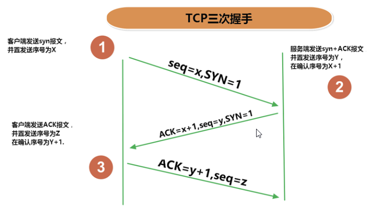

# 网络编程
## 1.网络编程概述
### 1.1 软件架构
在一定的协议下，实现两台计算机的通信的程序
+ C/S 架构
Client - Serve 客户端 - 服务器

+ B/S 架构 
Browser - Serve 浏览器 - 服务器

### 1.2 三个主要问题
定位主机 -> 定位主机上的应用 -> 数据传输

***

## 2. 网络通信要素
### 2.1 如何实现网络中的主机互相通信
1. 通讯双方地址
+ IP
+ 端口号
2. 一定的规则,网络通信协议
### 2.2 要素一: IP地址和域名
#### 2.2.1 IP地址
IP(Internet Protocol Address) 互联网协议地址
每一个计算机设备都有一个唯一的IP
#### 2.2.2 IP地址的分类
**IPv4/IPv6**
1. IPv4
32位二进制表示,通常8位一组,一共4组,用十进制表示,表示成 `a.b.c.d`的形式
其中 a,b,c,d 都是 0~255 之间的整数
+ IP地址 = 网络地址 + 主机地址
+ 例如: `192.168.1.200`
+ 2011年初就用完了
2. IPv6
128位二进制表示,16位一组,一共8组,用16进制表示，数之间用 `:` 隔开
+ 例如: `ABCD:EF01:2345:6789:ABCD:EF01:2345:6789`

**公网地址/私有地址**
+ `192.169.` 开头的是私有地址,地址范围 `192.168.0.0 - 192.168.255.255`
+ 常用命令
查看本机IP : `ifconfig`
检查网络连接 : `ping`
+ 特殊的IP地址
本地回环地址 : `127.0.0.1` (就是本机的意思)
主机名(hostName) : `localhost`

#### 2.2.3 域名
Internet上的主机有两种表示地址的方式
1. 域名(hostName) : www.baidu.com
2. IP地址(hostAddress) : 
+ 域名解析
域名是为了方便记忆,需要域名服务器(DNS,Domain Name System)将域名转化为IP地址才能和主机连接
+ 具体解析过程
1. 对`www.qq.com`,先在本地的`hosts`文件中看是否有相应网址映射关系,有就调用`hosts`中的IP地址映射
hosts 一般在 `C:\Windows\System32\drivers\etc\hosts` 
2. 查找本地DNS解析器缓存
查看方法 cmd -> ipconfig/displaydns
3. TCP/IP参数中设置的首选DNS服务器,本地DNS服务器
4. 本地DNS服务器缓存
5. 未用转发功能: 本地DNS就把请求发至13台根DNS,然后一级一级查询,结果返回本地DNS
6. 启用转发功能: 一级一级查询,结果返回本地DNS

### 2.3 要素二: 端口号
IP地址用于区分主机,端口号用于区分不同的进程
+ 两个字节表示的整数，它的取值范围是0~65535
+ 公认端口：0~1023。被预先定义的服务通信占用，如：HTTP（80），FTP（21），Telnet（23）
+ 注册端口：1024~49151。分配给用户进程或应用程序。如：Tomcat（8080），MySQL（3306），Oracle（1521）。
+ 动态/ 私有端口：49152~65535

### 2.3 要素三: 网络通信协议
为了实现可靠而高效的数据传输
+ 通信协议分层思想
同层间可以通信、上一层可以调用下一层、不能跨层调用、各层互不影响
+ OSI参考模型:理想模型
+ TCP/IP模型:事实上的国际标准

+ TCP/IP协议: 传输控制协议/因特网互联协议( Transmission Control Protocol/Internet Protocol)

***

## 3. InetAddress类的使用
### 3.1 使用
InetAddress类的一个实例代表了一个具体的ip地址

### 3.2 实例化方式
+ InetAddress getByName(String host)
+ InetAddress getLocalHost()

### 3.3 常用方法
+ String getHostName()
+ String getHostAddress()

***

## 4. TCP和UDP协议
java.net包下
+ TCP(Transmission Control Protocol) : 传输控制协议
+ UDP(User Datagram Protocol) : 用户数据报协议

### 4.1 TCP
+ 进行通信的两个应用进程: 客户端,服务端
+ 使用TCP协议前,要先建立TCP连接
+ 传输前,采用 **三次握手** 方法,点对点通讯,可靠
采用 **重发机制** ,发送后要接受确认信息,如果未接收到确认信息,会重新发送
+ 可进行大数量的传输
+ 需要释放已经建立的连接,效率低

### 4.2 UDP
+ 进行通信的两个应用进程: 发送端,接收端
+ 将数据、源、目的封装成数据包(传输的基本单位),不需要建立连接
+ 发送后不进行确认,不可靠
+ 每个数据报的大小限制在64K内
+ 发送结束后无需释放资源,效率高
+ 适合音频、视频和普通数据的传输

### 4.3 三次握手
TCP 发送数据前,客户端与服务端之间三次交互
1. 客户端向服务端发起TCP连接的请求
2. 服务端发送针对客户端TCP连接请求的确认
3. 客户端发送确认的确认


### 4.4 四次挥手
TCP 释放连接需要经过四次挥手
1. 客户端向服务器端提出结束连接,客户端不发送消息但可以接收消息
2. 服务器接收到客户端释放连接的请求后，`会将最后的数据发给客户端`。并告知上层的应用进程不再接收数据。
3. 服务器发送完数据后，会给客户端`发送一个释放连接的报文`。那么客户端接收后就知道可以正式释放连接了。
4. 客户端接收到服务器最后的释放连接报文后，要`回复一个彻底断开的报文


***

## 5. Socket类
+ Socket(标识符套接字) : 网络上具有唯一标识的IP地址和端口号的的组合
+ 由于Socket在网络应用开发程序中的广泛使用,网络通信其实就是Socket间的通讯
+ 主动发起通信的是客户端,等待通信请求的是服务端
+ 在两个Socket之间可以连接形成流,进行IO传输
+ Socket的分类
**流套接字(stream socket)**
ServerSocket : 实现TCP服务端的套接字类
Socket : 实现客户端的套接字类
**数据报套接字(datagram socket)**
DatagramSocket : 实现UDP发送端和接收端的套接字类

## 6. TCP 网络编程
### 6.1 通信模型


## 7. UDP 网络编程
```java
public class UDPTest {
    @Test
    public void sender() throws Exception{
        DatagramSocket datagramSocket = new DatagramSocket();

        InetAddress inetAddress = InetAddress.getByName("127.0.0.1");
        int port = 8989;
        byte[] butter = "我是发送端".getBytes(StandardCharsets.UTF_8);
        DatagramPacket packet = new DatagramPacket(butter,0,butter.length,inetAddress,port);
        datagramSocket.send(packet);
        datagramSocket.close();
    }

    @Test
    public void receiver() throws Exception{
        int port = 8989;
        DatagramSocket datagramSocket = new DatagramSocket(port);
        byte[] buffer = new byte[1024*64];
        DatagramPacket packet = new DatagramPacket(buffer,0,buffer.length);

        datagramSocket.receive(packet);
        String str = new String(packet.getData(),0, packet.getLength());
        System.out.println(str);
        datagramSocket.close();
    }
}
```

## 8. URL(Uniform Resource Locator) 统一资源定位符
### 8.1 作用
一个具体的url就对应着互联网上某一资源的地址
### 8.2 格式
http://192.168.21.107:8080/examples/abcdef.jpg?name=abc
应用层协议+IP地址+端口号+资源地址+参数列表
### 8.3 URL类的使用
```java
public class UDPTest {
    @Test
    public void URLTest() throws Exception{
        String str = "http://192.168.1.123:8080/example/abc.jpg?name=abc";
        URL url = new URL(str);
        System.out.println(url.getAuthority());
        System.out.println(url.getHost());
        System.out.println(url.getPort());
        System.out.println(url.getPath());
        System.out.println(url.getFile()); //获取文件名
        System.out.println(url.getQuery()); // 获取查询名
    }
}
```
### 8.4 下载文件
```java
public class UDPTest {
    @Test
    public void URLTest() throws Exception{
        String str = "https://bpic.588ku.com/element_origin_min_pic/23/07/11/d32dabe266d10da8b21bd640a2e9b611.jpg!r650";
        URL url = new URL(str);
        HttpsURLConnection httpsURLConnection = (HttpsURLConnection) url.openConnection();
        InputStream is = httpsURLConnection.getInputStream();

        File file = new File("src/UDP/image.jpg");
        FileOutputStream fos = new FileOutputStream(file);
        if(!file.exists()){
            file.createNewFile();
        }
        byte[] buffer = new byte[1024];
        int len = 0;
        while((len = is.read(buffer))!=-1){
            fos.write(buffer,0,len);
        }
        is.close();
        fos.close();
        httpsURLConnection.disconnect();
    }
}
```


