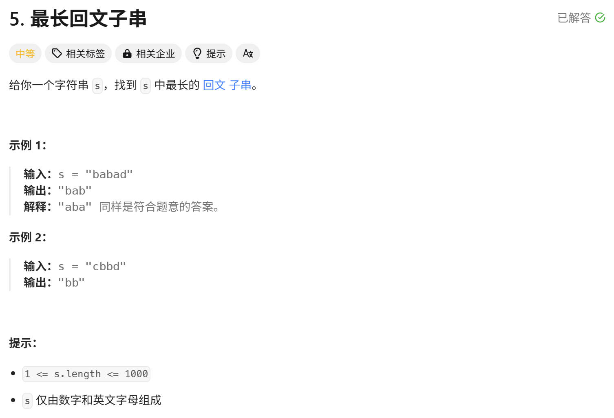

# 力扣 5 最长回文子串



## 解法一：动态规划

设 dp[i][j] 表示为子串 s[i...j] 是否为回文子串
dp[i][j] 由 dp[i+1][j-1] 得到
可以知道关系为：
```
if s[i] == s[j] : dp[i][j] = dp[i+1][j-1]
else : dp[i][j] = false
```
由 dp[i][j] = dp[i+1][j-1] 可见需要对dp[i][i] 和 dp[i][i+1]的情况特殊处理
也就是子串长度为 1 和 2 时要进行特殊处理

实现代码：
```
class Solution
{
public:
    string longestPalindrome(string s)
    {
        int n = s.length();
        //分配空间
        vector<vector<int>> dp(n, vector<int>(n));
        //长度为1的初始化
        for (int i = 0; i < n; ++i)
        {
            dp[i][i] = true;
        }
        //初始结果子串范围 s[left...right]
        int left = 0, right = 0;
        //遍历 L : 2 ... n
        for (int L = 2; L <= n; ++L)
        {
            for (int i = 0; i < n; ++i)
            {
                int j = i + L - 1;
                if (j >= n)
                    break;
                if (s[i] == s[j])
                {
                    //L = 2 的特殊处理
                    if (L == 2)
                    {
                        dp[i][j] = true;
                    }
                    else
                    {
                        dp[i][j] = dp[i + 1][j - 1];
                    }
                }
                else
                {
                    dp[i][j] = false;
                }
                //更新最长回文子串
                if (dp[i][j] && L > right - left + 1)
                {
                    left = i;
                    right = i + L - 1;
                }
            }
        }
        return s.substr(left, right - left + 1);
    }
};
```

***

## 解法二：中心扩展算法

遍历每一个点，得出以这个点为中心最大的回文子串
这里要注意中心的两种情况
一种是以一个点为中心，一种是以两个点为中心

实现算法：
```
class Solution
{
public:
    int expand(string s, int left, int right)
    {
        while (left >= 0 && right < (int)s.length() && s[left] == s[right])
        {
            left--;
            right++;
        }
        return right - left + 1 - 2;
    }
    string longestPalindrome(string s)
    {
        int left = 0;
        int maxlen = 1;
        for (int i = 0; i < (int)s.length(); ++i)
        {
            int len1 = expand(s, i, i);
            int len2 = expand(s, i, i + 1);
            int len = max(len1,len2);
            if (len > maxlen)
            {
                //中心点减去半径长得到起始点的位置
                left = i - (len - 1)/2;
                maxlen = len;
            }
        }
        return s.substr(left, maxlen);
    }
};
```

***

## 解法三：Manacher算法

运用了记忆化的方法简化了重复性的计算

实现算法：
```
class Solution
{
public:
    //计算半径长
    int expand(string s, int left, int right)
    {
        while (left >= 0 && right < s.length() && s[left] == s[right])
        {
            left--;
            right++;
        }
        return (right - left - 1) / 2;
    }
    string longestPalindrome(string s)
    {
        //构造处理字符串，统一奇数和偶数长字符串
        string tmp;
        tmp += '#';
        for (const auto &i : s)
        {
            tmp += i;
            tmp += '#';
        }
        s = tmp;
        vector<int> len;
        int left = 0;//最长回文子串开始位置
        int maxlen = 1;
        int C = -1;//中心
        int right = -1;//记忆化了的最右边
        for (int i = 0; i < s.length(); ++i)
        {
            int arm;
            //有记忆化就用记忆化的数据
            if (i <= right)
            {
                //右边和左边有对称关系
                arm = min(right - i, len[2 * C - i]);//不能超过右边界
                arm = expand(s, i - arm, i + arm);
            }
            else
            {
                arm = expand(s, i, i);
            }
            //下面都是更新数据
            len.push_back(arm);
            if (i + arm > right)
            {
                C = i;
                right = i + arm;
            }
            if (2 * arm + 1 > maxlen)
            {
                left = i - arm;
                maxlen = 2 * arm + 1;
            }
        }
        //还原
        string ans;
        for (int i = left; i < left + maxlen; ++i)
        {
            if (s[i] != '#')
            {
                ans += s[i];
            }
        }
        return ans;
    }
};
```