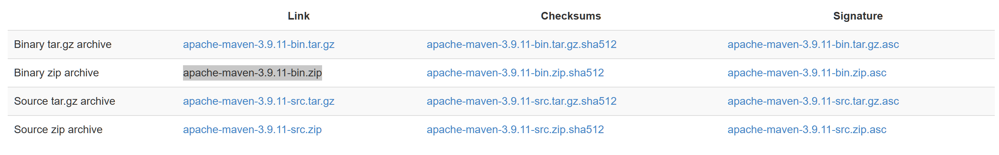
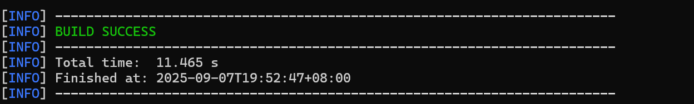

# maven
## 1. 作用
+ 自动化管理依赖

## 2. 下载Maven
Maven官网: https://maven.apache.org/
下载 -> apache-maven-3.9.11-bin.zip

E:\env\maven\apache-maven-3.9.11 目录下新建 repo 文件夹(用于存放maven的本地仓库,存放本地依赖)
复制路径

## 3. 配置环境变量
系统变量添加 MAVEN_HOME
值为 E:\env\maven\apache-maven-3.9.11
+ 配置路径
配置bin
+ 测试
`mvn --version`

## 4. 配置maven
conf -> setting.xml
1. 配置前面的repo的路径
46行
```xml
  <!-- localRepository
   | The path to the local repository maven will use to store artifacts.
   |
   | Default: ${user.home}/.m2/repository
  <localRepository>/path/to/local/repo</localRepository>
  -->
```
的下面
加上
```xml
<localRepository>E:\env\maven\apache-maven-3.9.11\repo</localRepository>
```

2. 配置国内镜像(最好不要,有些资源没有,反正我用是这样)
161行
```xml
<mirror>
    <id>maven-default-http-blocker</id>
    <mirrorOf>external:http:*</mirrorOf>
    <name>Pseudo repository to mirror external repositories initially using HTTP.</name>
    <url>http://0.0.0.0/</url>
    <blocked>true</blocked>
</mirror>
```
上方
```xml
<!-- 清华大学镜像 -->
<mirror>
    <id>tsinghua-maven</id>
    <mirrorOf>central</mirrorOf>
    <url>https://repo.maven.apache.org/maven2/</url>
</mirror>
<!-- 阿里云镜像 -->
<mirror>
    <id>aliyun-maven</id>
    <mirrorOf>central</mirrorOf>
    <url>https://maven.aliyun.com/repository/public</url>
</mirror>
```

3. 配置JDK
231行
```java
<profile>
  <id>jdk-1.4</id>
  <activation>
    <jdk>1.4</jdk>
  </activation>
  <repositories>
    <repository>
      <id>jdk14</id>
      <name>Repository for JDK 1.4 builds</name>
      <url>http://www.myhost.com/maven/jdk14</url>
      <layout>default</layout>
      <snapshotPolicy>always</snapshotPolicy>
    </repository>
  </repositories>
</profile>
```

4. 检验配置是否成功
`mvn help:system`(打印maven信息)
出现BUILD SUCCESS成功


## 5. 配置到idea中
1. 设置 -> 构建 -> 构建工具 -> Maven
2. 配置路径(bin上面一层)
`E:\env\maven\apache-maven-3.9.11`
3. setting 路径
4. repo路径
5. Maven -> 导入 -> JDK -> 选择JAVA_HOME
6. runner