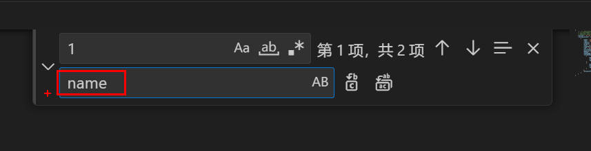
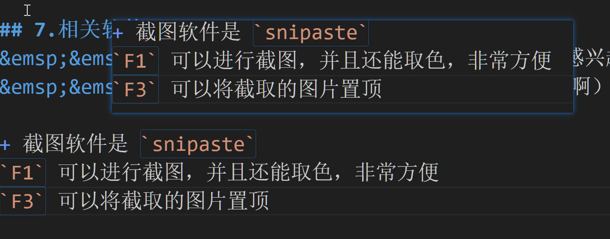

# 用 VScode 实现C++的多文件编译
手把手教你如何用 VScode 实现C++的多文件编译，通过这篇文章绝对可以让你成功运行
费尽巨大心血，无比详细，喂饭式讲解
看完你就能对多文件编译得心应手

如果想直接复制粘贴可以直接看第六部分，**建议不要**

## 1.创建工作目录
&emsp;&emsp;其实就是新建一个目录，然后用 vscode 打开，那这个目录就是工作目录
+ 这里要记住**工作目录**这个词，非常重要，下面还要用
+ 注意点：**所有文件**的名字都要用**英文**，全部都要用**英文**，全部都要用**英文**，非常非常重要，
如果有中文的话 vscode 可能会找不到路径

详细步骤示例：
+ 新建 `Multifile` 文件夹

+ 点击鼠标右键用 vscode 打开，此时这个 `Multifile` 文件夹就是工作目录


+ 最外面的就是工作目录


***

## 2.创建并配置 `launch.json` 文件
&emsp;&emsp;`launch.json` 文件按我的理解是vscode的一个自动化运行的配置文件，相当于宏命令，点击开始调试就会执行里面设定的命令
+ 先写好要用的 C++ 文件，我把他们放到了1文件夹下，1文件夹就相当于一个项目了。再次强调**文件名要是英文**

不要在意那个.vscode和output文件夹，这个图片是我后面截的，到这里没有才正常
测试代码如下：
main.cpp:
```
#include <iostream>
#include "Print.h"
using namespace std;
int main()
{
    Print a;
    a.print();
    return 0;
}
```
Print.h:
```
#ifndef PRINT
#define PRINT

class Print
{
public:
    void print();
};

#endif
```
Print.cpp
```
#include "Print.h"
#include <iostream>
using namespace std;

void Print::print()
{
    cout << "Multifile Runing" << '\n';
}
```
结果是输出 `Multifile Runing` 

+ 新建 `launch.json` 文件,这里要注意要先选中一个C++文件

这里选择 `C++(GDB/LLDB)` (因为这里用的是Mingw64,如果你用的不是这个那这篇文章就不能完全适用了)
1")
再选择 `C/C++(gdb) 启动`，
如果忘记点了也没有关系，点击右下角的添加配置可以添加
2")

+ 配置 `launch.json` 文件
文件内容如下,主要更改标号的那几个部分
注意啊，这个是原始文件，我把修改的内容写在注释里了
想要copy代码可以看第六部分
```
{
    // 使用 IntelliSense 了解相关属性。 
    // 悬停以查看现有属性的描述。
    // 欲了解更多信息，请访问: https://go.microsoft.com/fwlink/?linkid=830387
    "version": "0.2.0",
    "configurations": [
        {
            "name": "(gdb) 启动",
            "type": "cppdbg",
            "request": "launch",

            //111111111
            "program": "输入程序名称，例如 ${workspaceFolder}/a.exe",
            //改为 "program": "${workspaceFolder}/1/output/1.exe",
            //这里是更改生成的 .exe 文件放置的位置，下面会详细解释 

            "args": [],
            "stopAtEntry": false,
            "cwd": "${fileDirname}",
            "environment": [],

            //2222222222222
            "externalConsole": false,
            //这里的值 false 就在下面的终端运行，改为 true 会在一个新窗口运行

            "MIMode": "gdb",

            //333333333333
            "miDebuggerPath": "/path/to/gdb",
            //"/path/to/gdb" 改为 gdb.exe 文件的完整路径，示例："D:\\Mg\\mingw64\\bin\\gdb.exe"
            //gdb.exe 在你 mingw 安装目录下面的 bin 文件夹下

            "setupCommands": [
                {
                    "description": "为 gdb 启用整齐打印",
                    "text": "-enable-pretty-printing",
                    "ignoreFailures": true
                },
                {
                    "description": "将反汇编风格设置为 Intel",
                    "text": "-gdb-set disassembly-flavor intel",
                    "ignoreFailures": true
                }
            ],//注意这里要有一个英文逗号
            //444444444444444444444
            //加上下面这段话,记得取消注释啊
            //"preLaunchTask": "C/C++: g++.exe 生成活动文件"
        }
    ]
}
```
详细解释：
1. **第一个位置**
```
"program": "输入程序名称，例如 ${workspaceFolder}/a.exe",
//改为 "program": "${workspaceFolder}/1/output/1.exe",
```
+ ${workspaceFolder} 会自动填充当前**工作目录**的地址(即当前vscode打开的目录的地址)
  你们的一开始可能不是这个
+ 这里的作用是调试 工作目录下的1文件夹的output文件夹下(1.exe,1文件夹，output文件夹都是自己命名的)
  注意要和`task.json`中创建的路径相对应，下面会讲
  就是`launch.json` 的 `"program": "${workspaceFolder}/1/output/1.exe",`
  和`tasks.json` args里面的 `${workspaceFolder}/1/output/1.exe`

1. **第二个位置**
```
"externalConsole": false,
//这里的值 false 就在下面的终端运行，改为 true 会在一个新窗口运行
```
这看你们自己，我习惯在一个新窗口，所以就改了，这里也有要注意的地方，最后会说

1. **第三个位置**
```
"miDebuggerPath": "/path/to/gdb",
//"/path/to/gdb" 改为 gdb.exe 文件的完整路径，示例："D:\\Mg\\mingw64\\bin\\gdb.exe"
//gdb.exe 在你 mingw 安装目录下面的 bin 文件夹下
```
这里是环境配置，让`vscode`可以调用 `gdb.exe` ,如果实在找不到 `gdb.exe` 可以用 `everything` 找一下

1. **第四个位置**
```
//加上下面这段话
//"preLaunchTask": "C/C++: g++.exe 生成活动文件"
```
这里是配置执行 `launch.json` 前要执行的 `tasks.json` 任务
`"C/C++: g++.exe 生成活动文件"`就是配置的任务的名字，下面会讲

***

## 3.创建并配置 `tasks.json` 文件
+ 点击终端，再点击配置任务

+ 选择你要的编译器，一般是 g++.exe (g++是编译C++语言的，gcc是编译C语言的)
  我在下面那个g++是另外的mingw版本

+ 于是就生成了下面的 `tasks.json` 文件
修改标注的几个部分
```
{
	"version": "2.0.0",
	"tasks": [
		{
			"type": "cppbuild",
			"label": "C/C++: g++.exe 生成活动文件",//任务的名称，launch.json里面配置的任务名字要和这里一样
			"command": "D:\\Mg\\mingw64\\bin\\g++.exe",//这里就是你选择的编译器
            //这里其实就是调用了 cmd
            //相当于 ... -g ... -o ...
			"args": [
				"-fdiagnostics-color=always",
				"-g",

                //11111111111111111111
				"${file}",
                //改成 "*.cpp",

				"-o",

                //22222222222222222222
				"${fileDirname}\\${fileBasenameNoExtension}.exe"
                //改成 "${workspaceFolder}/1/output/1.exe"

			],
			"options": {
                
                //33333333333333333333
                //这里我的理解是打开 cmd 的位置
				"cwd": "${fileDirname}"
                //改成 "cwd": "${workspaceFolder}/1"

			},
			"problemMatcher": [
				"$gcc"
			],
			"group": "build",
			"detail": "编译器: D:\\Mg\\mingw64\\bin\\g++.exe"
		}
	]
}
```
+ 详细解释：
1. 第三部分
先讲第三部分，因为这一步是基础
```
//这里我的理解是打开 cmd 的位置
"cwd": "${fileDirname}"
//改成 "cwd": "${workspaceFolder}/1"
```
+ `${fileDirname}` : 自动填充当前文件所在的文件夹的地址，即 `task.json` 文件所在的位置
+ `${workspaceFolder}` ： 自动填充工作目录位置（应该知道工作目录什么意思了吧，不知道回看吧）
+ `"cwd": "${workspaceFolder}/1"` 的效果就是在 工作目录下的1文件夹下打开 `cmd` (这里文件夹1是自己取的名字，他会自动新建一个文件夹)
当然你也可以不这么写，自己指定一个位置也可以，不过要保证和第二部分的修改匹配

1. 第一部分
```
"${file}",
//改成 "*.cpp",
```
这里的效果是会编译所有带 `.cpp` 后缀的文件

1. 第二部分
```
"${fileDirname}\\${fileBasenameNoExtension}.exe"
//改成 "${workspaceFolder}/1/output/1.exe"
```
这里的效果是将编译后产生的 1.exe 文件放在 工作目录下的1文件夹的output文件夹下(1.exe,1文件夹，output文件夹都是自己命名的)

***

## 4.针对具体项目修改
1. 修改 `launch.json`
   + 进入 `launch.json`
   + ctrl + h 进行替换,替换为你的项目名

2. 修改 `tasks.json`
   + 进入 `tasks.json`
   + ctrl + h 进行替换,替换为你的项目名

  
***

## 5.运行
+ 完成上述步骤就可以进行调试了


+ 如果 `launch.json` 中 `"externalConsole": false,`
会在下方的终端运行


+ 如果 `launch.json` 中 `"externalConsole": true,`
会在新页面的终端运行
这时你会发现一个页面一闪而过，因为程序运行结束后就自动退出了
这时需要在主函数最后加一句话 `system("pause");` 进行暂停
```
#include <iostream>
#include "Print.h"
using namespace std;
int main()
{
    Print a;
    a.print();
    system("pause");
    return 0;
}
```
结果如下：

+ 请按任意键继续. . . 就是 `system("pause");` 的效果

有问题可以直接私信我
**编辑不易，麻烦点个赞吧，求求了**
悄悄说：如果能关注就更好了

***
## 6.简化版
1. 创建文件夹 multifile,用 vscode 打开
2. 创建文件夹，命名为 1
3. 写入文件
main.cpp:
```
#include <iostream>
#include "Print.h"
using namespace std;
int main()
{
    Print a;
    a.print();
    system("pause");
    return 0;
}
```
Print.h:
```
#ifndef PRINT
#define PRINT

class Print
{
public:
    void print();
};

#endif
```
Print.cpp
```
#include "Print.h"
#include <iostream>
using namespace std;

void Print::print()
{
    cout << "Multifile Runing" << '\n';
}
```
4. 配置`launch.json`文件
```
{
    "version": "0.2.0",
    "configurations": [
        {
            "name": "(gdb) 启动",
            "type": "cppdbg",
            "request": "launch",
            "program": "${workspaceFolder}/1/output/1.exe",
            "args": [],
            "stopAtEntry": false,
            "cwd": "${fileDirname}",
            "environment": [],
            "externalConsole": true,
            "MIMode": "gdb",
            "miDebuggerPath": "D:\\Mg\\mingw64\\bin\\gdb.exe"",//注意改地址，直接运行不了
            "setupCommands": [
                {
                    "description": "为 gdb 启用整齐打印",
                    "text": "-enable-pretty-printing",
                    "ignoreFailures": true
                },
                {
                    "description": "将反汇编风格设置为 Intel",
                    "text": "-gdb-set disassembly-flavor intel",
                    "ignoreFailures": true
                }
            ],
            "preLaunchTask": "C/C++: g++.exe 生成活动文件"
        }
    ]
}
```
要改一下 `gdb.exe` 的地址
5. 配置 `tasks.json` 文件
```
{
	"version": "2.0.0",
	"tasks": [
		{
			"type": "cppbuild",
			"label": "C/C++: g++.exe 生成活动文件",
			"command": "D:\\Mg\\mingw64\\bin\\g++.exe",
			"args": [
				"-fdiagnostics-color=always",
				"-g",
                "*.cpp",
				"-o",
                "${workspaceFolder}/1/output/1.exe"
			],
			"options": {
				"cwd": "${workspaceFolder}/1"
			},
			"problemMatcher": [
				"$gcc"
			],
			"group": "build",
			"detail": "编译器: D:\\Mg\\mingw64\\bin\\g++.exe"
		}
	]
}
```
要改一下 `gdb.exe` 的地址
6. 运行
+ 修改 `launch.json`
+ 修改 `tasks.json`
+ 成功运行

有问题可以直接私信我
**编辑不易，麻烦点个赞吧，求求了**
悄悄说：如果能关注就更好了

***

## 7.相关软件
&emsp;&emsp;有人对上面介绍时使用的截图软件和画图软件感兴趣吗
&emsp;&emsp;**关注并私信我**可以直接给你哦（有点无耻啊）,当然你也可以自己下载

+ 截图软件是 `snipaste`
`F1` 可以进行截图，并且还能取色，非常方便
`F3` 可以将截取的图片置顶


+ 画图软件是 `Zoomit`
`ctrl + 1` 可以放大画面
`ctrl + 2` 可以进行画图，画图时按住 `ctrl` 并拖动鼠标可以画矩形


