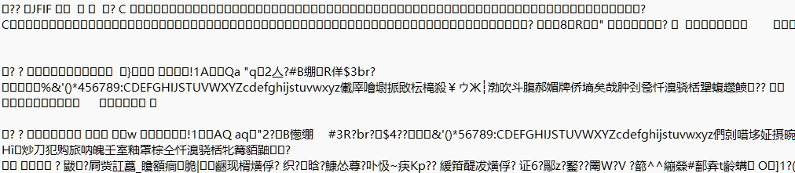

# dat文件到底有什么不为人知的秘密？     

先说结论 `.dat` 是一种通用的数据文件扩展名,是 `data` 的缩写,里面可以是任何文件，具体格式由创建它的程序自定义，他可能是一段文字,一个视频，一张图片，一个数据库，又或者是一段恶意代码。     
+ 这就意味着一个dat在打开之前永远是一个秘密     
     
下面就让我们深入了解一下 `.dat` 文件          
     
***     
     
## 1. dat文件有什么用     
这里我把它的作用概括为 `懒` , `骗` , `藏` 三个关键词     
### 1.1 懒     
懒得想新的扩展名，懒得在更新时顾及外部解析器     
### 1.2 骗     
骗windows别对文件处理,骗用户别打开这个文件     
### 1.3 藏     
藏着一个小天地,表面轻薄实际却可以是个压缩包     
     
***     
     
## 2. 如何打开dat文件     
一句话,怎么保存的就要用什么打开     
     
这里通过修改后缀的方式生成了两个对应的dat文件     
双击notebook.dat文件打开     
     
出现了这样的提示,可见win并不知道这是一个txt文件,选择文本编辑器打开     
     
可见内容正常     
下面我们再双击image.dat文件打开     
这时我们再选择文本编辑器打开     
     
怎么是一堆乱码,这是因为编码与解码不匹配造成的,也就是说钥匙和锁不匹配     
那我们换一把钥匙,用图片管理软件打开     
     
可见能成功打开     
     
**总结:**  什么格式的文件就用什么软件打开(具体是什么你就要猜了),其实也有些通用软件可以打开dat     

***

下面是私货(java对dat的使用)
## 3. 在Java中使用     
之所以想要了解 `dat` 文件也是因为最近在学java     
那在java中是如何使用dat文件的呢     
### 3.1 java 数据流/对象流     
java的数据流用于存储和使用基本数据类型和String类型的数据     
java的数据流既支持Java基本数据类型的数据读写，又支持Java对象的读写     
所以下面介绍对象流的使用     
### 3.2 主要使用类与方法     
**构造器**     
+ ObjectOutputStream(OutputStream out) 可见是对OutputStream的包装     
+ ObjectInputStream(InputStream in)     
**方法**     
+ 就是类似 `readInt(),writeInt()` 的形式     
### 3.3 使用     
+ **对基本数据类型与String类型**     
```java     
int id = 123;     
double price = 23.29;     
char gender = '男';     
String name = "火柴人";     
boolean sign = true;     

File file = new File("basic/src/files/information.dat");

//文件流
fos = new FileOutputStream(file);
//对象流
oos = new ObjectOutputStream(fos);
//输出到文件(序列化)
oos.writeInt(id);
oos.writeDouble(price);
oos.writeChar(gender);
oos.writeUTF(name);
oos.writeBoolean(sign);

//文件流
fis = new FileInputStream(file);
//对象流
ois = new ObjectInputStream(fis);
//读入(反序列化)
int id_copy = ois.readInt();
double price_copy = ois.readDouble();
char gender_copy = ois.readChar();
String name_copy = ois.readUTF();
boolean sign_copy = ois.readBoolean();
```
最后有完整代码     

+ **对引用数据类型**     
```java
ArrayList<Obj> list = new ArrayList<>(
        Arrays.asList(
                new Obj(123,23.29,'男',"火柴人",true),
                new Obj(101, 19.90, '女', "樱花",     false),
                new Obj(102, 58.00, '男', "钢铁侠",   true),
                new Obj(103,  9.99, '女', "泡泡糖",   true),
                new Obj(104, 42.50, '男', "暗影之刃", false),
                new Obj(105, 66.66, '女', "月光石",   true)
        )
);

File file = new File("basic/src/files/information.dat");

//文件流
fos = new FileOutputStream(file);
//对象流
oos = new ObjectOutputStream(fos);
//输出到文件(序列化)
oos.writeObject(list);

//文件流
fis = new FileInputStream(file);
//对象流
ois = new ObjectInputStream(fis);
//读入(反序列化)
@SuppressWarnings("unchecked")
ArrayList<Obj> list_copy = (ArrayList<Obj>) ois.readObject();
```

***

## 4. 总结     
可见dat文件的关键就是编码和解码的问题,以特定的方式存入dat文件中,然后可以用和他相匹配的解码方法进行正确的打开     

***

## 5. 代码
### 3.3.1
```java
public class FileTest {
    public static void main(String[] args) {
        int id = 123;
        double price = 23.29;
        char gender = '男';
        String name = "火柴人";
        boolean sign = true;

        //创建文件路径
        File file = new File("basic/src/files/information.dat");
        //如果没有文件就创建文件
        try {
            if(!file.exists()){
                if(file.createNewFile()){
                    System.out.println("文件成功创建");
                }else{
                    System.out.println("创建失败");
                }
            }else{
                System.out.println("文件存在");
            }
        } catch (IOException e) {
            System.out.println(e.getMessage());
        }
        FileInputStream fis = null;
        FileOutputStream fos = null;
        ObjectInputStream ois = null;
        ObjectOutputStream oos = null;

        try{
            //文件流
            fos = new FileOutputStream(file);
            //对象流
            oos = new ObjectOutputStream(fos);
            //输出到文件(序列化)
            oos.writeInt(id);
            oos.writeDouble(price);
            oos.writeChar(gender);
            oos.writeUTF(name);
            oos.writeBoolean(sign);

        }catch(IOException e){
            System.out.println(e.getMessage());
        }finally{
            try {
                if(oos!=null)
                    oos.close();
            } catch (IOException e) {
                System.out.println(e.getMessage());
            }
        }

        try{
            //文件流
            fis = new FileInputStream(file);
            //对象流
            ois = new ObjectInputStream(fis);
            //读入(反序列化)
            int id_copy = ois.readInt();
            double price_copy = ois.readDouble();
            char gender_copy = ois.readChar();
            String name_copy = ois.readUTF();
            boolean sign_copy = ois.readBoolean();
            //输出到控制台
            System.out.println("id: \t" + id_copy);
            System.out.println("price: \t" + price_copy);
            System.out.println("gender:\t" + gender_copy);
            System.out.println("name: \t" + name_copy);
            System.out.println("sign: \t" + sign_copy);
        }catch(IOException e){
            System.out.println(e.getMessage());
        }finally{
            try {
                if(ois!=null)
                    ois.close();
            } catch (IOException e) {
                System.out.println(e.getMessage());
            }
        }
    }
}
```
### 3.3.2
```java
public class FileTest {
    public static void main(String[] args) {
        ArrayList<Obj> list = new ArrayList<>(
                Arrays.asList(
                        new Obj(123,23.29,'男',"火柴人",true),
                        new Obj(101, 19.90, '女', "樱花",     false),
                        new Obj(102, 58.00, '男', "钢铁侠",   true),
                        new Obj(103,  9.99, '女', "泡泡糖",   true),
                        new Obj(104, 42.50, '男', "暗影之刃", false),
                        new Obj(105, 66.66, '女', "月光石",   true)
                )
        );

        //创建文件路径
        File file = new File("basic/src/files/information.dat");
        //如果没有文件就创建文件
        try {
            if(!file.exists()){
                if(file.createNewFile()){
                    System.out.println("文件成功创建");
                }else{
                    System.out.println("创建失败");
                }
            }else{
                System.out.println("文件存在");
            }
        } catch (IOException e) {
            System.out.println(e.getMessage());
        }
        FileInputStream fis = null;
        FileOutputStream fos = null;
        ObjectInputStream ois = null;
        ObjectOutputStream oos = null;

        try{
            //文件流
            fos = new FileOutputStream(file);
            //对象流
            oos = new ObjectOutputStream(fos);
            //输出到文件(序列化)
            oos.writeObject(list);
        }catch(IOException e){
            System.out.println(e.getMessage());
        }finally{
            try {
                if(oos!=null)
                    oos.close();
            } catch (IOException e) {
                System.out.println(e.getMessage());
            }
        }

        try{
            //文件流
            fis = new FileInputStream(file);
            //对象流
            ois = new ObjectInputStream(fis);
            //读入(反序列化)
            @SuppressWarnings("unchecked")
            ArrayList<Obj> list_copy = (ArrayList<Obj>) ois.readObject();
            //输出到控制台
            for(var i : list_copy){
                System.out.println(i);
            }
        }catch(IOException e){
            System.out.println(e.getMessage());
        } catch (ClassNotFoundException e) {
            throw new RuntimeException(e);
        } finally{
            try {
                if(ois!=null)
                    ois.close();
            } catch (IOException e) {
                System.out.println(e.getMessage());
            }
        }
    }
}

class Obj implements Serializable{
    @Serial
    private static final long serialVersionUID = 1L;

    private int id;
    private double price;
    private char gender;
    private String name;
    private boolean sign;

    public Obj() {
    }

    public Obj(int id, double price, char gender, String name, boolean sign) {
        this.id = id;
        this.price = price;
        this.gender = gender;
        this.name = name;
        this.sign = sign;
    }

    @Override
    public String toString() {
        return  "id= " + id +
                ", price= " + price +
                ", gender= " + gender +
                ", name= " + name +
                ", sign= " + sign;
    }
}
```