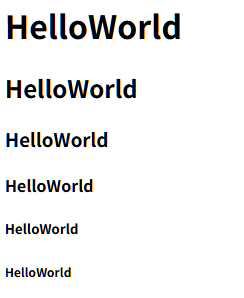
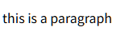
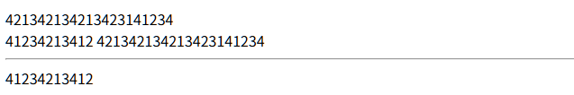
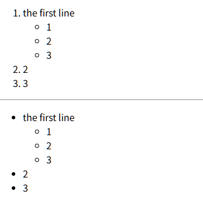
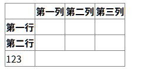
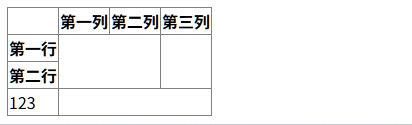
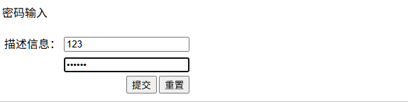
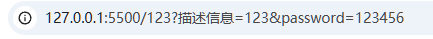
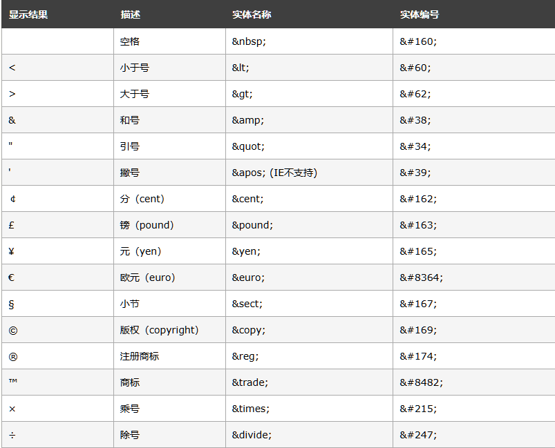

# HTML
## 1. HTML入门
### 1.1 HTML&CSS&JavaScript的作用
+ html用于网页主体结构的搭建
+ css用于页面元素的美化
+ JavaScript用于页面元素的动态处理

### 1.2 什么是html
HTML(Hyper Test Markup Language)超文本标记语言
+ html文件是浏览器负责解析和展示的
+ html文件是纯文本文件

***

## 2. HTML基本标签
1. html 文件的根标签
2. html根标签下有两个一级子标签<head><body>
+ <head>
头标签,定义那些不直接展示子啊页面主体上,但是又很重要的内容
比如：字符集、CSS引入、js引入
+ <body>
体标签，定义要展示到页面主体的标签
3. 注释 `<!-- -->`
```html
<!DOCTYPE html>
<html lang="zh-cn">
<html>
    <head> 
        <title>123</title>
        <meta charset="utf-8">
    </head>
    <body> </body>
</html>
```

***

## 3. HTML专业词汇
+ 标签 tag
+ 属性 attribute
+ 文本 text
+ 元素 element : 开始标签 + 属性 + 文本 + 结束标签

***

## 4.HTML注意细节
1. 根标签<html>有且只有一个
2. 标签可以嵌套但不能交叉嵌套
3. 属性名和属性值相同时可以省略属性值
4. 不严格区分单双引号
5. 不严格区分大小写但不能混用
6. 不允许自定义标签名
7. 属性之间用空格,不用逗号

***

## 5. HTML常见标签
## 5.1 标题标签
一共六级
```html
<h1>HelloWorld</h1>
<h2>HelloWorld</h2>
<h3>HelloWorld</h3>
<h4>HelloWorld</h4>
<h5>HelloWorld</h5>
<h6>HelloWorld</h6>
```


## 5.2 段落标签
```html
<p>this is a paragraph</p>
```


## 5.3 换行
+ `hr` 带分割线
```html
421342134213423141234 <br> 41234213412
421342134213423141234 <hr> 41234213412
```


## 5.3 列表标签
+ `<ol>` 有序列表
+ `<ul>` 无序列表
+ `<li>` 列表项
```html
<ol>
    <li>
        the first line
        <ul>
            <li>1</li>
            <li>2</li>
            <li>3</li>
        </ul>
    </li>
    <li>2</li>
    <li>3</li>
</ol>
<hr>
<ul>
    <li>
        the first line
        <ul>
            <li>1</li>
            <li>2</li>
            <li>3</li>
        </ul>
    </li>
    <li>2</li>
    <li>3</li>
</ul>
```


## 5.4 超链接标签
`<a>`
属性：
1. `href`
指定url
2. `target`
指定打开方式
+ _blank 新窗口打开
+ _self 当前窗口打开**(默认)**
```html
<a href="https://www.baidu.com/" target="_blank">baidu</a>
```

+ href的值的说明
`../` 上一层目录
`/` 工作目录

## 5.5 图片标签
``
属性
1. src 
2. title 定义鼠标悬停时显示的文字
3. alt 定义图片无法显示时显示的文字
```html

```

## 5.6 表格标签
### 5.6.1 简介
+ `<table>` 表格根标签
+ `<thead>` 表格头,可以省略
+ `<tbody>` 表格体,可以省略
+ `<tfoot>`表格尾,可以省略
+ `<tr>` 一行
+ `<td>` 一行中的一格
+ `<th>` 加粗居中的td
```html
<table border="1px" style="border-collapse: collapse;">
    <thead>
        <tr>
            <th></th>
            <th>第一列</th>
            <th>第二列</th>
            <th>第三列</th>
        </tr>
    </thead>
    <tbody>
        <tr>
            <th>第一行</th>
            <td></td>
            <td></td>
            <td></td>
        </tr>
        <tr>
            <th>第二行</th>
            <td></td>
            <td></td>
            <td></td>
        </tr>
    </tbody>
    <tfoot>
        
    </tfoot>
</table>
```


### 5.6.2 合并单元格
+ 行合并 `rowspan`
+ 列合并 `colspan`
注意要记得删除多余的单元格
```html
<table border="1px" style="border-collapse: collapse;">
    <thead>
        <tr>
            <th></th>
            <th>第一列</th>
            <th>第二列</th>
            <th>第三列</th>
        </tr>
    </thead>
    <tbody>
        <tr>
            <th>第一行</th>
            <td colspan="2" rowspan="2"></td>
            <td rowspan="2"></td>
        </tr>
        <tr>
            <th>第二行</th>
        </tr>
    </tbody>
    <tfoot>
        <tr>
            <td>123</td>
        </tr>
    </tfoot>
</table>
```


## 5.7 表单标签
### 5.7.1 form标签
属性
1. `action` 定义信息提交的服务器的地址
2. `method` 定义信息的提交方式
值:
+ `get` 数据会后缀到url后,以?作为参数开始的表示,对个参数用&隔开
+ `post` 数据会通过请求体发送,不会后缀到url后 

### 5.7.2 input标签
1. `name` 
2. `type`
值:
+ `text` 文本框
+ `password` 密码框
+ `submit` 提交按钮
+ `reset` 重置按钮
+ `radio` 单选框,要有相同的name
+ `checked` 默认勾选
+ `checkbox` 复选框
+ `hidden` 隐藏域,页面上不显示
+ `readonly` 只读
+ `disable` 弃用
+ `file` 文件上传
```html
<form action="123" method="get">
    <p>密码输入</p>
    <table>
        <tr>
            <td>描述信息：</td>
            <td><input type="text" name="描述信息"></td>
        </tr>
        <tr>
            <td></td>
            <td><input type="password" name="password"><br></td>
        </tr>
        <tr>
            <td colspan="2" style="text-align: right;">
                <input type="submit">
                <input type="reset">
            </td>
        </tr>
    </table>
</form>
```



### 5.7.3 提交方式的特点
1. get
+ 数据暴露
+ 地址栏长度有限,提交的数据量不大
+ 只能提交字符,不能提交文件

### 5.7.4 其他标签
1. 文本域
`<textarea>`
2. 下拉框
+ `select`
+ `option` 提交的时候如果没有设定value会自动提交option包围的内容
属性 `selected` 默认选择

## 5.8 布局相关标签
+ `div` 块标签
+ `span` 行内标签


## 5.9 特殊符号


