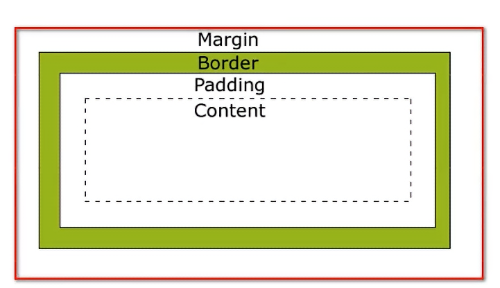

# CSS
## 1. CSS简介
CSS(Cascading Sytle Sheets)
层叠样式表

***

## 2. CSS引入方式
1. 行内式
通过 `style` 属性
2. 内嵌式
在<head>的<style>中
3. 外部样式表
使用 <link>
属性
+ href  url
+ rel   类型    css是stylesheet

***

## 3. 三大选择器
1. 元素选择器
2. 类选择器 `.`
3. id选择器 `#`

***

## 4. 浮动
1. display
值:
+ block
+ inline
+ inline-block
2. float
会挤出文字

***

## 5. 定位
1. position
+ static 静态
+ absolute 绝对,相对页面
+ fixed 相对,相对窗口
+ relative 相对,相对原本的位置,不让出原来的位置
2. right,left,top,bottom

***

## 6. 盒子模型

+ margin 外边界
+ border 边框
+ padding 内边界
+ content 实际内容

