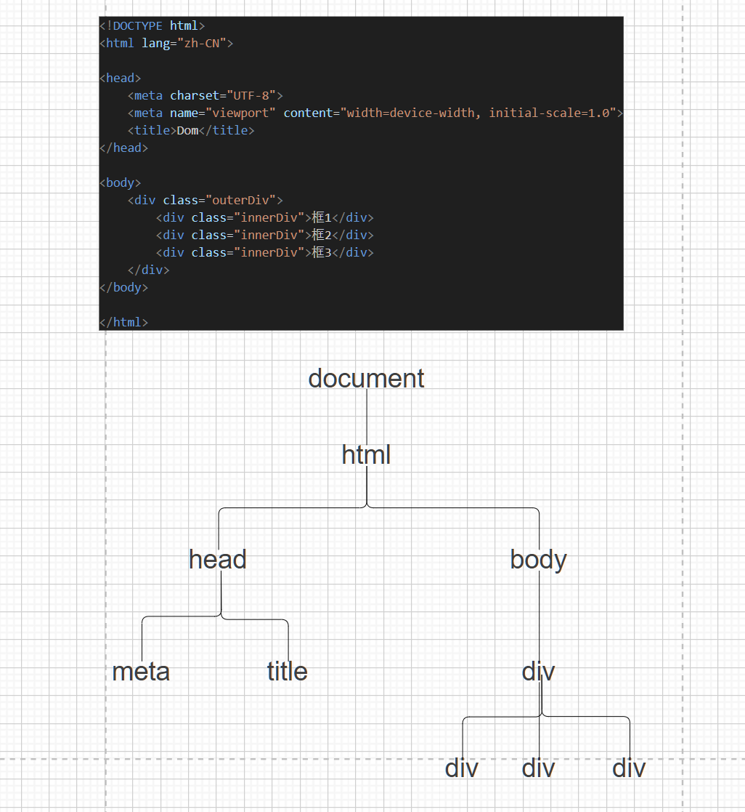

# JavaScript
## 1. 简介
脚本语言，不需要编译
+ 弱类型
+ 事件驱动
+ 跨平台
**简单使用**
+ 函数
`function name(){}`
+ 使用
记得使用函数要带上括号
`<input type="button" value="你好" onclick="hello()">`
+ 代码写不写分号都可以

***

## 2. 引入方式
1. 内嵌式
通过<script>实现
2. 外部链接
使用<script></script>
+ 注意是一对,中间最好不要有任何字符
属性:
+ src
+ type text/javascript

***
## 3. 变量和数据类型
### 3.1 变量的声明
使用 var 进行声明
在声明时不指定类型,在赋值时才确定类型(弱类型)
+ 输出 `concole.log()`
在日志中可见
+ var声明的变量可以重复声明
+ 大小写敏感
### 3.2 常见数据类型
+ 数值类型      number 整数和小数
+ 字符串类型    string
+ 布尔类型      boolean
+ 引用类型      Object
+ function类型 function
+ 命名未赋值    undefine
+ 赋予null     Object
+ 数组
`var arr = ["",""]`

***

## 4. 运算符
1. 算术运算符
+ `/` 不是整除
+ 除0 Infinity(无限大)
+ 模0 NaN(Not a Number)
2. 复合算术运算符
3. 关系运算符
多了一个 `===`
+ `==` 如果两边的数据类型不一致,会尝试将两边的数据都转换为数字进行比较
123 -> 123
true -> 1
false -> 0
+ `===` 直接进行比较
1. 逻辑运算符
2. 条件运算符
3. 位运算符

***

## 5. 流程控制语句
+ 输入`prompt("提示")`
返回值是string,转换为整数 `parseInt()`
分支，选择，循环
+ 和C语言一样
+ 打印在浏览器上
`document.write`
+ foreach
`for(var i in arr)`
注意这里的i是索引,不是值

***

## 6. 函数
### 6.1 函数声明的方法
1. `function name(){}`
2. `var name = function{}`
+ 参数类型不用写
+ 实参和形参的类型可以不一致,可以通过arguments数组选择调用
`var function name(a,b){}`

***

## 7. 对象的创建
+ 没有类,直接就是对象
1. `new Object()`
+ 添加属性
person.name="张三"
person.eat = function(food){
    console.log(this.name + "吃" + food);
}
2. `{属性名:属性值,...,函数名:function(){}}`
属性名加不加双引号都可以,但最好加上去

***

## 8. JSON格式
JSON(JavaScript Object Notation)JS对象简谱
+ 一种轻量级的数据交换格式
+ 一种字符串格式
+ 用于前后端数据交互
### 8.1 JSON格式的语法
```javascript
var personStr = `{"属性名":属性值}`
```
+ 字符串必须要加双引号,属性名必须加双引号
### 8.2 前端使用
```javascript
var personStr = '{"name":"张三","age":10,"dog":{"dname":"小花"},"loveSingers":["张晓明","张小东"],"friends":[{"fname":"小红"},{"fname":"小明"}]';
var person = JSON.parse(personStr);
```
+ 对象 -> JSON 
使用 `JSON.stringify()`
### 8.3 java使用
+ 这里使用jackson库进行操作
**Object <-> json**
```java
public class JsonTest {
    @Test
    public void objectToString() throws JsonProcessingException {
        //实例化对象
        Dog dog = new Dog("小黄");
        Person person = new Person("小明",18,dog);
        //对象装换为JSON 可以使用Gson,Jackson,Fastjson
        ObjectMapper objectMapper = new ObjectMapper();
        String personStr = objectMapper.writeValueAsString(person);
        System.out.println(personStr);
    }

    @Test
    public void stringToObject() throws JsonProcessingException {
        String personStr ="{\"name\":\"小明\",\"age\":18,\"dog\":{\"name\":\"小黄\"}}";
        ObjectMapper objectMapper = new ObjectMapper();
        Person person = objectMapper.readValue(personStr,Person.class);
        System.out.println(person.toString());
    }
}
```
**Map <-> json**
```java
@Test
public void mapToString() throws JsonProcessingException {
    Map<String,Integer> map = new HashMap<>();
    map.put("小明",18);
    map.put("小红",19);
    ObjectMapper objectMapper = new ObjectMapper();
    String mapStr = objectMapper.writeValueAsString(map);
    System.out.println(mapStr);
}
@Test
public void stringToMap() throws JsonProcessingException {
    String mapStr = "{\"小明\":18,\"小红\":19}";
    ObjectMapper objectMapper = new ObjectMapper();
    Map<String,Integer> map = objectMapper.readValue(mapStr,Map.class);
    System.out.println(map);
}
```

**Array <-> json**
```java
@Test
public void test1() throws JsonProcessingException {
    int[] arr ={1,2,3};
    ObjectMapper objectMapper = new ObjectMapper();
    String arrStr = objectMapper.writeValueAsString(arr);
    System.out.println(arrStr);
}
@Test
public void test2() throws JsonProcessingException {
    String arrStr = "[1,2,3]";
    ObjectMapper objectMapper = new ObjectMapper();
    int[] arr = objectMapper.readValue(arrStr,int[].class);
    for(var i : arr){
        System.out.println(i);
    }
}
```

***

## 9. js常用对象
### 9.1 数组
`var arr = new Array()`
`var arr = new Array(len)`
`var arr = new Array(num1,num2)`
`var arr = [num1,num2]`

+ concat
合并并创建一个新的数组，不改变原来的数组
+ pop
+ push(num)
+ indexOf()
+ reverse()
+ join()
转换为字符串
+ slice()
截取
+ splice(start,len,addContent)
修改
### 9.2 Boolean
### 9.3 Date
### 9.4 Math
### 9.5 Number
### 9.6 String

***

## 10. 事件
+ 浏览器或用户行为
+ js是时间驱动的
### 10.1 鼠标事件
+ onclick 单击
+ ondblclick 双击
+ oncontextmenu 右键
+ onmousedown 鼠标被按下
+ onmouseup 鼠标按键松开
+ onmousemove 鼠标移动(单独对一个元素)
+ onmouseenter 鼠标移入
+ onmouseleave 鼠标移出
+ onmouseover 鼠标移入(子元素也起作用)
+ onmouseout 鼠标移出(子元素也起作用)
### 10.2 键盘事件
+ onkeydown 按下
+ onkeypress 按下并松开
+ onkeyup 松开
### 10.3 表单事件
+ onblur 失去焦点
+ onfocus 得到焦点
+ onchange 内容改变
+ onfocusin 即将获取焦点
+ onfocusout 即将失去焦点
+ oninput 获取输入时
+ onreset 重置时
+ onsearch 向<input='search'>中输入文本时
+ onselect
+ onsubmit
onsubmit要写在<form>中
可以使用 `event.preventDefault()` 阻止组件的默认行为

***

## 11. 弹窗的三种方式
1. alert() 信息提示框
2. prompt() 信息输入框
3. confirm() 信息确认框
**阻止提交**
+ 方法一
```javascript
<!DOCTYPE html>
<html lang="zh-cn">

<head>
    <meta charset="UTF-8">
    <meta name="viewport" content="width=device-width, initial-scale=1.0">
    <title>Document</title>
    <script src="test.js"></script>
</head>

<body>
    <form action="test.html" onsubmit="onsubmitTest(event)">
        <input type="submit" value="提交">
    </form>
</body>

</html>

function onsubmitTest(event) {
    var key = confirm("确认提交吗");
    if (!key) {
        event.preventDefault();
    }
}
```
+ 方法二
```javascript
<!DOCTYPE html>
<html lang="zh-cn">

<head>
    <meta charset="UTF-8">
    <meta name="viewport" content="width=device-width, initial-scale=1.0">
    <title>Document</title>
    <script src="test.js"></script>
</head>

<body>
    <form action="test.html" onsubmit="return onsubmitTest(event)">
        <input type="submit" value="提交">
    </form>
</body>

</html>

function onsubmitTest(event) {
    var key = confirm("确认提交吗");
    if (key) {
        return true;
    }else{
        return false;
    }
}
```

***

## 12. 事件通过DOM编程进行绑定和触发
+ 通过DOM编程动态绑定
+ 页面加载事件 onload 页面加载完毕事件
### 12.1 绑定和触发
1. 元素设置id
`<button id = "btn">按钮</button>`
2. 通过dom获取要操作的元素
`var btn = document.getElementById("btn")`
3. 绑定一个事件
```javascript
btn.onclick=function(){
    alert("hello");
}
```
4. 要使用 onload
```javascript
<body onload="ready()">

</body>

function ready(){
    var btn = document.getElementById("btn")
    btn.onclick=function(){
    alert("hello");
}
}
```
或者
```javascript
windows.onload = function(){
    var btn = document.getElementById("btn")
    btn.onclick=function(){
        alert("hello");
    }
}
```

***

## 13. BOM编程
### 13.1 概念
BOM(Browser Object Model)
+ 没有统一标准
+ 将浏览器的各个组成部分抽象成各个对象
### 13.2 BOM的对象结构
+ window 代表整个浏览器窗口
    - location      地址栏
    - history       访问历史
    - screen        屏幕
    - navigator     浏览器软件本身
    - document      html文档
    - console       控制台
    - localStorage  本地数据持久化存储
    - sessionStorage本地数据会话级存储
### 13.3 window的API
+ `window.`可以省略不写
1. 三种弹窗方式
+ alert
+ prompt
+ confirm
2. 定时任务
setTimeout(function,time)
### 13.4 history
1. forwrad() 
向后翻一页
2. back()
向前翻页
3. go()
翻页
### 13.5 location
1. href(属性,不是方法)
地址栏地址
### 13.6 sessionStorage/localStorage
1. setItem()
存储
`setItem("key","value")`
2. getItem()
读取
`getItem("key")`
3. removeItem()
移除
`removeItem("key")`

***

## 14. DOM编程
DOM(Document Object Model)
+ 使用document对象的API完成对网页HTML文档进行动态修改
### 14.1 dom的相关概念
dom是树形结构的
1. dom树上的结点类型

node结点
1. element 元素结点 
2. attribute 属性结点
3. text 文本结点
### 14.2 获取页面元素的几种方式
#### 14.2.1 在整个文档内查找
1. 根据id值查询
`document.getElementById("id")`
返回一个元素节点
2. 根据标签名查询
`document.getElementByTagName("tagName")`
返回元素节点数组
+ 对数组遍历不要用foreach，foreach会遍历attribute
3. 根据name数值查询
`document.getElementByName("name")`
返回元素节点数组
4. 根据类名查询
`document.getElementByClassName("className")`
返回元素节点数组
#### 14.2.2 在具体元素节点范围内查找子节点
+ 要先获取父元素或子元素element
1. 查找子标签
`element.children`
2. 查找第一个子标签
`element.firstElementChild`
3. 查找最后一个子标签
`element.lastElementChild`
4. 获取父元素
`element.parentElement`
5. 获取兄弟元素
`element.previousElementSibling`
`element.nextElementsibling`

### 14.3 操作元素
#### 14.3.1 属性操作
1. 读取数据 
`element.attribute`
2. 修改操作
`element.attribute = value`
#### 14.3.2 内部文本操作
1. 获取或设置标签体的文本内容
`element.innerText`
2. 获取或设置标签体内容
`element.innerHTML`
#### 14.3.3 增删元素
1. `document.createElement("tagName")`
创建元素节点并返回,但不会自动添加到文档中
2. `document.createTextNode("text")`
创建文本节点并返回,但不会自动添加到文档中
3. `parentEle.appendChild(ele)`
将ele添加到parentEle所有子节点之后
4. `parentEle.insertBefore(newEle,targetEle)`
将newEle插入到targetEle面前
5. `parentEle.replaceChild(newEle,oldEle)`
用新节点替换原有的旧子节点
6. `element.remove()`
删除某个标签
7. `element.innerHTML = ""`
清空

***

## 15. 正则表达式
+ 用于字符串匹配
+ `var patt = new TegExp(pattern,modifiers);`
+ `var patt = /pattern/modifiers;`
### 15.1 修饰符
1. i 大小写不敏感
2. g 全局匹配
3. m 多行匹配
### 15.2 相关使用
+ ^ 开始
+ $ 结尾
+ [] 匹配其中一个字符
+ {num1,num2} 重复次数(num1~num2次)
+ `+` 至少一个
+ `*` 0个或多个
+ ? 0个或一个
+ \w 字母数字下划线
+ \d 数字
+ \s 空格


