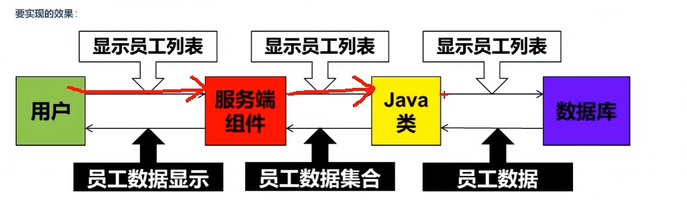

# servlet
## 1. 动态资源和静态资源
1. 静态资源
已经存在
2. 动态资源
动态生成

## 2. servlet简介
servlet 能处理客户端请求并做出响应的一套技术标准


要实现的效果


## 3. 示例
1. 创建web项目,加入依赖
2. 继承 HttpServlet
3. 重写 Server 方法
```java
public class Servlet extends HttpServlet {
    @Override
    protected void service(HttpServletRequest req, HttpServletResponse resp) throws ServletException, IOException {
        //1. 获取请求报文对象 req 信息
        //使用的get的方法应该会是 http://servlet/userServlet?username=...
        String username = req.getParameter("username"); //通过参数名获取参数值
        //2. 处理
        String key = "false";
        if(username.equals("123")){
            key = "true";
        }
        //3. 将要响应的数据放入 resp
        PrintWriter pw = resp.getWriter(); // 返回一个向响应体重打印字符串的打印流
        pw.write(key);
    }
}
```
4. 在web.xml中配置servlet对应的请求映射路径
xml:
```xml
<?xml version="1.0" encoding="UTF-8"?>
<web-app xmlns="https://jakarta.ee/xml/ns/jakartaee"
         xmlns:xsi="http://www.w3.org/2001/XMLSchema-instance"
         xsi:schemaLocation="https://jakarta.ee/xml/ns/jakartaee https://jakarta.ee/xml/ns/jakartaee/web-app_6_0.xsd"
         version="6.0">
    <!--  配置esrvlet类,并起一个别名  -->
    <servlet>
        <servlet-name>userServet</servlet-name>
        <!--   告诉tomcat要实例化的Servlet类     -->
        <servlet-class>Servlet</servlet-class>
    </servlet>

    <servlet-mapping>
        <servlet-name>userServet</servlet-name>
        <!--    要有一个 / 开头    -->
        <url-pattern>/userServet</url-pattern>
    </servlet-mapping>
</web-app>
```

## 4. servlet-api.jar
添加web服务tomcat时初始配置了
编码的时候需要,运行的时候由服务软件 tomcat 提供

## 5. Content-Type响应头
Content-Type : MIME类型响应头 媒体类型，文件类型，响应的数据类型
用于告诉客户端响应的数据类型是什么类型
tomcat的conf/web.xml中记录了几乎所有文件类型对应的MIME类型
**使用**
1. resp.setHeader("Content-Type","text/html");
2. resp.setContentType("text/html");

## 6. url-pattern 的不同写法
1. 精确匹配
`/servlet`
2. 模糊匹配
使用 `*` 作为通配符
+ / 匹配全部,不匹配jsp文件
+ /* 匹配全部,匹配jsp文件
+ /a/* 匹配前缀
+ *.action 匹配后缀

## 7. servlet注解方式配置
@webServlet("/s1")

## 8. servlet生命周期
1. 实例化               构造器      第一次请求
2. 初始化               init()      构造完毕
3. 接收请求,处理请求     service()   每次请求
4. 销毁                 destory()   关闭服务
+ servlet在tomcat中是单例的,所以最好不要修改变量,可能会导致线程的不安全
+ 使用 `loadOnStartup` 可让构造和初始化在tomcat启动时就进行
+ loadOnStartup = -1 不会进行
+ loadOnStartup = 其他正整数,表示第几个进行,冲突会自动处理
+ 前面有些tomcat已经用了,最好从6开始用
**在xml中使用**
```xml
<servlet>
    <servlet-name>userServet</servlet-name>
    <!--   告诉tomcat要实例化的Servlet类     -->
    <servlet-class>Servlet</servlet-class>
    <!-- 要写在后面 -->
    <load-on-startup>1</load-on-startup>
</servlet>
```

## 9. default-servlet
对静态资源进行处理

## 10. servlet继承结构
servlet <- GenericServlet <- HttpServlet <- 自定义
+ 要掌握的技能
重写service或do...

## 11. ServletConfig
为Servlet提供初始配置参数的一种对象
+ 每个Servlet都有自己独立唯一的ServletConfig
+ 通过init()传入
```xml
<init-param>
    <param-name>key1</param-name>
    <param-value>value1</param-value>
</init-param>
<init-param>
    <param-name>key2</param-name>
    <param-value>value2</param-value>
</init-param>
```
**注解方式**
```
@WebServlet(
    urlPatterns = "/servlet1",
    initParams = {@WebInitParam(name="key1",value="value1"),@WebInitParam(name="key2",value="value2")}
)
```

## 12. ServletContext
+ 上下文对象/应用域对象
+ 每个项目有一个独立且唯一的ServletContext
+ 为所有ServletConfig所共有
+ 可以为所有的ServletConfig提供初始配置参数
```xml
<context-param>
    <param-name>encoding</param-name>
    <param-value>UTF-8</param-value>
</context-param>
<context-param>
    <param-name>username</param-name>
    <param-value>morning</param-value>
</context-param>
```
**使用**
+ getServletContext()
+ getInitParameter("key")
+ getInitParameterNames()
```
Enumeration<String> parameterNames = req.getInitParameterNames();
while(parameterNames.hasMoreElements()){
    String pname = parameterNames.nextElement();
}
```

## 13. ServeContext的使用
### 13.1 获取文件路径和上下文
+ 获取部署项目的磁盘路径
`getRealPath()`
+ 获取部署项目的上下文路径(也是就项目的访问路径)
`getContextPath()`
完整展示
```java
@WebServlet("/abc")
public class ServletContextTest extends HttpServlet {
    @Override
    protected void service(HttpServletRequest req, HttpServletResponse resp) throws ServletException, IOException {
        ServletContext servletContext = getServletContext();
        //获取一个指向项目部署位置下的某个文件/目录的磁盘真实路径的API
        String path = servletContext.getRealPath("upload");
        System.out.println(path);
        //获得项目部署的上下文路径(项目的访问路径)
        String contextPath = servletContext.getContextPath();
        System.out.println(contextPath);
    }
}
```
### 13.2 域对象相关API
+ 域对象 : 一些用于存储数据和传递数据的对象,每个域对象影响的范围不同
+ ServletContext 是应用域,是最大的域
**常用API**
1. void setAttribute(String key,Object value)
存储/修改数据
2. Object getAttribute(String key)
获取域对象中的数据
3. void removeAttrivute(String key)
移除域对象中的数据

## 14. HttpServletRequest
**常见API**
1. 行相关 GET/POST uri http/1.1
+ getMethod() 请求方式
+ getScheme() 请求协议
+ getProtocol() 协议及版本号
+ getRequestURI() 项目内资源路径(uri 统一资源标识符 规范)
+ getRequestURL() 项目内资源的完整路径(url 统一资源定位符 实现)
+ getLocalPort() 本应用容器的端口号
+ getServerPort() 客户端发送请求时使用的端口号
+ getRemotePort() 客户端软件的端口号
2. 头相关
+ getHeader(String key)
+ getHeaderNames()
3. 获取请求参数
+ getParameter(String key) 获取键值对类型的数据
+ getParameterValues(String key) 获取多个值
+ getParameterNames()
+ getParameterMap() 返回所有参数的map
+ getReader() 读取非键值对形式数据(json)
+ getInputStream() 读取非键值对形式数据(文件)

## 15. HttpServletResponse
**常见API**
1. 行 http/1.1 200 describe
+ setStatus(404)
2. 头
+ setHeader("key","value");
+ setContentType()
+ setContentLength()
```java
//setContentLength()的使用
String s = "abc";
resp.setContentLength(s.getBytes().length());
```
3. 体
+ getWriter();
```java
PrintWriter pw = resp.getWriter();
pw.writer(s);
```
+ getOutputStream();

## 16. 请求转发和响应重定向
+ web应用中间接访问项目资源的两种手段,也是Servlet控制页面跳转的两种手段
+ 请求转发通过 HttpServletRequest 实现
张三找李四,李四找王五
+ 响应重定向通过 HttpServletResponse 实现
张三找李四,李四叫张三去找王五

### 16.1 请求转发
+ 请求转发时,请求和响应对象一直向下传递,只有一对
+ 参数可以传递
+ 客户端不知道这个传递行为
+ 客户端只产生一次请求
+ 可以用于访问WEB_INF资源
```
@WebServlet("/servleta")
public class ServletA extends HttpServlet {
    @Override
    protected void service(HttpServletRequest req, HttpServletResponse resp) throws ServletException, IOException {
        System.out.println("servletA running");

        //请求转发
        //获得请求转发器
        //注意这个servletb不是类是地址
        RequestDispatcher requestDispatcher = req.getRequestDispatcher("/servletb");
        requestDispatcher.forward(req,resp);
    }
}
```

### 16.2 响应重定向
```
@WebServlet("/servletc")
public class ServletC extends HttpServlet {
    @Override
    protected void service(HttpServletRequest req, HttpServletResponse resp) throws ServletException, IOException {
        System.out.println("servletC running");
        //响应重定向
        resp.sendRedirect("servletd");
    }
}
```

***

## 17. 路径问题
### 17.1 前端相对路径
通过客户端进行解析路径,在当前资源的所在路径后,拼接目标资源的路径
+ 注意请求转发的情况下,原本路径是没有变的
### 17.2 前端绝对路径
+ 注意不同的项目中出发位置可能不同
绝对路径和上下文有关,但是项目的上下文可能发生改变
1. 可以采用对相对路径改进的方法
在<head> 标签中加上
```
<base href="/demo/">
```
页面中所有不加修饰(没有./或者../)的相对路径前会自动加上href中的内容
2. 不设置文件上下文
### 17.2 后端绝对路径
请求转发不需要添加项目上下文,直接设置为 `/`

## 18. 乱码问题

### 1 HTML乱码问题
### 2 Tomcat控制台乱码
### 3 sout乱码
设置JVM加载.class文件时使用utf-8字符集
虚拟机选项添加：
`-Dfile.encoding=UTF-8`
强制使用utf-8字符集进行解析


