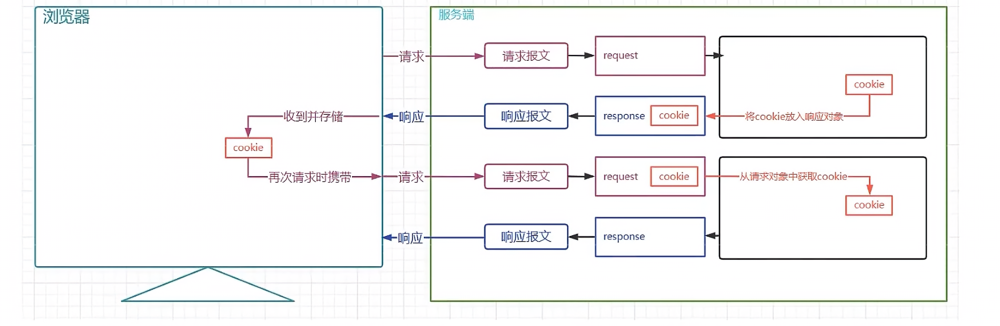
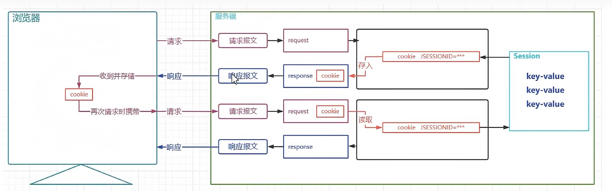
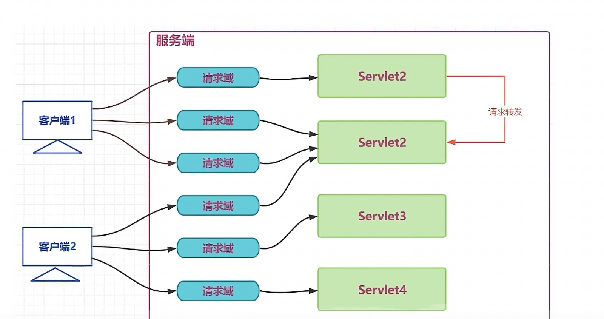
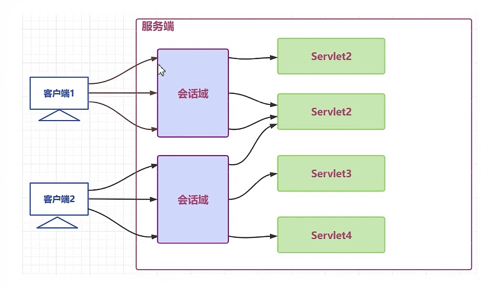
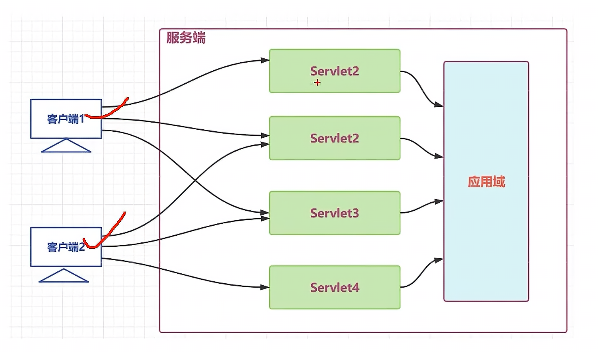
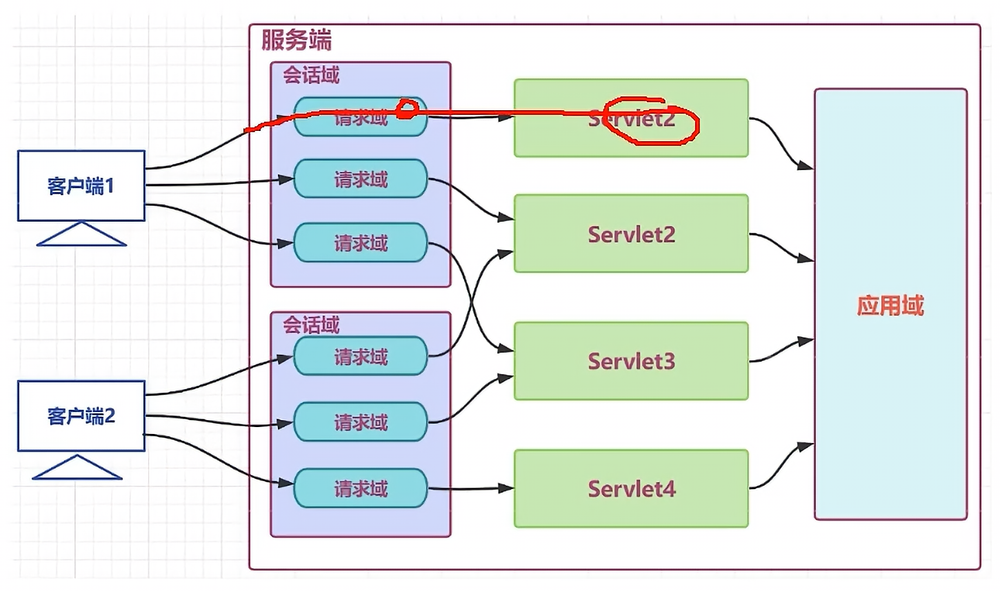

# 会话 过滤器 监听器
## 1. 会话管理
使用 cookie 和 Session 实现数据的长期保存
+ cookie 在客户端保留少量数据,通过响应头向客户端响应
+ session 在服务端保留更多数据,主要通过 HttpSession 对象保存数据
### 1.1 Cookie原理图

### 1.2 Cookie的使用
1. 设置
```
@WebServlet("/servletA")
public class ServletA extends HttpServlet {
    @Override
    protected void service(HttpServletRequest req, HttpServletResponse resp) throws ServletException, IOException {
        //创建cookie
        Cookie cookie1 = new Cookie("userName1" ,"morning1");
        Cookie cookie2 = new Cookie("userName2" ,"morning2");
        //放入resp
        resp.addCookie(cookie1);
        resp.addCookie(cookie2);
    }
}
```
2. 获取
```
@WebServlet("/servletB")
public class ServletB extends HttpServlet {
    @Override
    protected void service(HttpServletRequest req, HttpServletResponse resp) throws ServletException, IOException {
        //获取请求报文中的cookie
        //如果没有cookie那会是null
        Cookie[] cookies = req.getCookies();
        if (cookies != null) {
            for (Cookie cookie : cookies) {
                System.out.println(cookie);
            }
        }
    }
}
```

### 1.3 Cookie的时效性
默认是会话级的
1. 设置保存时间
`setMaxAge(time)`
时间单位是秒

### 1.4 Cookie提交路径
`setPath(path)`

### 1.5 Session原理图
要配合cookie使用


### 1.6 Session的时效性
默认30分钟
在web.xml中设置
```
<session-config>
    <session-timeout>30</session-timeout>
</session-config>
```
+ java代码设置
`session.setMaxInactiveInterval(60*30)`
+ 让session失效
`session.invalidate`

### 1.7 三大域对象
各自区域只能使用各自区域的东西
+ 请求域(HttpServletRequest)
+ 会话域(HttpSession)
+ 应用域(ServletContext)





### 1.8 域对象API
1. void setAttribute(String name,String value)
2. Object getAttribute(String name)
3. removeAttribute(String name)

***

## 2. Filter
对目标资源的请求进行过滤

### 2.1 使用
+ java
```java
// 日志过滤器,记录请求的历史，打印到控制体
// 1. 实现Filter接口(注意是jakarta.servlet中的)
public class LoggingFilter implements Filter {

    private final SimpleDateFormat dateFormat = new SimpleDateFormat("yyyy-MM-dd HH:mm:ss");

    //2. 重写 doFilter方法
    @Override
    public void doFilter(ServletRequest servletRequest, ServletResponse servletResponse, FilterChain filterChain) throws IOException, ServletException {
        HttpServletRequest req = (HttpServletRequest)servletRequest;
        HttpServletResponse resp = (HttpServletResponse)servletResponse; 

        //1. 进入
        String requestURI = req.getRequestURI();
        String dateTime = dateFormat.format(new Date());
        String beforeLogging = requestURI + "在" + dateTime + "被访问了";
        System.out.println(beforeLogging);
        long t1 = System.currentTimeMillis();
        //2. 放出
        filterChain.doFilter(req,resp);
        //3. 最终响应前的处理
        long t2 = System.currentTimeMillis();
        long t = t2 - t1;
        String afterLogging = requestURI + "资源在" + dateTime + "的请求耗时" + t + "ms";
        System.out.println(afterLogging);
    }
}
```
+ xml
```xml
<filter>
    <filter-name>loggingFilter</filter-name>
    <filter-class>com.morning.servlet.filters.LoggingFilter</filter-class>
</filter>
<!--  设置要过滤什么 ，使用 路径 或者 servlet-name -->
<!--  url-pattern  -->
<!--  servlet-name -->
<filter-mapping>
    <filter-name>loggingFilter</filter-name>
    <url-pattern>/servlet1</url-pattern>
</filter-mapping>
```

### 2.2 Filter的声明周期
1. 构造(构造器)
2. 初始化(init)
3. 过滤(doFilter)
4. 销毁(distory)

### 2.3 Filter的执行顺序
如果有多个Filter对同一个请求进行处理,他们的执行顺序和web.xml中的mapping顺序有关

### 2.4 通过注解的形式定义Filter
`@WebFilter()`
+ 如果有多个Filter对同一个请求进行处理,他们的执行顺序在同一个包中的顺序有关
示例
```java
@WebFilter(
    filterName = "loggingFilter",
    initParams = {@WebInitParam(name="dateTimePattern",value="yyyy-MM-dd HH:mm:ss")},
    urlPatterns = {"/servletA","*.html"},
    servletName = {"servletBName"}
)
```

***

## 3. 监听器
用于对域对象对象身上发生的事件或状态改变进行监听和相应处理的对象

### 3.1 八大监听器
1. ServletContextListener
2. ServletContextAttributeListener
3. HttpSessionListener
4. HttpSessionAttributeListener
5. HttpSessionBinding
6. HttpSessionActivationListener
7. ServletRequestListener
8. ServletRequestAttributeListener

### 3.2 主要api
`implements ServletContextListener`
需要web.xml中配置
```
<listener>
```
或者
`@WebListener`