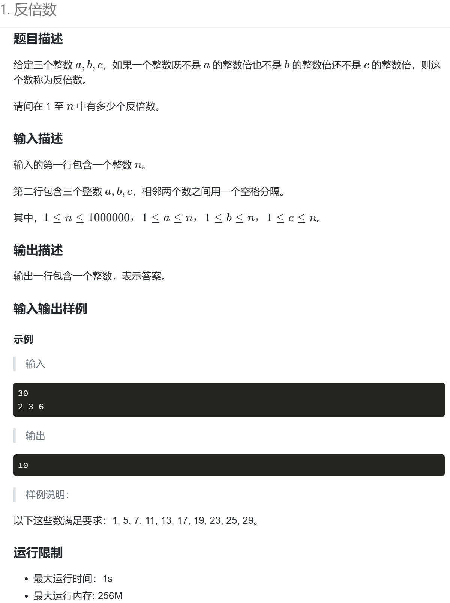

# 蓝桥152 反倍数
**题目来源**：https://www.lanqiao.cn/problems/152/learning


## 1.题目分析

暴力枚举1到n ,对每一个数进行判断

***

## 2.代码实现

```
#include <bits/stdc++.h>//通用头文件
using namespace std;

int a, b, c;

bool f(int x) //判断是否符合条件
{
    if (x % a != 0 && x % b != 0 && x % c != 0)
    {
        return true;
    }
    else
    {
        return false;
    }
}

int main()
{
    ios::sync_with_stdio(0), cin.tie(0), cout.tie(0);//优化输入输出流
    cin >> n;
    cin >> a >> b >> c;
    int count = 0;
    for (int i = 1; i <= n; i++)//枚举1到n
    {
        if (f(i))//判断是否符合要求
        {
            count++;
        }
    }
    cout << count;
    return 0;
}
```