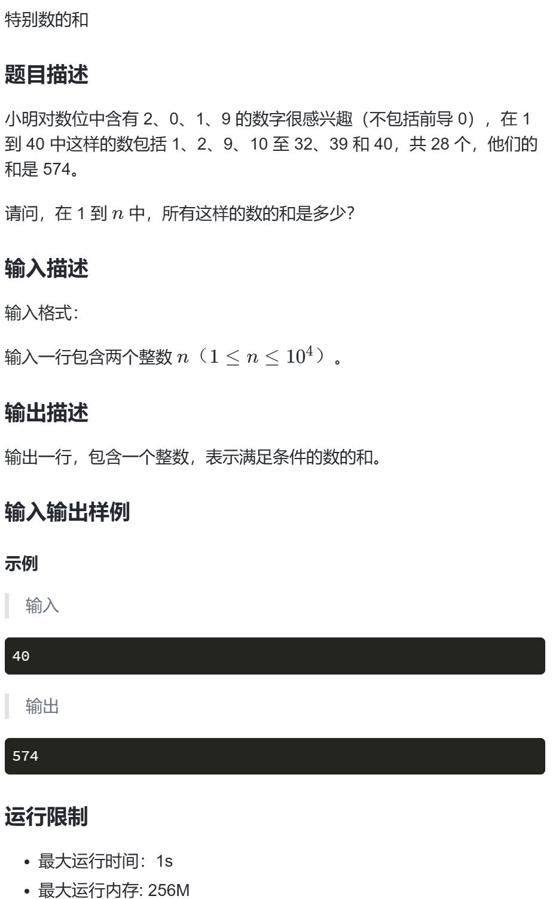

# 蓝桥191 特别的数
**题目来源**：https://www.lanqiao.cn/problems/191/learning


## 1.题目分析

+ 暴力枚举1到n ,对每一个数进行判断
+ 对每一个数分解每一位进行判断是否符合条件
+ 求和

***

## 2.代码实现

```
#include <bits/stdc++.h>
using namespace std;
using ll = long long;

bool f(int n)
{
    while (n)
    {
        int tmp = n % 10;//提取个位
        if (tmp == 2 || tmp == 0 || tmp == 1 || tmp == 9)//看要求的数是否存在
            return true;
        n /= 10;//更新n,为提取下一位做准备
    }
    return false;
}

int main()
{
    int n;
    cin >> n;
    ll ans = 0;//注意用 ll ,避免溢出
    for (int i = 1; i <= n; ++i)//枚举
    {
        if (f(i))//调用函数进行判断
            ans += i;
    }
    cout << ans;
    return 0;
}
```