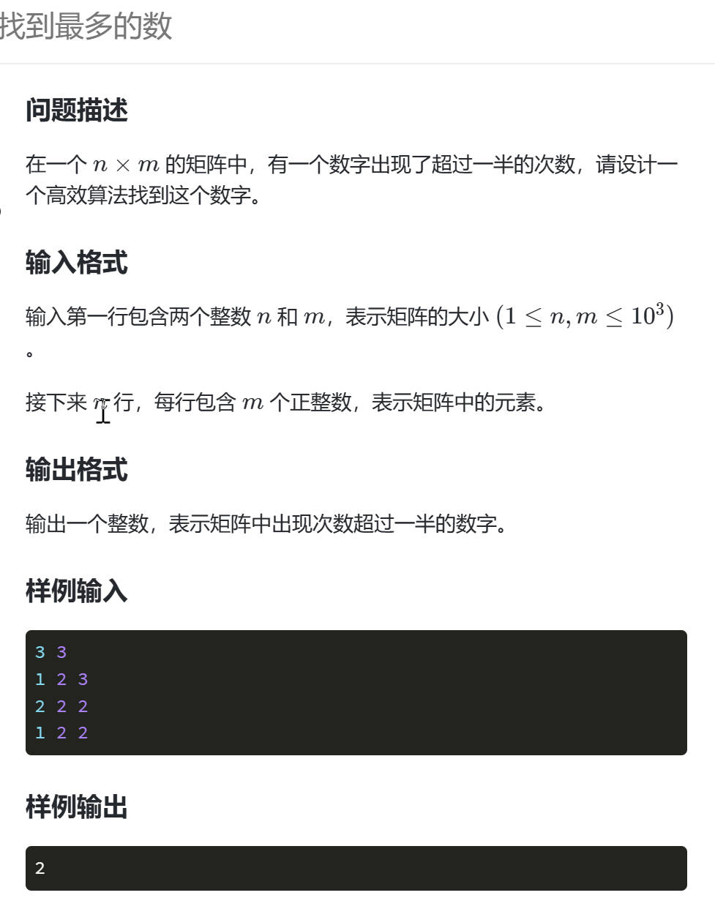

# 蓝桥3227 特别的数
**题目来源**：https://www.lanqiao.cn/problems/3227/learning


## 1.题目分析

1. 方法一
+ 运用 `map<int,int>` 提取信息，键位数字，对应的值为这个数的个数
+ 遍历 `map` 找出那个数字

2. 方法二
+ 运用dp(动态规划)的思想动态更新，找出其中的一个最多的数
因为这里题目明确了确实有一个数字的数目超过一半，所以这个方法可以找出

***

## 2.代码实现

1. 方法一
```
#include <bits/stdc++.h>
using namespace std;
map<int, int> d;
int main()
{
    int n, m;
    cin >> n >> m;
    for (int i = 1; i <= n * m; ++i)//存入所有的数据
    {
        int x;
        cin >> x;
        d[x]++;//数字 x 的个数加1
    }
    for (auto i : d)//遍历 map
    {
        //i.first 是数字,i.second 是这个数字对应的个数
        if (i.second * 2 > m * n)//如果符合要求，明显就只有一个符合要求
        {
            cout << i.first;
            break;
        }
    }
    return 0;
}
```

***

1. 方法二
```
#include <bits/stdc++.h>
using namespace std;
int main()
{
    int n, m;
    cin >> n >> m;
    int count = 1;
    int tmp = -1;//初始化 -1 的个数为1
    //因为所有的数据都为正数，这样初始化可以保证进入循环后一定会更新
    for (int i = 1; i <= n * m; ++i)//输入所有数据
    {
        int x;
        cin >> x;
        if (tmp != x)//不是x就抵消
            count--;
        else
            count++;
        if (count == 0)//抵消完了就更新
        {
            tmp = x;
            count = 1;
        }
    }
    cout << tmp;//输出剩下的那个数
    return 0;
}
```
