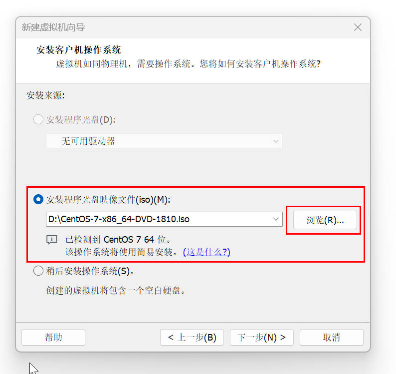

# 创建虚拟机 -- 基于安装 Linux 进行介绍

## 1.为什么需要虚拟机
如果你用的是 `windows` 系统，如果你想要在这台电脑上操作 `Linux` 系统。
如果你不想重装系统的话(大部分人不会想重装系统吧) 那你就需要虚拟机了。
虚拟机就相当于创建了一个全新的电脑，完全和你原本的系统相隔离，不会对现在的系统有任何的影响。

***

## 2.什么是虚拟机
那什么是虚拟机呢
按我的理解，虚拟机其实就相当于一个可以模拟电脑的软件
通过它可以模拟计算机硬件，并给虚拟硬件安装真实的操作系统，从而实现对真实电脑的模拟

***

## 3.安装 VMware WorkStation
1. 这里使用 `VMware WorkStation` 软件来创建虚拟机(需要资源可以私信)
2. 检查 `VMware WorkStation` 是否安装成功(检查网卡是否存在)
这里以 win11 为例
+ 进入设置->网络和Internet -> 高级网络设置

+ 也可以用命令行进行操作
win + R -> 输入ncpa.cpl 

***

## 4.下载 CentOS 操作系统
什么是 `CentOS` 操作系统呢，我们要装的不是 `Linux` 系统吗？
其实 `Linux` 其实是操作系统的内核,而我们并不能直接操作内核，或者说操作内核非常麻烦
于是这时候便需要一些已经在内核的基础上编写的软件对操作进行辅助，而这就是Linux发行版
CentOS 操作系统就是Linux发行版的一种
简而言之 Linux发行版 = Linux内核 + 系统软件，我们一般说的Linux其实是Linux发行版

+ 下载CentOS操作系统
下载地址：https://vault.centos.org/7.6.1810/isos/x86_64/

+ 下载框选的那个文件，`.ios`是光盘镜像文件，下载好就行，要记住下载的位置

***

## 5.创建虚拟机
1.打开 `VMware WorkStation`->点击创建新的虚拟机->选择典型(操作更加简单)

2.安装程序光盘映像文件(就刚才安装的CentOS操作系统)

3.填写内容，这些东西要记好

4.命名虚拟机，选择虚拟机的存储位置(放哪里都可以)

5.指定模拟硬盘的大小

6.后面全部默认就可以了，下面这个勾选一下

7.进行虚拟机后它会自动安装

***

## 6.远程连接
这个时候虚拟机已经完成安装了，那什么要介绍远程连接呢？
首先是因为这时虚拟机和电脑是完全隔离的，本机电脑里的文件完全到不了虚拟机
比如复制的文本就不能粘贴到虚拟机
其次我感觉这虚拟机很不好用，不知道是不是我电脑的问题，非常不流畅
+   这里通过 `FinalShell` 进行远程连接
    下载地址 : http://hostbuf.com/
+   查看虚拟机ip
    在虚拟机中右键打开终端
    输入ifconfig -> 查看 ens33 中的 ip
+   连接

下面按照提示操作就可以了，输入的名字是上面设置的用户名

