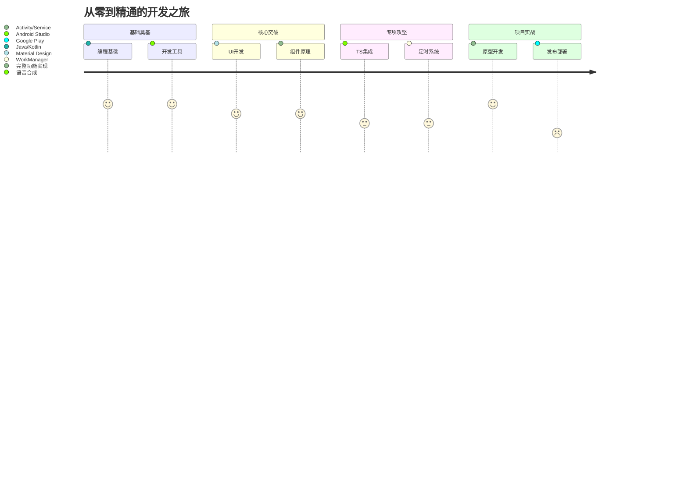
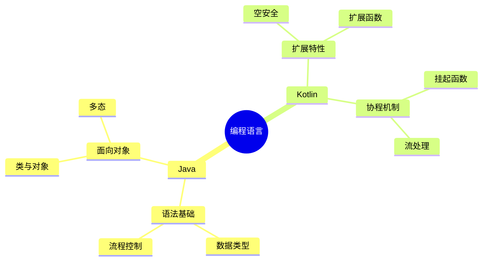
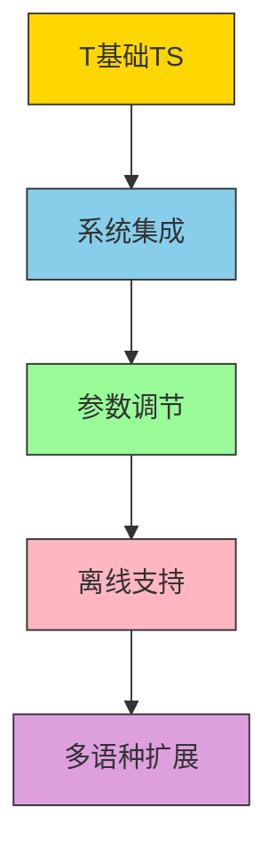
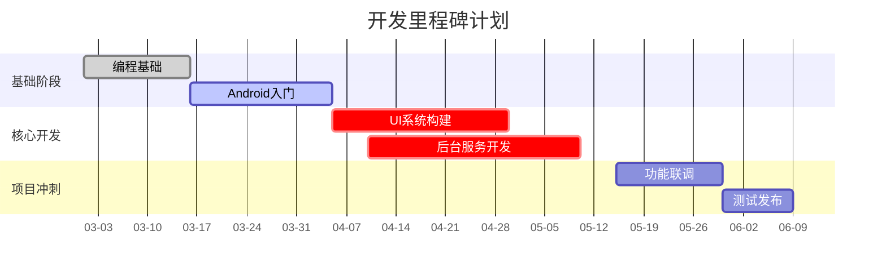
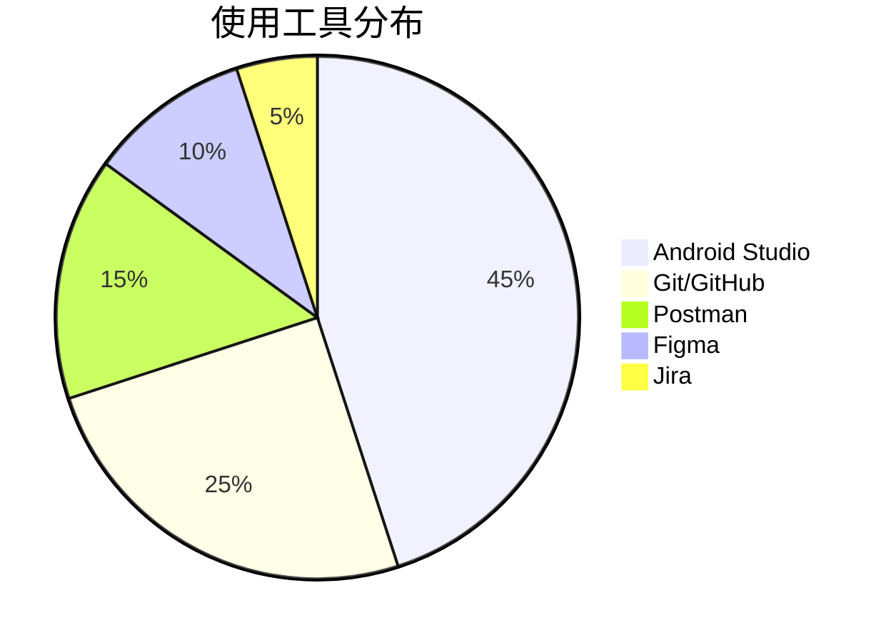

# 🚀 运动训练助手开发学习路径

## 🌆 学习路径导图
<div align="center">
  
</div>

## 📌 学习路线总览

## 🧩 知识体系详解

### 🌟 一、编程语言基础 - Java/Kotlin 双轨学习


### 🌟 二、安卓开发核心技术 - 四大组件应用矩阵
| 组件类型  | 核心功能           | 项目应用场景               | 学习重点     |
| --------- | ------------------ | -------------------------- | ------------ |
| Activity  | 界面展示与交互     | 主训练界面                 | 管理生命周期 |
| Service   | 后台任务执行、计时 | 服务提醒                   | 前台服务实现 |
| Broadcast | 系统事件监听       | 设备连接状态监控           | 动态注册机制 |
| Provider  | 数据共享           | 训练计划导出、URI 权限管理 |              |

### 🌟 三、专项技术图谱

#### 🎙️ 语音合成技术栈


#### ⏰ 定时任务方案对比
```mermaid
bar
    title 定时任务技术方案适用度对比
    x-axis 方案
    y-axis 适用度
    series 项目适用指数
    "AlarmManager": 85
    "WorkManager": 95
    "Handler": 65
```

## 📅 阶段学习计划 - 90 天速成方案


## 🔧 工具链推荐 - 开发必备工具套件


## 📚 推荐学习资源 - 知识获取矩阵
| 资源类型 | 推荐内容                                                                                                   |
| -------- | ---------------------------------------------------------------------------------------------------------- |
| 官方文档 | [Android 官方文档](https://developer.android.com/)                                                         |
| 视频课程 | [Udacity Android Developer Nanodegree](https://www.udacity.com/course/android-developer-nanodegree--nd801) |
| 书籍     | 《Kotlin实战》《安卓编程权威指南》                                                                         |
| 社区     | [StackOverflow 中文版](https://stackoverflow.com/) / [VEX 技术社区](https://example.com)                   |

## 🔖 版本信息
<div align="center" style="margin-top:50px">
    <sub>学习路径版本 v1.2 | 更新日期: 2024-01-22</sub> 
</div>