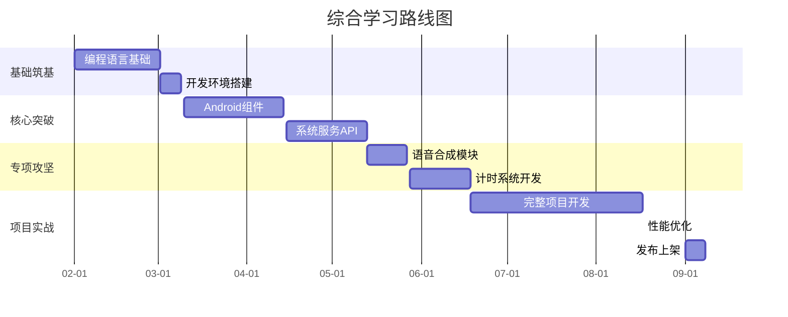
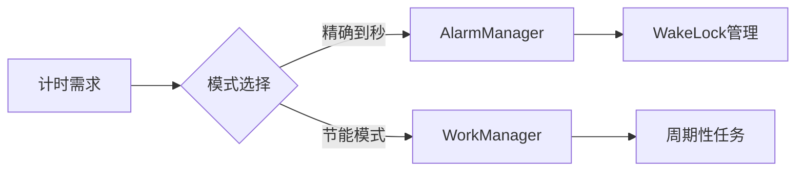

🚀 安卓运动训练助手开发学习规划 
 
 ## 学习路线总图 

 
---
 
阶段一：开发基础筑基（6周）
 
1.1 Kotlin语言核心 
学习内容：
- 基本语法（变量/类型/运算符）
- 函数式编程（lambda/高阶函数）
- 协程与异步编程 
- 空安全机制 
 
配套资源：
- 图书：《Kotlin实战》(Dmitry+)
- 文档：
- 实战：编写训练计划管理器命令行版 
 
1.2 Android Studio精通 
掌握要点：
- 调试工具链（ADB/Profiler）
- 布局编辑器深度使用 
- Gradle脚本配置 
- 模拟器快照管理 
 
配套资源：
- Google官方Codelab教程 
- 《Android Studio实战指南》电子书 
- 实战：制作计时器原型应用 
 
---
 
阶段二：核心组件攻克（8周）
 
2.1 界面开发体系 
知识要点：
```mermaid 
graph TD 
    A[UI基础] --> B[布局系统]
    A --> C[控件体系]
    A -->[ D资源管理]
    B --> B1[ConstraintLayout]
    B --> B2[动态布局]
    C --> C1[RecyclerView优化]
    C --> C2[自定义View]
```
 
学习资料：
- Udacity Android Basics Nanodegree 
- 《App界面设计规范》MD3文档 
 
2.2 跨进程通信 
重点组件：
- Service绑定模式 
- Broadcast系统消息 
- ContentProvider数据共享 
 
实践项目：
- 实现后台定时提醒服务 
- 开发训练数据导出模块 
 
---
 
阶段三：核心功能实现（6周）
 
3.1 语音合成模块 
技术要点：
- TextToSpeech API集成 
- 离线语音包管理 
- 语音参数调校 
- 多语种切换实现 
 
资源推荐：
- Google TTS开发指南 
- Azure语音服务文档 
- 实战：制作有声训练计划播放器 
 
3.2 精准计时系统 
技术方案：

 
关键学习：
- Android电源管理机制 
- JobScheduler API使用 
- 实战：马拉松训练计时器 
 
---
 
阶段四：项目实战开发（12周）
 
4.1 工程实践要点 
开发规范：
- 分支管理策略（Git Flow）
- 模块化架构设计 
- CI/CD流水线配置 
- 文档编写规范（Markdown）
 
配套工具：-
 GitHub Actions 
- SonarQube代码检测 
- Jira项目管理 
 
4.2 全功能实现路线 
1. 需求细化（输出需求文档）
2. 架构设计（绘制UML图）
3. 功能拆分（制定开发里程碑）
4. 联调测试（编写测试用例）
5. 用户反馈（实施灰度发布）
 
---
 
阶段五：性能与部署（3周）
 
5.1 应用优化方案 
优化方向：
- 启动速度优化（懒加载）
- 内存泄漏检测（LeakCanary）
- 包体积控制（资源压缩）
- 耗电量分析（atteryB Historian）
 
5.2 应用发布流程 
上架步骤：
1. 生成签名APK 
2. 准备商店素材（截图/文案）
3. 配置应用内购（可选）
4. 提交Google Play审核 
 
关键文档：
 Google- Play开发者政策 
- 隐私政策生成工具 
- 用户协议模板 
 
---
 
📚 综合学习资源库 
 
在线平台推荐 
| 平台名称 | 特色课程              | 链接地址          |
| -------- | --------------------- | ----------------- |
| Coursera | 安卓专项课程          | www.coursera.org  |
| 极客时间 | 《Android开发高手课》 | time.geekbang.org |
| B站官方  | MD设计规范系列课程    | www.bilibili.com  |
 
技术书单推荐 
1. 《第一行代码第》3版（郭霖）
2.  Android 《进阶解密》（任玉刚）
3. 《Kotlin实战》(Dmitry Jemerov)
4. 《Clean Architecture》（Martin）
 
---
 
<div align="center">
  <sub>⚠️ 本规划按每周20-30小时有效学习时间制定 | 动态调整建议保留20%缓冲时间</sub>
</div>
 
学习建议：
1. 双轮驱动法：每周保证1:1的学练时间比 
2. 问题聚焦清单：记录日常开发中遇到的典型问题 
3. 交叉验证学习：同一个知识点参考至少2种资料 
4. 版本管理纪律：每个功能模块单独建立Git分支 
5. 复现经典项目：定期临摹官方Google示例项目)