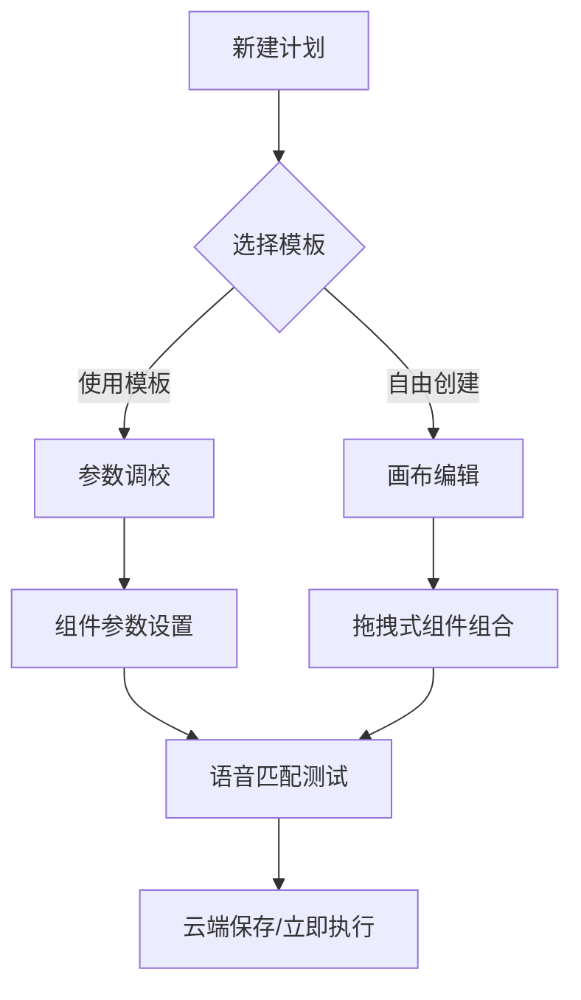

# 🏋️ 运动训练助手安卓应用设计方案 
 

  < img src="https://via.placeholder.com/800x200.pngtext?=Training+Assistant+Mockup" alt="应用原型示意图">

 
## 📚 导航目录 
1. [架构设计](#-系统架构设计)
2. [功能模块](#-核心功能模块)  
3. [交互体验](#-交互设计规范)  
4. [技术架构](#-技术实现方案)  
5. [扩展能力](#-扩展能力规划)  
 
---
 
## 🏗 系统架构设计 
 
### 三层架构体系 
| 架构层级         | 核心组件                                   | 功能描述                   |
| ---------------- | ------------------------------------------ | -------------------------- |
| **表示层**  📱 | 流程编辑器   3D时间轴   语音调试台   | 提供可视化训练计划编排界面 |
| **逻辑层**  ⚙️ | 调度引擎   TTS控制器   设备适配器    | 实现业务规则与算法控制     |
| **数据层**  💾 | 云端模板库   本地语音库   设备配置集 | 实现数据的持久化存储与同步 |
 
---
 
## 🧩 核心功能模块 
 
### 1. 智能训练编排系统 
✅ **结构化流程配置**
- 🌀 深度嵌套循环组（支持999层递归）
- 🎚️ 智能动作组合：根据运动类型自动生成建议组合 
- ⚡ 实时反馈调整：运动中动态调整后续动作 
 
✅ **动态语音调控**
- 🎚️ 多层语音优先级（重要提示>常规提醒>背景音乐）
- 🌐 多语种支持（自动识别用户语言环境）
- 🎭 角色化语音包（健身教练/虚拟偶像/卡通角色）
 
---
 
## ✨ 交互设计规范 
 
### 训练计划创建流程 
