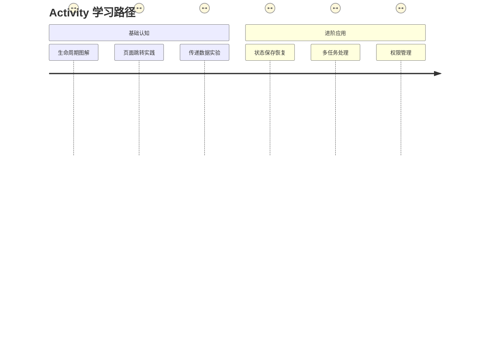
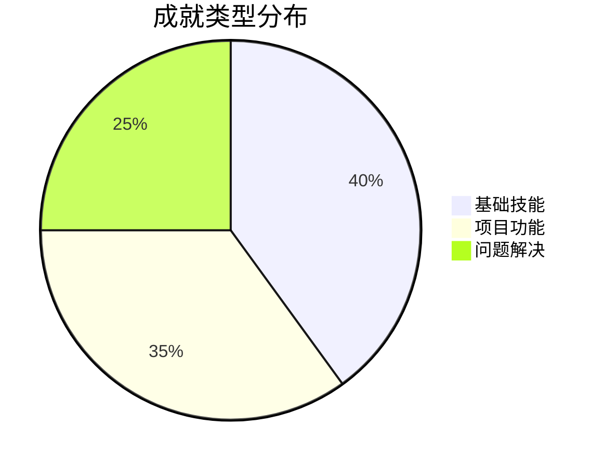

# 📅 轻松精确到天学习计划（总周期 300 天）

## 🌟 设计原则
``` plaintext
每日有效学习时间：60 - 90 分钟  
每周 2 天预留缓冲日  
里程碑奖励机制：每完成一阶段赠送 1 天休息
```

---

## 阶段一：Kotlin 基础（45 天）

### 第 1 周：语法入门
| 日期 | 学习内容       | 实践任务                | 成就徽章   |
| ---- | -------------- | ----------------------- | ---------- |
| Day1 | 变量与数据类型 | 编写 BMI 计算器         | 🎯 初识代码 |
| Day2 | 运算符与控制流 | 制作成绩评级程序        | 🧠 逻辑入门 |
| Day3 | 空安全机制     | 完善 BMI 计算器空值处理 | 🛡️ 安全卫士 |
| Day4 | 函数基础       | 开发温度转换工具        | 🔄 转换大师 |
| Day5 | 复习与扩展练习 | 自由创作小程序          | 🌈 创意新星 |

### 第 2 周：面向对象
| 日期  | 学习内容       | 实践任务                 | 成就徽章   |
| ----- | -------------- | ------------------------ | ---------- |
| Day6  | 类与对象       | 创建“运动计划”类         | 🏗️ 类建筑师 |
| Day7  | 继承与接口     | 实现不同运动类型继承体系 | 👑 继承达人 |
| Day8  | 数据类与密封类 | 优化运动计划数据结构     | 📦 数据管家 |
| Day9  | 扩展函数       | 为现有类添加实用方法     | 🧰 工具专家 |
| Day10 | 复习与调试     | 优化本周项目代码         | 🔍 代码侦探 |

（后续周计划以此类推，每个知识点间隔 1 天缓冲期）

---

## 阶段二：Android 基础（60 天）

### 第 1 月：组件认知


### 典型学习日安排
- 19:00 - 19:20：观看教学片段（精选 10 分钟短视频）
- 19:20 - 19:50：动手实践（分步骤指导文档）
- 19:50 - 20:00：记录学习日志

### 追踪进度表
| 里程碑            | 预计天数 | 解锁成就     |
| ----------------- | -------- | ------------ |
| 完成首个 Activity | 3 天     | 🚪 门户开发者 |
| 实现复杂布局      | 7 天     | 🎨 UI 设计师  |
| 数据持久化存储    | 10 天    | 💾 存储专家   |

---

## 阶段三：专项开发（90 天）

### 语音模块开发节奏
```mermaid
gantt
    title 语音功能 30 天计划
    dateFormat  DD
    axisFormat %d 日

    section 基础阶段
        TTS 集成 :a1, 1, 3d
        参数调节 :a2, after a1, 3d
    section 进阶阶段
        离线支持 :after a2, 5d
        多语种切换 :after 离线支持, 7d
```

### 每日任务示例
- Day 1：运行官方 TTS Demo（30 分钟）
- Day 2：实现基础朗读文本（45 分钟）
- Day 3：添加语速滑块调节（60 分钟）
- Day 4：调试不同设备适配（45 分钟）
- Day 5：庆祝第一阶段完成 🎉

---

## 阶段四：项目实战（105 天）

### 敏捷开发迭代
```plaintext
版本 0.1：基础计时器（3 周）
  ✓ 核心功能：启动/暂停/重置
  ✓ 技术栈：Activity + Handler

版本 0.5：语音增强版（5 周）
  ✓ 新增：语音倒计时提醒
  ✓ 技术栈：Service + TTS

版本 1.0：完整功能版（7 周）
  ✓ 新增：训练计划管理
  ✓ 技术栈：Room + RecyclerView
```

### 每周成就系统
- 铜级成就：完成 80% 基础任务
- 银级成就：实现 1 个扩展功能
- 金级成就：解决 3 个技术难题

---

## 📌 弹性执行策略

### 1. 动态调整机制
每周末根据实际进度微调下周计划
```plaintext
if (未完成任务 > 30%) {
    下周任务量 × 0.8
} else {
    保持原计划
}
```

### 2. 成就可视化系统


### 3. 防挫折方案
- 连续 3 天未达标 → 启动简化模式（任务量减半）
- 关键节点未完成 → 启用备用教学资源
- 开发卡壳超过 2 天 → 申请社区协助

---

## 🎁 激励设计

### 里程碑奖励体系
| 完成阶段      | 奖励内容           |
| ------------- | ------------------ |
| 语法基础通关  | Kotlin 吉祥物贴纸  |
| 首个完整 Demo | 自定义 GitHub 徽章 |
| 项目 Alpha 版 | 技术书籍兑换券     |
| 上架应用      | 开发者纪念 T 恤    |

<div align="center">
  <sub>📆 计划版本：v3.0｜学业优先模式｜更新日期：2024 - 01 - 25</sub>
</div>

## 执行建议
1. 使用 Notion 模板追踪每日进度
2. 设置手机定时提醒学习时间
3. 每周生成学习报告（可用 ChatGPT 辅助）
4. 重要成就分享到开发者社区
5. 建立“已完成”清单代替传统待办事项 