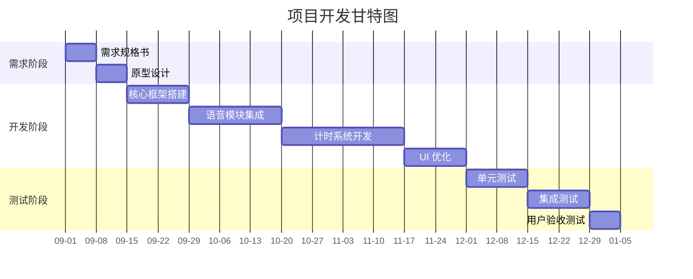

阶段一（基础筑基）需要学习Kotlin和Android Studio。每天的任务可能包括理论学习、编码练习和环境配置例如。，前三天可以K专注于otlin基础语法，每天学习变量、函数和控制结构，并进行练习。
 
接下来阶段是二的核心组件，如Activity、Service等。每个组件的学习可能需要几天时间，理解包括生命周期、编写示例代码。例如，Activity可能需要两天时间，第一天学习生命周期，第二天实践页面跳转和数据传递。
 
专项攻坚部分涉及语音合成和定时任务。这些需要集成特定的API，如TextToSpeech和AlarmManager。每个模块可能需要时间一周，包括研究文档、编写测试代码和调试。
 
项目实战阶段需要将各个模块整合，完整开发应用。这需要分步骤，如需求分析、UI设计、实现功能、测试和发布。每天的任务可能涉及模块不同的开发，第一例如周设计数据库，第二周实现服务后台。
 
需要注意每个阶段之间的过渡，确保前一阶段的知识足够支持后续内容。例如，在学习Service之前，必须已经掌握Activity和Intent的基础。
 
还要考虑复习练习和的时间每周。安排一天复习，巩固所学内容，解决遗留问题。此外，项目开发可能会中遇到意外问题，计划中需要留有一定的缓冲时间。
 
最后，确保计划表清晰易懂，使用表格或列表展示每天的任务，标明内容学习、预期资源和成果。用户这样能按部就班地跟进，遗漏不会步骤重要。
 
📅安卓 开发精确到天的学习计划表 
 
# 📅 安卓开发精确到天的学习计划表

## 基础筑基阶段（42 天）

### Kotlin 语言学习（21 天）
| 日期        | 学习内容             | 实践项目           | 学习资源                         |
| ----------- | -------------------- | ------------------ | -------------------------------- |
| Day 1 - 3   | 基本语法与类型系统   | 开发 BMI 计算器    | 《Kotlin 实战》第 1 - 3 章       |
| Day 4 - 6   | 函数与 Lambda 表达式 | 实现排序算法可视化 | Kotlin 官方文档 - 函数篇         |
| Day 7 - 9   | 面向对象编程         | 设计训练计划类     | 《Kotlin 设计模式》第 1 章       |
| Day 10 - 12 | 空安全与扩展函数     | 开发空安全验证工具 | Kotlin 中文站 - 空安全特性       |
| Day 13 - 15 | 协程与异步编程       | 模拟网络请求队列   | Android 开发者 - Coroutines 指南 |
| Day 16 - 18 | 集合与泛型           | 开发训练计划管理器 | 《Kotlin 集合操作实战》          |
| Day 19 - 21 | 反射与注解           | 实现自动配置模块   | 《深入理解 Kotlin》第 8 章       |

### Android 基础（21 天）
| 日期        | 学习内容                     | 实践项目             | 关键产出物         |
| ----------- | ---------------------------- | -------------------- | ------------------ |
| Day 22 - 24 | Activity 生命周期            | 实现页面跳转逻辑     | 基础导航 Demo      |
| Day 25 - 27 | Layout 布局系统              | 制作训练界面原型     | XML 布局文件集     |
| Day 28 - 30 | RecyclerView 高级用法        | 开发训练计划列表     | 自定义 Adapter 类  |
| Day 31 - 33 | Fragment 管理                | 实现 Tab 导航        | Fragment 通信 Demo |
| Day 34 - 36 | 数据存储 (SharedPreferences) | 实现用户设置保存功能 | 配置管理模块       |
| Day 37 - 39 | 基础动画实现                 | 设计加载动画效果     | 属性动画 Demo      |
| Day 40 - 42 | 调试技巧与单元测试           | 编写测试用例         | 测试覆盖率报告     |

## 核心组件阶段（56 天）

### 系统组件（28 天）
| 日期        | 学习重点                          | 关键技术点        | 验证指标           |
| ----------- | --------------------------------- | ----------------- | ------------------ |
| Day 43 - 45 | Service 基础                      | 启动/绑定模式     | 后台计时 Demo 服务 |
| Day 46 - 48 | BroadcastReceiver                 | 动态/静态注册     | 网络状态监听模块   |
| Day 49 - 51 | ContentProvider                   | 跨进程数据共享    | 训练记录导出功能   |
| Day 52 - 54 | WorkManager                       | 周期性后台任务    | 每日提醒功能       |
| Day 55 - 57 | AlarmManager                      | 精确时间触发      | 秒级计时器         |
| Day 58 - 60 | Notification 系统                 | 前台服务通知      | 训练进度提醒通知   |
| Day 61 - 64 | 多线程编程（Handler/Looper 机制） | 异步数据加载 Demo | 异步数据加载 Demo  |

### 高级 UI（28 天）
| 日期        | 技术模块      | 关键实现        | 产出物              |
| ----------- | ------------- | --------------- | ------------------- |
| Day 65 - 67 | 自定义 View   | 训练进度环形图  | CustomProgressView  |
| Day 68 - 70 | 复杂手势处理  | 滑动删除/缩放   | 计划管理项交互 Demo |
| Day 71 - 73 | 主题与样式    | 暗黑模式适配    | 主题切换功能        |
| Day 74 - 76 | Layout Motion | 复杂转场动画    | 训练详情页动效      |
| Day 77 - 79 | 响应式布局    | 多屏幕适配方案  | 平板适配 Demo       |
| Day 80 - 82 | 性能优化      | 布局层级优化    | Systrace 分析报告   |
| Day 83 - 84 | 内存管理      | LeakCanary 集成 | 内存泄漏检测报告    |

## 专项攻坚阶段（35 天）

### 语音合成模块（14 天）
| 日期        | 里程碑         | 关键技术         | 验证方式         |
| ----------- | -------------- | ---------------- | ---------------- |
| Day 85 - 86 | TTS 基础集成   | TextToSpeech API | 朗读文本 Demo    |
| Day 87 - 88 | 语音参数调校   | 语速/音调设置    | 参数调节界面     |
| Day 89 - 90 | 语音包离线管理 | 语音包下载/删除  | 离线模式测试报告 |
| Day 91 - 92 | 多语言支持     | 中英文切换逻辑   | 双语用例测试     |
| Day 93 - 94 | 音频混合输出   | 背景叠加音乐     | 混合播放 Demo    |
| Day 95 - 96 | 异常处理       | 设备兼容性测试   | 真机测试报告     |

### 计时系统（21 天）
| 日期          | 开发重点                             | 技术方案                   | 质量验证         |
| ------------- | ------------------------------------ | -------------------------- | ---------------- |
| Day 97 - 99   | 精确计时架构                         | AlarmManager + WakeLock    | 毫秒级误差测试   |
| Day 100 - 102 | 省电模式适配                         | WorkManager + JobScheduler | 功耗分析报告     |
| Day 103 - 105 | 计时状态持久化                       | Room 数据库存储            | 数据恢复测试     |
| Day 106 - 108 | 多计时器管理                         | 并发任务调度               | 压力测试结果     |
| Day 109 - 111 | 智能暂停/恢复                        | 传感器事件监听             | 运动场景模拟测试 |
| Day 112 - 114 | 实时进度反馈（LiveData + ViewModel） | 界面刷新率检测             | 界面刷新率检测   |
| Day 115       | 系统集成测试                         | 全流程验证                 | 缺陷跟踪报告     |

## 项目实战阶段（90 天）

### 开发迭代计划

 
 
### 每日 开发节奏（示例周）
| 时间段       | 周一                   | 周二         | 周三               |
| ------------ | ---------------------- | ------------ | ------------------ |
| 9:00-10:30   | 语音模块接口      设计 | 服务计时开发 | 数据库模型优化     |
| 10:45-12:00  | 代码审查               | 单元测试编写 | 性能分析           |
| 14:00-1530 : | 需求讨论会             | 技术方案评审 | 缺陷修复           |
| :1545-17:30  | 核心功能开发           | 编写文档     | 自动化测试脚本开发 |
 
---
 
📌 注意事项 
1. 机制弹性：预留每周1天空日白用于补缺 
2. 验收标准：每个阶段结束需提交可运行Demo 
3. 知识管理：建立个人库知识（推荐Obsidian）
4. 健康管理：每学习50分钟休息10分钟 
5. 版本控制每日代码：提交Git仓库 
 

  🔄 计划表版本：v2.0｜更新：202日期4-01-24sub>
</

执行建议：
1. 使用Notion/Trell进行o每日任务管理 
2. 建立学习日志记录关键问题与解决方案 
3. 每周日进行进度复盘与计划 
4. 加入开发者社区及时帮助获取 
5. 定期备份项目与文档代码 