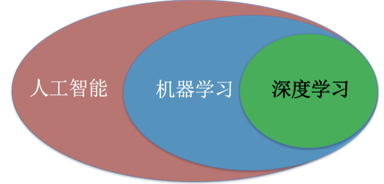
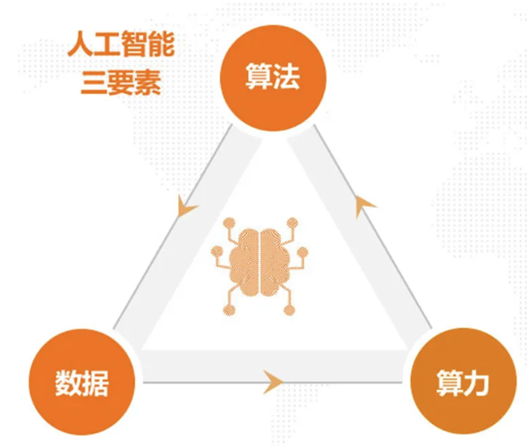
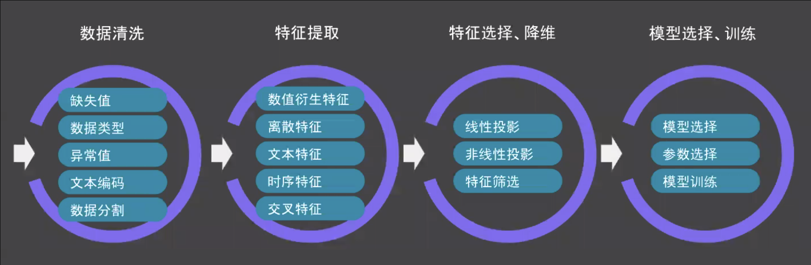
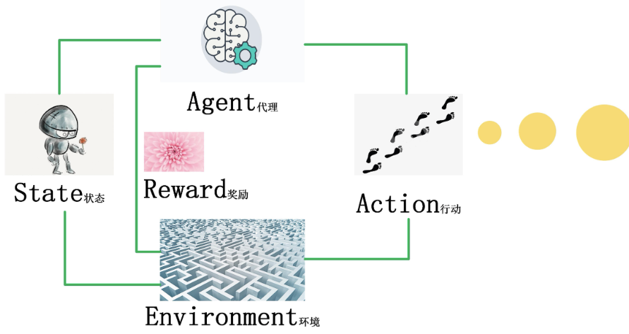

# 001 机器学习 基础介绍
--依照黑马教程学习   

## 1. 人工智能发展必备三要素
数据，算法，算力   
+ CPU适合I/O密集型任务   
+ GPU适合计算密集型任务   

***

## 2. 人工智能的三个关键能力
通讯，感知，行动   

***

## 3. 人工智能的主要分支
计算机视觉(CV) , 自然语言处理(NLP) , 机器人   
+ 计算机视觉   
+ 语音识别   
+ 文本挖掘/分类   
+ 机器翻译   
+ 机器人   

***

## 4. 机器学习的工作流程
(1) 获取数据    
(2) 数据基本处理   
(3) 特征工程   
(4) 机器学习   
(5) 模型评估   

### 4.1 获取数据
+ 一行数据: 样本   
  一列数据: 特征   
+ 数据类型的构成   
(1) 特征值 + 目标值 (监督训练)   
(2) 特征值 (无监督训练)   
+ 数据分割   
把数据分为训练数据和测试数据   
(1) 训练数据 : 用于构建模型 (70% ~ 80%)   
(2) 测试数据 : 用于评估模型   

### 4.2 特征工程
+ 特征提取   
+ 特征预处理   
+ 特征降维   

***

## 5. 机器学习的分类
监督学习，半监督学习，无监督学习，强化学习   

### 5.1 监督学习
数据为 : 特征值 + 目标值   
输出数据可以是连续的值(回归)或有限的离散值(分类)   
+ 回归问题   
+ 分类问题    

### 5.2 无监督学习
数据为 : 特征值   
根据样本间的相似性对样本集进行类别划分   

### 5.3 半监督学习
训练集同时包含有标记数据和未标记数据   

### 5.4 强化学习
自动进行决策   
agent,action,reward,environment,observation   

***

## 6. 模型评估
### 6.1 分类模型评估
准确率   

### 6.2 回归模型评估
均方根误差   

### 6.3 欠拟合
训练集表现就不好，学的东西太少   

### 6.4 过拟合
训练集表现优越，测试集表现不好，学的东西太多   
