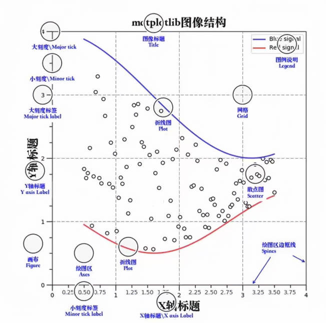
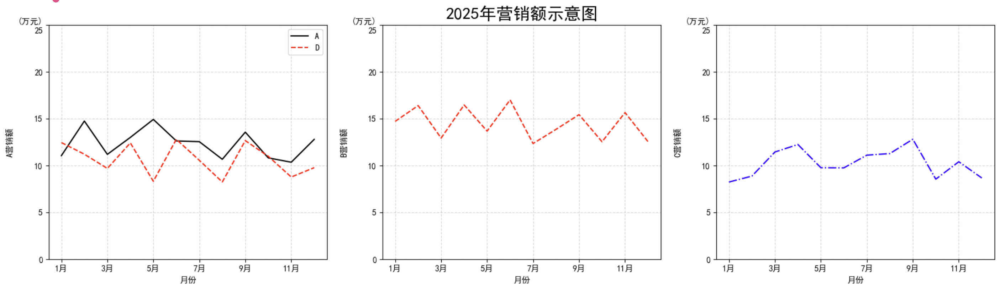
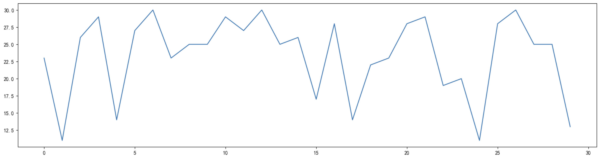
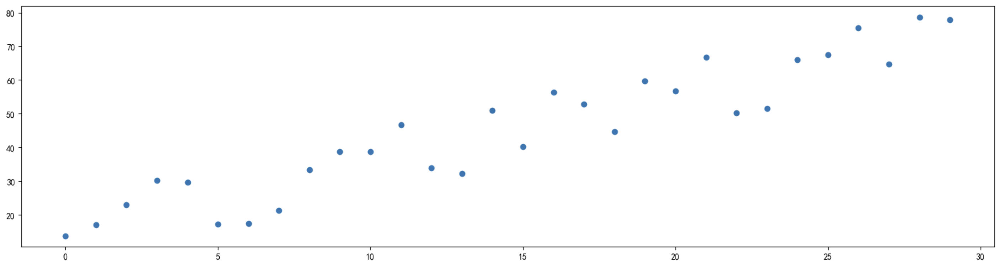
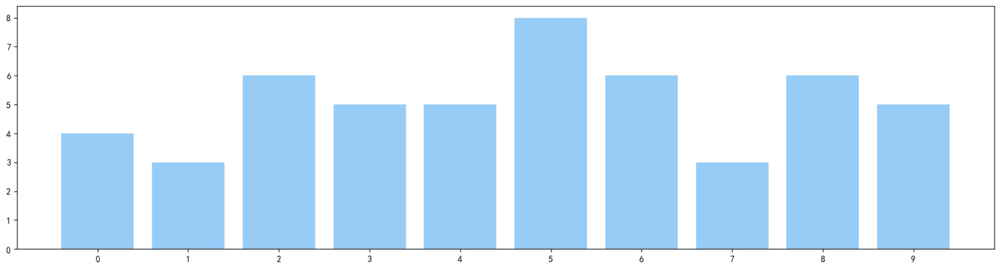
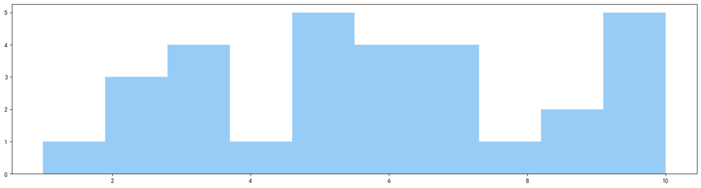
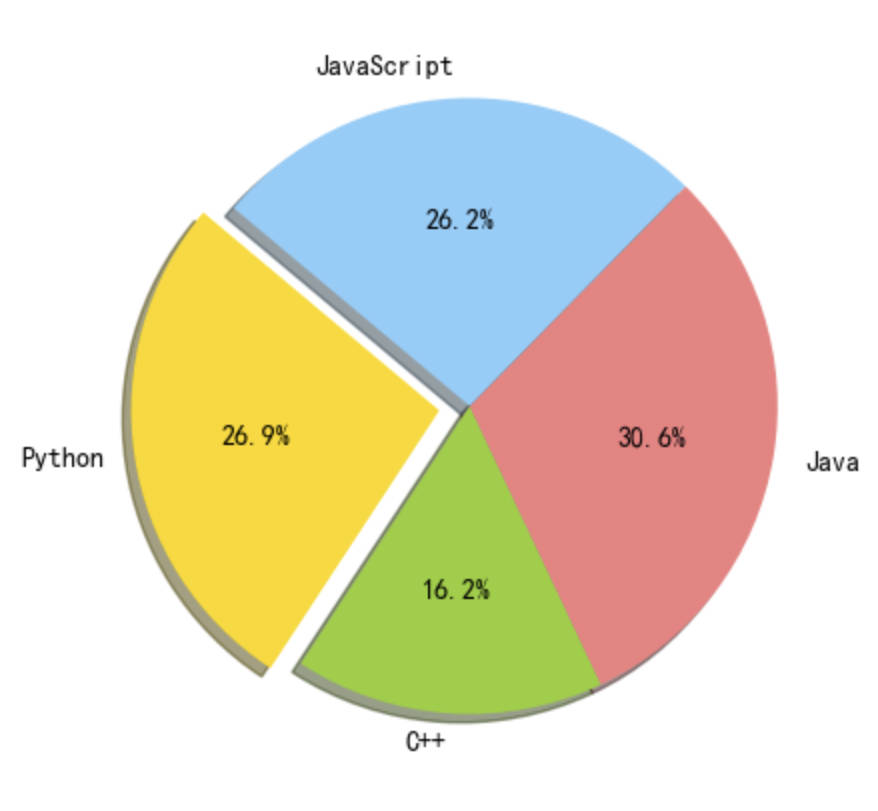

# Matplotlib

专门用于2D图像绘制，也可以绘制3D图像   

## 1. matplotlib.pyplot模块   

matplotlib.pyplot中包含了一系列类似于matlab的画图函数   


```python
import matplotlib.pyplot as plt   
```

***

## 2. 图形绘制流程   

### (1) 创建画布      
plt.figure()   
+ figsize : 指定图的长和宽   
+ dpi : 指定图的清晰度   

### (2) 绘制图像   

plt.plot(x,y)      
绘制折线图   


```python
import matplotlib.pyplot as plt   

plt.figure(figsize=(10, 10), dpi=100)   

plt.plot([1, 2, 3, 4, 5, 6, 7], [17, 17, 18, 15, 11, 11, 13])   
```


​    


### (3) 显示图像


```python
plt.show()
```

### (4) 完整展示


```python
import matplotlib.pyplot as plt

plt.figure(figsize=(20, 10), dpi=50)
plt.plot([1, 2, 3, 4, 5, 6, 7, 8, 9, 10], [12, 12, 15, 23, 19, 13, 15, 12, 10, 15])
plt.show()
```


​    

***

## 3. Matplotlib图像结构


***
## 4. 完善折线图

### (1) 准备数据并画出初始折线图


```python
import random

import matplotlib.pyplot as plt

# 生成序列 12个月
x = range(12)
# 列表生成式
y_A = [random.uniform(10, 15) for i in x]

# 画布
plt.figure(figsize=(20, 5), dpi=100)

plt.plot(x, y_A)
```


​    


### (2) 添加自定义x,y刻度

plt.xticks(x,**kwargs)      
plt.yticks(y,**kwargs)      
注意：如果是纯数字可以直接就用x,如果有数值，首先要用数字，然后替换数字   


```python
import random

import matplotlib.pyplot as plt

# 生成序列 12个月
x = range(12)
# 列表生成式
y_A = [random.uniform(10, 15) for i in x]

# 画布
plt.figure(figsize=(20, 5), dpi=100)

# import matplotlib

# 置字体为支持中文的字体
# matplotlib.rcParams["font.family"] = "SimHei"  # 黑体
# matplotlib.rcParams["font.size"] = 12
# matplotlib.rcParams["axes.unicode_minus"] = False  # 解决负号显示问题
# 这里通过jupyter的系统设置实现,最后会进行介绍

# 构造x,y刻度标签
x_ticks = ["{}月".format(i + 1) for i in x]
y_ticks = range(30)

# 修改x,y坐标的刻度显示
plt.xticks(x[::2], x_ticks[::2])
plt.yticks(y_ticks[::2])

plt.plot(x, y_A)
```


​    


### (3) 添加网格显示

plt.grid(True,linestyle='--',alpha=0.5)      
True 为启动网格显示      
linestyle 为网格的样式   
alpha 为透明度   


```python
import random

import matplotlib.pyplot as plt

# 生成序列 12个月
x = range(12)
# 列表生成式
y_A = [random.uniform(10, 15) for i in x]

# 画布
plt.figure(figsize=(20, 5), dpi=100)

# import matplotlib

# 置字体为支持中文的字体
# matplotlib.rcParams["font.family"] = "SimHei"  # 黑体
# matplotlib.rcParams["font.size"] = 12
# matplotlib.rcParams["axes.unicode_minus"] = False  # 解决负号显示问题
# 这里通过jupyter的系统设置实现,最后会进行介绍

# 构造x,y刻度标签
x_ticks = ["{}月".format(i + 1) for i in x]
y_ticks = range(30)

# 修改x,y坐标的刻度显示
plt.xticks(x[::2], x_ticks[::2])
plt.yticks(y_ticks[::2])

# 添加网格显示
plt.grid(True, linestyle="--", alpha=0.5)

plt.plot(x, y_A)
```


​    


### (4) 添加描述信息

plt.title("2025 年营销额示意图", fontsize=20)   
plt.xlabel("月份", fontsize=15)   
plt.ylabel("营销额", fontsize=15)   


```python
import random

import matplotlib.pyplot as plt

# 生成序列 12个月
x = range(12)
# 列表生成式
y_A = [random.uniform(10, 15) for i in x]

# 画布
plt.figure(figsize=(20, 5), dpi=100)

# 构造x,y刻度标签
x_ticks = ["{}月".format(i + 1) for i in x]
y_ticks = range(30)

# 修改x,y坐标的刻度显示
plt.xticks(x[::2], x_ticks[::2])
plt.yticks(y_ticks[::2])

# 添加网格显示
plt.grid(True, linestyle="--", alpha=0.5)

plt.title("2025年营销额示意图", fontsize=20)
plt.xlabel("月份", fontsize=15)
plt.ylabel("营销额", fontsize=15)
plt.grid(True, linestyle="--", alpha=0.5)

plt.plot(x, y_A)
```


​    


### (5) 图像保存

plt.savefig("outimages/test.png")   
需要注意：plt.show()会把figure资源释放,如果在show之后保存，那么保存的会是空值   


```python
import random

import matplotlib.pyplot as plt

# 生成序列 12个月
x = range(12)
# 列表生成式
y_A = [random.uniform(10, 15) for i in x]

# 画布
plt.figure(figsize=(20, 5), dpi=100)

# 构造x,y刻度标签
x_ticks = ["{}月".format(i + 1) for i in x]
y_ticks = range(30)

# 修改x,y坐标的刻度显示
plt.xticks(x[::2], x_ticks[::2])
plt.yticks(y_ticks[::2])

# 添加网格显示
plt.grid(True, linestyle="--", alpha=0.5)

plt.title("2025年营销额示意图", fontsize=20)
plt.xlabel("月份", fontsize=15)
plt.ylabel("营销额", fontsize=15)
plt.grid(True, linestyle="--", alpha=0.5)

# 图像保存
plt.savefig("../images/Matplotlib的学习/test.png")

plt.plot(x, y_A)
```


​    


### (6) 完整代码


```python
import random

import matplotlib.pyplot as plt

# 生成序列 12个月
x = range(12)
# 列表生成式
y_A = [random.uniform(10, 15) for i in x]

# 画布
plt.figure(figsize=(20, 5), dpi=100)

# 构造x,y刻度标签
x_ticks = ["{}月".format(i + 1) for i in x]
y_ticks = range(30)

# 修改x,y坐标的刻度显示
plt.xticks(x[::2], x_ticks[::2])
plt.yticks(y_ticks[::2])

# 添加网格显示
plt.grid(True, linestyle="--", alpha=0.5)

plt.title("2025年营销额示意图", fontsize=20)
plt.xlabel("月份", fontsize=15)
plt.ylabel("营销额", fontsize=15)
plt.grid(True, linestyle="--", alpha=0.5)

# 图像保存
plt.savefig("../images/Matplotlib的学习/test.png")

plt.plot(x, y_A)
```


​    

***

## 5.一个坐标系中绘制多个图像

### (1) 多次plot


```python
import random

import matplotlib.pyplot as plt

x = range(12)
y_A = [random.uniform(10, 15) for i in x]
y_B = [random.uniform(12, 17) for i in x]
y_C = [random.uniform(8, 13) for i in x]

plt.figure(figsize=(20, 5), dpi=100)
plt.plot(x, y_A, color="k", linestyle="-")
plt.plot(x, y_B, color="r", linestyle="--")
plt.plot(x, y_C, color="b", linestyle="-.", label="C")
```


​    


### (2) 设置图片风格

|  颜色  |   风格    |
| :----: | :-------: |
| r 红色 |  - 实线   |
| g 绿色 |  -- 虚线  |
| b 蓝色 | -. 点划线 |
| w 白色 | : 点虚线  |
| c 青色 |           |
| m 洋红 |           |
| y 黄色 |           |
| k 黑色 |           |

### (3) 显示图例

在 plt.plot()中设置 label   
通过 plt.legend() 显示   


```python
import random

import matplotlib.pyplot as plt

x = range(12)
y_A = [random.uniform(10, 15) for i in x]
y_B = [random.uniform(12, 17) for i in x]
y_C = [random.uniform(8, 13) for i in x]

plt.figure(figsize=(20, 5), dpi=100)
plt.plot(x, y_A, color="k", linestyle="-", label="A")
plt.plot(x, y_B, color="r", linestyle="--", label="B")
plt.plot(x, y_C, color="b", linestyle="-.", label="C")
plt.legend(loc=0)
```


​    


loc的取值：

| Location String | Location Code |
| :-------------: | :-----------: |
|      best       |       0       |
|   upper right   |       1       |
|   upper left    |       2       |
|   lower left    |       3       |
|   lower right   |       4       |
|      right      |       5       |
|   center left   |       6       |
|  center right   |       7       |
|  lower center   |       8       |
|  upper center   |       9       |
|     center      |      10       |

### (4) 完整代码


```python
import random

import matplotlib.pyplot as plt

x = range(12)
y_A = [random.uniform(10, 15) for i in x]
y_B = [random.uniform(12, 17) for i in x]
y_C = [random.uniform(8, 13) for i in x]

plt.figure(figsize=(20, 5), dpi=100)
plt.plot(x, y_A, color="k", linestyle="-", label="A")
plt.plot(x, y_B, color="r", linestyle="--", label="B")
plt.plot(x, y_C, color="b", linestyle="-.", label="C")
plt.legend(loc=0)

plt.title("2025年营销额示意图", fontsize=20)
plt.xlabel("月份", fontsize=15)
plt.ylabel("营销额", fontsize=15)
plt.grid(True, linestyle="--", alpha=0.5)

# 下面对y做了特殊处理以达到显示单位的效果
x_ticks = ["{}月".format(i + 1) for i in x]
y_ticks = list(range(30))  # 因为range不可改动所以转为list
y_ticks[25] = "(万元)\n25"
plt.xticks(x[::2], x_ticks[::2])
y = range(30)
plt.yticks(y[::5], y_ticks[::5])

plt.savefig("../outimages/2025年营销额示意图.png")

plt.show()
```


​    

​    
***
## 6. 一个坐标中绘制多个图像(subplots实现)
subplots(nrow,ncols,*fig_kw)   
创建一个带有多个axes(坐标系)的图   
设置坐标刻度的方法有改变   
set_xticks   
set_yticks   
set_xlabel   
set_ylabel   
```python
import random

import matplotlib.pyplot as plt

x = range(12)
y_A = [random.uniform(10, 15) for i in x]
y_B = [random.uniform(12, 17) for i in x]
y_C = [random.uniform(8, 13) for i in x]
y_D = [random.uniform(8, 13) for i in x]

# plt.figure(figsize=(20, 5), dpi=100)
fig, axes = plt.subplots(nrows=1, ncols=3, figsize=(20, 5), dpi=100)

# plt.plot(x, y_A, color="k", linestyle="-", label="A")
# plt.plot(x, y_B, color="r", linestyle="--", label="B")
# plt.plot(x, y_C, color="b", linestyle="-.", label="C")
# plt.legend(loc=0)
axes[0].plot(x, y_A, color="k", linestyle="-", label="A")
axes[0].plot(x, y_D, color="r", linestyle="--", label="D")
axes[0].legend(loc=0)
axes[1].plot(x, y_B, color="r", linestyle="--", label="B")
axes[2].plot(x, y_C, color="b", linestyle="-.", label="C")

axes[1].set_title("2025年营销额示意图", fontsize=20)
# plt.xlabel("月份", fontsize=15)
# plt.ylabel("营销额", fontsize=15)
# plt.grid(True, linestyle="--", alpha=0.5)

# 下面对y做了特殊处理以达到显示单位的效果
x_ticks = ["{}月".format(i + 1) for i in x]
y = range(30)
y_ticks = list(range(30))  # 因为range不可改动所以转为list
y_ticks[25] = "(万元)\n25"
# plt.xticks(x[::2], x_ticks[::2])
# plt.yticks(y[::5], y_ticks[::5])

axes[0].set_xlabel("月份")
axes[0].set_ylabel("A营销额")
axes[0].set_xticks(x[::2])
axes[0].set_xticklabels(x_ticks[::2])
axes[0].set_yticks(y[::5])
axes[0].set_yticklabels(y_ticks[::5])
axes[0].grid(True, linestyle="--", alpha=0.5)

axes[1].set_xlabel("月份")
axes[1].set_ylabel("B营销额")
axes[1].set_xticks(x[::2])
axes[1].set_xticklabels(x_ticks[::2])
axes[1].set_yticks(y[::5])
axes[1].set_yticklabels(y_ticks[::5])
axes[1].grid(True, linestyle="--", alpha=0.5)

axes[2].set_xlabel("月份")
axes[2].set_ylabel("C营销额")
axes[2].set_xticks(x[::2])
axes[2].set_xticklabels(x_ticks[::2])
axes[2].set_yticks(y[::5])
axes[2].set_yticklabels(y_ticks[::5])
axes[2].grid(True, linestyle="--", alpha=0.5)

plt.savefig("../outimages/2025年营销额示意图.png")

plt.show()
```


***
## 7. 常见图形绘制
### (1) 折线图
能够显示数据的变化趋势
plt.plot(x,y)

```python
import random

import matplotlib.pyplot as plt

x = range(30)
y = [random.randint(10, 30) for i in x]

fig, axes = plt.subplots(nrows=1, ncols=1, figsize=(20, 5), dpi=100)
axes.plot(x, y)

plt.show()
```


***

### (2) 散点图
判断变量之间是否存在数量关联趋势   
plt.scatter(x,y)

```python
import random

import matplotlib.pyplot as plt

x = range(30)
y = [2 * x[i] + 5 + random.uniform(0, 20) for i in x]

fig, axes = plt.subplots(nrows=1, ncols=1, figsize=(20, 5), dpi=100)
axes.scatter(x, y)

plt.show()
```


### (3)柱状图
便于判断数据大小，比较数据之间的差别
plt.bar(x,y,width,align='center',**kwargs)
+ x : 值
+ width : 宽度
+ align : 对齐方式 (center,edge)
+ **kwargs: color
```python
import random

import matplotlib.pyplot as plt

x = range(10)
y = [random.randint(2, 10) for i in x]

fig, axes = plt.subplots(nrows=1, ncols=1, figsize=(20, 5), dpi=100)
axes.bar(x, y, align="center", color="#87CEFA")

axes.set_xticks(x[::1])

plt.show()
```


### (4) 直方图
绘制连续性的数据展示一组或多组数据的分布
plt.hist(x,y,bins=None)

+ x : 数据
+ bins : 组距
```python
import random

import matplotlib.pyplot as plt

x = [random.randint(1,10) for i in range(30)]

fig, axes = plt.subplots(nrows=1, ncols=1, figsize=(20, 5), dpi=100)
axes.hist(x, bins=None, color="#87CEFA")

plt.show()
```


### (5) 饼图
分类数据的占比情况
plt.pie(x,labels,autopct,colors)
+ x : 数据,指定的是每个扇面的大小
+ labels : 每部分的名称
+ autopct : 占比显示 '%1.1f%%' : %是python字符串格式化的开始标记,1.1f表示宽度为1(会自动扩展),小数1位,为浮点型,%%为%的表示
+ colors : 每部分颜色
```python
import random

import matplotlib.pyplot as plt

sizes = [215, 130, 245, 210]
labels = ['Python', 'C++', 'Java', 'JavaScript']
colors = ['gold', 'yellowgreen', 'lightcoral', 'lightskyblue']
explode = (0.1, 0, 0, 0)  # 突出显示第一个扇形

fig, axes = plt.subplots(nrows=1, ncols=1, figsize=(20, 5), dpi=100)
axes.pie(sizes, explode=explode, labels=labels, colors=colors,autopct='%1.1f%%', shadow=True, startangle=140)

plt.show()
```


### (6) 其他
可在 https://matplotlib.org/index.html 中查看

## 8. 中文显示实现

1. 下载 SimHei 字体 或者其他支持中文显示的字体   
将字体保存在 C:\Windows\Fonts 中   
2.  删除 C:\Users\用户名\.matplotlib 中文件   
3.  修改 matplotlibrc 文件   
新建 matplotlibrc 文件文件   
写入(针对不同下载的不同字体进行修改)   
font.family   : sans-serif   
font.sans-serif   : SimHei   
axes.unicode_minus : False   